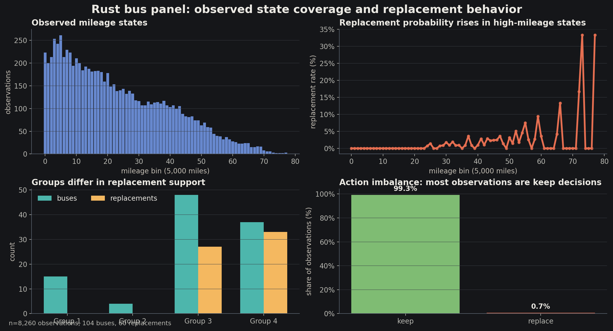
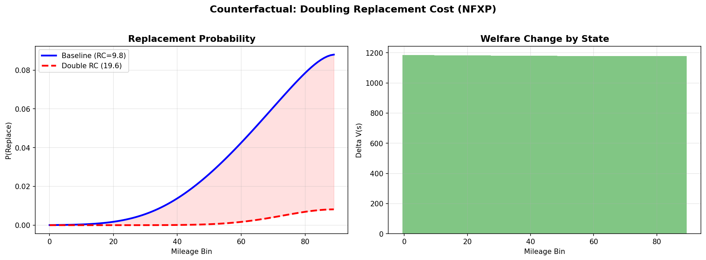
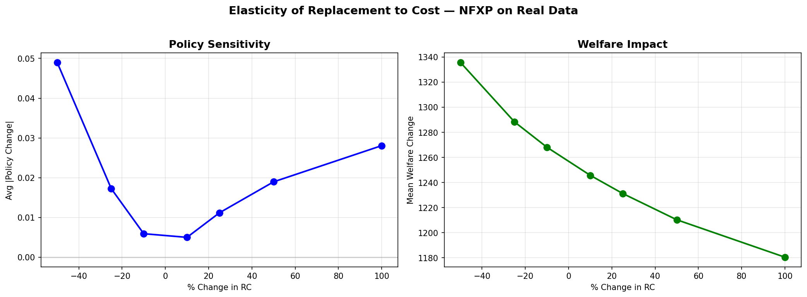
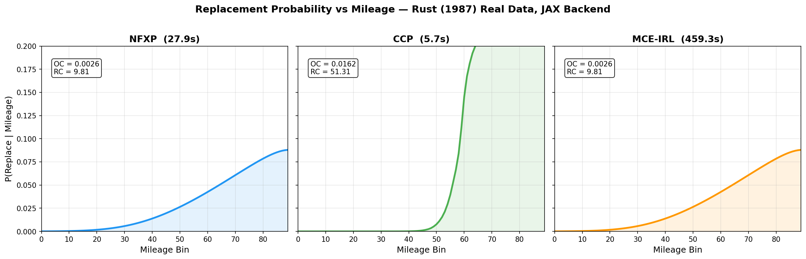
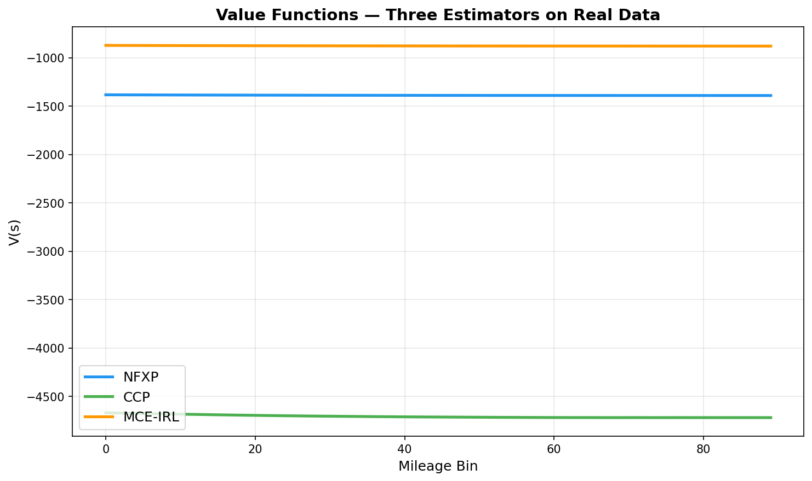
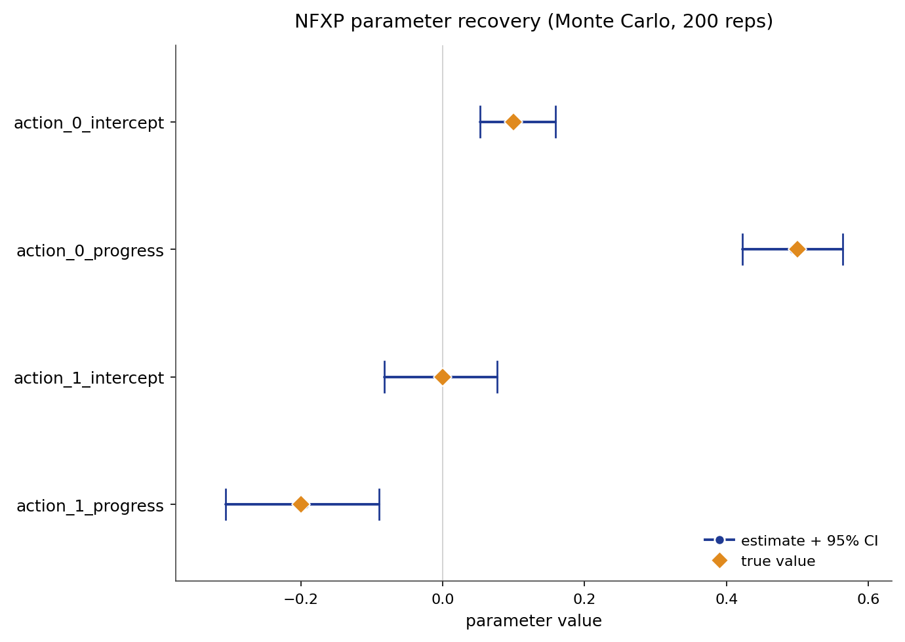
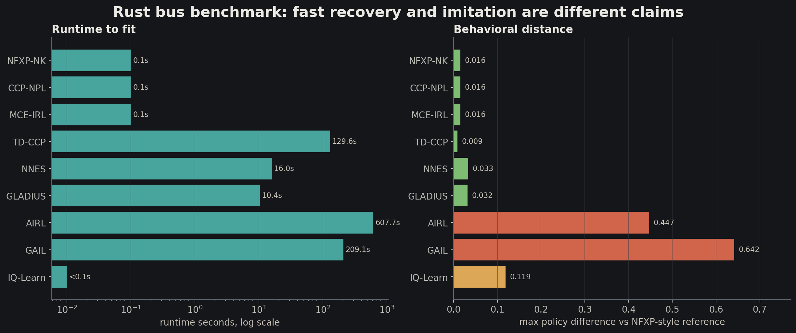
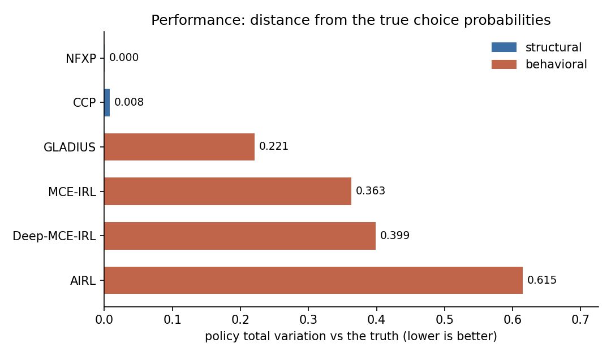
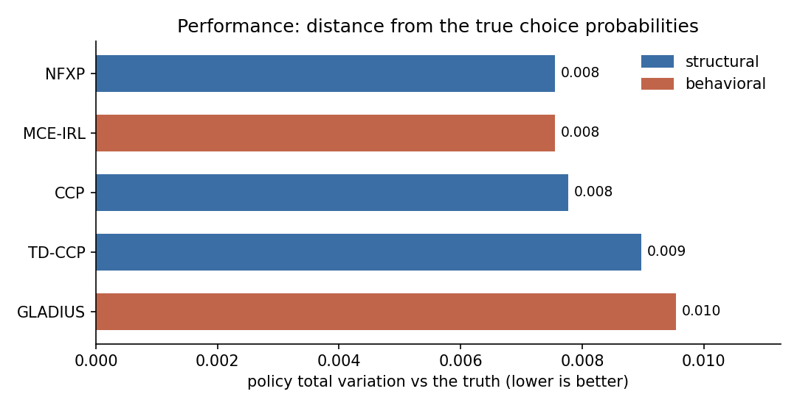

```{=html}
<style>
:root {
  --bg: #151619; --fg: #ebe9e3; --muted: #9a9a94; --sub: #c6c0b6;
  --teal: #4db6ac; --blue: #7aa2f7; --amber: #f4b860; --coral: #e76f51;
  --green: #8ccf7e; --violet: #b48ead; --rule: #31343a; --card: #202225;
  --card2: #24272c; --ink: #101114;
}
.reveal { font-family: -apple-system, BlinkMacSystemFont, "Segoe UI", Roboto, Helvetica, Arial, sans-serif; }
.reveal, .reveal .slides section { background: var(--bg); color: var(--fg); }
.reveal h1, .reveal h2, .reveal h3 { color: var(--fg); font-weight: 720; letter-spacing: 0; text-transform: none; }
.reveal h2 { font-size: 1.44em; border-bottom: 2px solid var(--rule); padding-bottom: 0.24em; margin-bottom: 0.44em; }
.reveal h3 { font-size: 0.78em; color: var(--sub); margin-bottom: 0.28em; }
.reveal a { color: var(--blue); }
.reveal strong { color: var(--teal); }
.reveal em { color: var(--sub); font-style: italic; }
.reveal .slide-number { background: none; color: var(--muted); font-size: 12px; }
.reveal .footer { font-size: 12px; }
.reveal .lead { font-size: 1.06em; line-height: 1.42; color: var(--fg); }
.reveal .subtle { color: var(--muted); font-size: 0.78em; line-height: 1.35; }
.reveal code { color: var(--green); background: rgba(140,207,126,0.09); padding: 1px 6px; border-radius: 4px; }
.reveal pre code { font-size: 0.64em; line-height: 1.28; max-height: 50vh; }
.reveal section img { background: none; border: none; box-shadow: none; }
.viz { width: 100%; height: auto; max-height: 60vh; display: block; margin: 0 auto; }
.viz.tall { max-height: 64vh; }
.figimg { display: block; width: 100%; max-height: 58vh; object-fit: contain; margin: 0 auto; border-radius: 6px; }
.figimg.tall { max-height: 64vh; }
.figimg.wide { max-height: 54vh; }
.caption { color: var(--muted); font-size: 0.58em; line-height: 1.25; margin-top: 0.34em; text-align: center; }
.eqbox { background: var(--card); border: 1.5px solid var(--rule); border-radius: 8px; padding: 0.62em 0.86em; margin: 0.36em auto; width: 88%; }
.eqbox.compact { padding: 0.46em 0.7em; }
.eqbox .math.display { margin: 0.16em 0; }
.reveal .eqbox p { margin: 0.14em 0; }
.mathgrid { display: grid; grid-template-columns: 1fr 1fr; gap: 0.54em; align-items: stretch; }
.mathgrid .eqbox { width: auto; margin: 0; }
.metricgrid { display: grid; grid-template-columns: repeat(4, 1fr); gap: 0.42em; margin-top: 0.4em; }
.metric { background: var(--card); border: 1.5px solid var(--rule); border-radius: 8px; padding: 0.48em 0.35em; text-align: center; }
.metric .num { color: var(--teal); font-weight: 760; font-size: 1.1em; line-height: 1.1; }
.metric .txt { color: var(--sub); font-size: 0.5em; line-height: 1.22; margin-top: 0.22em; }
.resulttable { width: 88%; margin: 0.34em auto; border-collapse: collapse; font-size: 0.54em; }
.resulttable th { color: var(--teal); font-weight: 720; border-bottom: 1.5px solid var(--rule); padding: 0.45em 0.5em; }
.resulttable td { color: var(--fg); border-bottom: 1px solid var(--rule); padding: 0.45em 0.5em; text-align: center; }
.resulttable td:first-child, .resulttable th:first-child { text-align: left; color: var(--sub); }
.panel { fill: var(--card); stroke: var(--rule); stroke-width: 1.5; rx: 8; }
.panel2 { fill: var(--card2); stroke: var(--rule); stroke-width: 1.5; rx: 8; }
.panel.teal { stroke: var(--teal); }
.panel.blue { stroke: var(--blue); }
.panel.amber { stroke: var(--amber); }
.panel.coral { stroke: var(--coral); }
.zone { fill: none; stroke: var(--rule); stroke-width: 1.5; rx: 10; }
.node { fill: #1b2226; stroke: var(--teal); stroke-width: 2.5; }
.node.blue { stroke: var(--blue); }
.node.amber { stroke: var(--amber); }
.node.coral { stroke: var(--coral); }
.node.green { stroke: var(--green); }
.node.violet { stroke: var(--violet); }
.label { fill: var(--fg); font: 600 18px -apple-system, sans-serif; text-anchor: middle; }
.label.big { font-size: 24px; font-weight: 720; }
.label.small { font-size: 14px; font-weight: 620; }
.label.left { text-anchor: start; }
.label.dim { fill: var(--muted); }
.label.teal { fill: var(--teal); }
.label.blue { fill: var(--blue); }
.label.amber { fill: var(--amber); }
.label.coral { fill: var(--coral); }
.label.green { fill: var(--green); }
.mono { fill: #d8e2dc; font: 600 15px ui-monospace, "SF Mono", Menlo, monospace; text-anchor: middle; }
.mono.left { text-anchor: start; }
.note { fill: var(--sub); font: 15px -apple-system, sans-serif; text-anchor: middle; }
.note.left { text-anchor: start; }
.edge { stroke: #66717c; stroke-width: 2.4; fill: none; marker-end: url(#arrowGray); }
.edge.teal { stroke: var(--teal); marker-end: url(#arrowTeal); }
.edge.blue { stroke: var(--blue); marker-end: url(#arrowBlue); }
.edge.amber { stroke: var(--amber); marker-end: url(#arrowAmber); }
.edge.coral { stroke: var(--coral); marker-end: url(#arrowCoral); }
.dash { stroke-dasharray: 7 6; }
.thin { stroke-width: 1.4; }
.token { fill: var(--card2); stroke: #46505c; stroke-width: 1.3; rx: 6; }
.token.hot { stroke: var(--amber); }
.token.good { stroke: var(--green); }
.token.blue { stroke: var(--blue); }
.token.coral { stroke: var(--coral); }
.chiptext { fill: var(--fg); font: 600 14px -apple-system, sans-serif; text-anchor: middle; }
.tiny { fill: var(--muted); font: 12px -apple-system, sans-serif; text-anchor: middle; }
.axis { stroke: var(--rule); stroke-width: 2; }
.grid { stroke: #30353b; stroke-width: 1; }
.accentbar { fill: var(--teal); opacity: 0.72; }
.reveal .fragment.fade-step { visibility: visible !important; opacity: 1 !important; transform: none; transition: none; }
.reveal .fragment.fade-step.visible { opacity: 1; transform: none; }
</style>

<svg width="0" height="0" style="position:absolute" aria-hidden="true">
  <defs>
    <marker id="arrowGray" viewBox="0 0 10 10" refX="8.5" refY="5" markerWidth="7" markerHeight="7" orient="auto">
      <path d="M0,0 L10,5 L0,10 z" fill="#66717c"/>
    </marker>
    <marker id="arrowTeal" viewBox="0 0 10 10" refX="8.5" refY="5" markerWidth="7" markerHeight="7" orient="auto">
      <path d="M0,0 L10,5 L0,10 z" fill="#4db6ac"/>
    </marker>
    <marker id="arrowBlue" viewBox="0 0 10 10" refX="8.5" refY="5" markerWidth="7" markerHeight="7" orient="auto">
      <path d="M0,0 L10,5 L0,10 z" fill="#7aa2f7"/>
    </marker>
    <marker id="arrowAmber" viewBox="0 0 10 10" refX="8.5" refY="5" markerWidth="7" markerHeight="7" orient="auto">
      <path d="M0,0 L10,5 L0,10 z" fill="#f4b860"/>
    </marker>
    <marker id="arrowCoral" viewBox="0 0 10 10" refX="8.5" refY="5" markerWidth="7" markerHeight="7" orient="auto">
      <path d="M0,0 L10,5 L0,10 z" fill="#e76f51"/>
    </marker>
  </defs>
</svg>
```

## The question {.center}

::: lead
How do we learn what people, firms, or agents value when each choice changes the future they will face next?
:::

```{=html}
<svg viewBox="0 0 1000 395" class="viz">
  <g class="fragment fade-step">
    <circle class="node blue" cx="160" cy="190" r="48"/><text class="label" x="160" y="197">state</text>
    <text class="note" x="160" y="258">where the agent is</text>
  </g>
  <g class="fragment fade-step">
    <circle class="node teal" cx="360" cy="190" r="48"/><text class="label" x="360" y="197">action</text>
    <text class="note" x="360" y="258">what they do</text>
    <path class="edge teal" d="M 210 190 L 310 190"/>
  </g>
  <g class="fragment fade-step">
    <circle class="node amber" cx="560" cy="190" r="48"/><text class="label" x="560" y="197">reward</text>
    <text class="note" x="560" y="258">what they get now</text>
    <path class="edge amber" d="M 410 190 L 510 190"/>
  </g>
  <g class="fragment fade-step">
    <circle class="node coral" cx="780" cy="190" r="54"/><text class="label" x="780" y="184">next</text><text class="label" x="780" y="210">state</text>
    <text class="note" x="780" y="258">where they land</text>
    <path class="edge coral" d="M 610 190 L 724 190"/>
    <path class="edge blue dash" d="M 780 136 C 720 45 230 45 170 136"/>
  </g>
</svg>
```

::: notes
The whole topic is the loop. A decision is not just a static response to today's covariates. It changes tomorrow's state, and tomorrow's state changes the value of today's action.
:::

---

## Static choice is a photograph

```{=html}
<svg viewBox="0 0 1000 430" class="viz">
  <g class="fragment fade-step">
    <rect class="panel blue" x="70" y="80" width="380" height="250"/>
    <text class="label big blue" x="260" y="125">Static choice</text>
    <text class="note" x="260" y="172">state today</text>
    <path class="edge blue" d="M 185 200 L 335 200"/>
    <circle class="node blue" cx="165" cy="200" r="42"/><text class="label small" x="165" y="206">price</text>
    <circle class="node teal" cx="355" cy="200" r="42"/><text class="label small" x="355" y="206">buy?</text>
    <text class="note" x="260" y="280">no future state in the model</text>
  </g>
  <g class="fragment fade-step">
    <rect class="panel teal" x="550" y="80" width="380" height="250"/>
    <text class="label big teal" x="740" y="125">Dynamic choice</text>
    <circle class="node blue" cx="650" cy="205" r="42"/><text class="label small" x="650" y="211">state</text>
    <circle class="node teal" cx="820" cy="205" r="42"/><text class="label small" x="820" y="211">act</text>
    <path class="edge teal" d="M 694 205 L 776 205"/>
    <path class="edge amber" d="M 820 163 C 785 85 685 85 650 163"/>
    <text class="note" x="740" y="280">today changes tomorrow</text>
  </g>
</svg>
```

::: notes
Static discrete choice asks which option wins today. Dynamic discrete choice asks which option wins after adding the future that the option creates.
:::

---

## What the data look like

```{=html}
<svg viewBox="0 0 1000 430" class="viz">
  <g class="fragment fade-step">
    <text class="label big" x="250" y="56">panel rows</text>
    <rect class="panel" x="70" y="90" width="360" height="238"/>
    <line class="grid" x1="70" y1="138" x2="430" y2="138"/>
    <line class="grid" x1="160" y1="90" x2="160" y2="328"/>
    <line class="grid" x1="270" y1="90" x2="270" y2="328"/>
    <line class="grid" x1="350" y1="90" x2="350" y2="328"/>
    <text class="mono" x="115" y="121">id</text><text class="mono" x="215" y="121">state</text><text class="mono" x="310" y="121">action</text><text class="mono" x="390" y="121">next</text>
    <text class="mono" x="115" y="174">bus 7</text><text class="mono" x="215" y="174">43</text><text class="mono" x="310" y="174">keep</text><text class="mono" x="390" y="174">45</text>
    <text class="mono" x="115" y="220">bus 7</text><text class="mono" x="215" y="220">45</text><text class="mono" x="310" y="220">keep</text><text class="mono" x="390" y="220">46</text>
    <text class="mono" x="115" y="266">bus 7</text><text class="mono" x="215" y="266">46</text><text class="mono" x="310" y="266">replace</text><text class="mono" x="390" y="266">0</text>
  </g>
  <g class="fragment fade-step">
    <text class="label big" x="730" y="56">model pieces</text>
    <rect class="token blue" x="555" y="105" width="350" height="44"/><text class="chiptext" x="730" y="132">transition: P(next state | state, action)</text>
    <rect class="token teal" x="555" y="170" width="350" height="44"/><text class="chiptext" x="730" y="197">reward: u(state, action; theta)</text>
    <rect class="token hot" x="555" y="235" width="350" height="44"/><text class="chiptext" x="730" y="262">discount: beta</text>
    <rect class="token coral" x="555" y="300" width="350" height="44"/><text class="chiptext" x="730" y="327">shock: unobserved taste draw</text>
  </g>
</svg>
```

::: notes
EconIRL fits panels of decisions. A row is one observed state, action, and usually next state. The model adds a reward, a transition kernel, a discount factor, and a distribution for private shocks.
:::

---

## Observed Rust bus data

{.figimg .tall}

::: {.caption}
Original Rust bus panel used in the EconIRL replication examples: state coverage, replacement support, and action imbalance.
:::

::: notes
This is the empirical object behind the toy row table. It is a sparse dynamic panel: many keep decisions, few replacement decisions, and replacement support concentrated in high-mileage states and older groups.
:::

---

## Three neighboring languages

```{=html}
<svg viewBox="0 0 1000 430" class="viz">
  <g class="fragment fade-step">
    <rect class="panel teal" x="80" y="95" width="250" height="240"/>
    <text class="label big teal" x="205" y="140">DDCM</text>
    <text class="note" x="205" y="188">choices are data</text>
    <text class="note" x="205" y="218">estimate preference</text>
    <text class="note" x="205" y="248">parameters</text>
    <text class="note" x="205" y="292">counterfactual policy</text>
  </g>
  <g class="fragment fade-step">
    <rect class="panel blue" x="375" y="95" width="250" height="240"/>
    <text class="label big blue" x="500" y="140">RL</text>
    <text class="note" x="500" y="188">reward is given</text>
    <text class="note" x="500" y="218">learn a policy</text>
    <text class="note" x="500" y="248">by interaction</text>
    <text class="note" x="500" y="292">control problem</text>
  </g>
  <g class="fragment fade-step">
    <rect class="panel amber" x="670" y="95" width="250" height="240"/>
    <text class="label big amber" x="795" y="140">IRL</text>
    <text class="note" x="795" y="188">behavior is given</text>
    <text class="note" x="795" y="218">infer a reward</text>
    <text class="note" x="795" y="248">that explains it</text>
    <text class="note" x="795" y="292">imitation and value</text>
  </g>
</svg>
```

::: notes
The same mathematical loop appears in three dialects. Economics usually wants interpretable primitive parameters. RL usually wants a good policy from a reward. IRL starts from behavior and tries to recover the reward.
:::

---

## The decision process

```{=html}
<svg viewBox="0 0 1000 430" class="viz">
  <circle class="node blue" cx="230" cy="210" r="58"/><text class="label" x="230" y="205">s</text><text class="tiny" x="230" y="231">state</text>
  <circle class="node teal" cx="470" cy="210" r="58"/><text class="label" x="470" y="205">a</text><text class="tiny" x="470" y="231">action</text>
  <circle class="node amber" cx="710" cy="140" r="58"/><text class="label" x="710" y="135">u</text><text class="tiny" x="710" y="161">flow payoff</text>
  <circle class="node coral" cx="710" cy="295" r="58"/><text class="label" x="710" y="290">s'</text><text class="tiny" x="710" y="316">next state</text>
  <path class="edge teal" d="M 290 210 L 410 210"/>
  <path class="edge amber" d="M 526 196 C 590 180 610 150 650 142"/>
  <path class="edge coral" d="M 525 226 C 595 242 618 284 650 292"/>
  <path class="edge blue dash" d="M 710 353 C 625 405 315 405 235 270"/>
  <g class="fragment fade-step">
    <rect class="panel" x="90" y="34" width="820" height="52"/>
    <text class="mono" x="500" y="66">agent picks a to maximize u(s,a) + discounted future value</text>
  </g>
</svg>
```

::: notes
The state is the sufficient summary of the past. The transition kernel tells where actions can move the agent. The reward says what is valuable. The discount says how much tomorrow matters.
:::

---

## Math object: primitives

::: {.eqbox}
$$
\mathcal{M}_\theta =
\left(\mathcal{S},\mathcal{A},P(s'\mid s,a),u_\theta(s,a),\beta,\sigma\right)
$$
:::

::: {.mathgrid}
::: {.eqbox .compact}
$$s\in\mathcal{S}$$
state
:::

::: {.eqbox .compact}
$$a\in\mathcal{A}(s)$$
feasible action
:::

::: {.eqbox .compact}
$$P(s'\mid s,a)$$
transition law
:::

::: {.eqbox .compact}
$$u_\theta(s,a)+\varepsilon_a$$
flow utility plus shock
:::
:::

::: notes
No derivation here. These are the primitive objects. The rest of the deck changes which part is known, estimated, approximated, or learned.
:::

---

## Math object: observed panel

::: {.eqbox}
$$
\mathcal{D}=\{(i,t,s_{it},a_{it},s_{i,t+1})\}_{i=1,\ldots,N;\;t=1,\ldots,T_i}
$$
:::

::: {.eqbox}
$$
a_{it}\sim \pi_\theta(\cdot\mid s_{it}),\qquad
s_{i,t+1}\sim P(\cdot\mid s_{it},a_{it})
$$
:::

::: {.metricgrid}
<div class="metric"><div class="num">8,260</div><div class="txt">Rust bus observations</div></div>
<div class="metric"><div class="num">104</div><div class="txt">buses in groups 1-4</div></div>
<div class="metric"><div class="num">90</div><div class="txt">mileage state bins</div></div>
<div class="metric"><div class="num">2</div><div class="txt">actions: keep or replace</div></div>
:::

::: notes
The panel is the empirical bridge from behavior to model. It records choices and state transitions; it does not directly record reward.
:::

---

## Math object: Bellman system

::: {.eqbox}
$$
Q_\theta(s,a)
= u_\theta(s,a)+\beta\sum_{s'\in\mathcal{S}}P(s'\mid s,a)V_\theta(s')
$$
:::

::: {.eqbox}
$$
V_\theta(s)=\sigma\log\sum_{b\in\mathcal{A}(s)}
\exp\!\left(\frac{Q_\theta(s,b)}{\sigma}\right)
$$
:::

::: {.caption}
This states the fixed point. Dynamic programming is the numerical route to the pair $(Q_\theta,V_\theta)$.
:::

::: notes
This is the math the user asked to see. The slide states the equations and names their role without deriving the log-sum-exp expression.
:::

---

## Math object: policy and likelihood

::: {.eqbox}
$$
\pi_\theta(a\mid s)=
\frac{\exp(Q_\theta(s,a)/\sigma)}
{\sum_{b\in\mathcal{A}(s)}\exp(Q_\theta(s,b)/\sigma)}
$$
:::

::: {.eqbox}
$$
\ell(\theta;\mathcal{D})
=\sum_i\sum_t\log \pi_\theta(a_{it}\mid s_{it})
$$
:::

::: {.caption}
Structural DDCM estimation asks which $\theta$ makes the observed choices most likely after solving the dynamic problem.
:::

::: notes
This is the likelihood spine behind NFXP and closely related structural estimators.
:::

---

## Bellman equation: one-step thinking

```{=html}
<svg viewBox="0 0 1000 430" class="viz">
  <g class="fragment fade-step">
    <rect class="panel teal" x="70" y="120" width="330" height="170"/>
    <text class="label big teal" x="235" y="164">Q(s, a)</text>
    <text class="note" x="235" y="210">reward now</text>
    <text class="note" x="235" y="238">plus discounted future value</text>
  </g>
  <g class="fragment fade-step">
    <path class="edge amber" d="M 410 205 L 565 205"/>
    <rect class="panel amber" x="585" y="120" width="345" height="170"/>
    <text class="label big amber" x="758" y="164">V(s)</text>
    <text class="note" x="758" y="210">soft max over actions</text>
    <text class="note" x="758" y="238">because shocks are logit</text>
  </g>
  <g class="fragment fade-step">
    <text class="mono" x="500" y="350">Q(s,a) = u(s,a) + beta * E[V(s') | s,a]</text>
    <text class="mono" x="500" y="382">V(s) = sigma * log sum_a exp(Q(s,a) / sigma)</text>
  </g>
</svg>
```

::: notes
This is the soft Bellman operator used by the package. The log-sum-exp form comes from Type-I extreme value shocks, the same logit structure used in dynamic discrete choice.
:::

---

## Dynamic programming solves the loop

```{=html}
<svg viewBox="0 0 1000 420" class="viz">
  <g class="fragment fade-step">
    <rect class="token blue" x="80" y="155" width="145" height="56"/><text class="chiptext" x="152" y="188">V0 guess</text>
    <path class="edge blue" d="M 230 183 L 315 183"/>
  </g>
  <g class="fragment fade-step">
    <rect class="token teal" x="320" y="155" width="145" height="56"/><text class="chiptext" x="392" y="188">T(V0)</text>
    <path class="edge teal" d="M 470 183 L 555 183"/>
  </g>
  <g class="fragment fade-step">
    <rect class="token amber" x="560" y="155" width="145" height="56"/><text class="chiptext" x="632" y="188">T(V1)</text>
    <path class="edge amber" d="M 710 183 L 795 183"/>
  </g>
  <g class="fragment fade-step">
    <rect class="token good" x="800" y="155" width="145" height="56"/><text class="chiptext" x="872" y="188">V*</text>
  </g>
  <g class="fragment fade-step">
    <rect class="panel" x="240" y="285" width="520" height="62"/>
    <text class="label" x="500" y="323">contraction: repeat until the values stop moving</text>
  </g>
</svg>
```

::: notes
Dynamic programming is not a different model. It is the way we solve the same fixed point. In NFXP, this solve happens again and again inside the likelihood search.
:::

---

## Reinforcement learning, quickly

```{=html}
<svg viewBox="0 0 1000 430" class="viz">
  <g class="fragment fade-step">
    <rect class="panel blue" x="75" y="85" width="265" height="255"/>
    <text class="label big blue" x="208" y="132">RL</text>
    <text class="note" x="208" y="184">given reward</text>
    <text class="note" x="208" y="216">learn policy</text>
    <text class="mono" x="208" y="276">r -> pi</text>
  </g>
  <g class="fragment fade-step">
    <rect class="panel amber" x="370" y="85" width="265" height="255"/>
    <text class="label big amber" x="502" y="132">IRL</text>
    <text class="note" x="502" y="184">given behavior</text>
    <text class="note" x="502" y="216">learn reward</text>
    <text class="mono" x="502" y="276">pi_E -> r</text>
  </g>
  <g class="fragment fade-step">
    <rect class="panel teal" x="665" y="85" width="265" height="255"/>
    <text class="label big teal" x="798" y="132">DDCM</text>
    <text class="note" x="798" y="184">given panel</text>
    <text class="note" x="798" y="216">learn structural theta</text>
    <text class="mono" x="798" y="276">choices -> theta</text>
  </g>
</svg>
```

::: notes
RL is the control direction. IRL is the inverse direction. Dynamic discrete choice is usually an inverse problem too, but it imposes a structural reward specification and uses likelihood or moment restrictions.
:::

---

## The estimator map

```{=html}
<svg viewBox="0 0 1000 430" class="viz">
  <line class="axis" x1="110" y1="210" x2="890" y2="210"/>
  <g class="fragment fade-step">
    <circle class="node teal" cx="160" cy="210" r="42"/><text class="label small" x="160" y="216">NFXP</text>
    <text class="note" x="160" y="285">exact likelihood</text>
  </g>
  <g class="fragment fade-step">
    <circle class="node amber" cx="335" cy="210" r="42"/><text class="label small" x="335" y="216">CCP</text>
    <text class="note" x="335" y="285">invert choices</text>
  </g>
  <g class="fragment fade-step">
    <circle class="node blue" cx="510" cy="210" r="42"/><text class="label small" x="510" y="216">MCE</text>
    <text class="note" x="510" y="285">match features</text>
  </g>
  <g class="fragment fade-step">
    <circle class="node coral" cx="685" cy="210" r="42"/><text class="label small" x="685" y="216">AIRL</text>
    <text class="note" x="685" y="285">adversarial reward</text>
  </g>
  <g class="fragment fade-step">
    <circle class="node violet" cx="860" cy="210" r="42"/><text class="label small" x="860" y="216">more</text>
    <text class="note" x="860" y="285">scale, heterogeneity</text>
  </g>
  <text class="tiny" x="250" y="352">same decision process, different shortcut or target</text>
</svg>
```

::: notes
The deck now walks this map. Each method answers one question: keep the exact structural target, avoid repeated solves, learn reward from demonstrations, or handle an added complication.
:::

---

## The long road map

```{=html}
<svg viewBox="0 0 1000 430" class="viz">
  <rect class="panel" x="70" y="70" width="860" height="280"/>
  <g class="fragment fade-step">
    <rect class="token blue" x="105" y="115" width="180" height="46"/><text class="chiptext" x="195" y="144">model pieces</text>
    <text class="note" x="195" y="190">state, action, reward</text>
  </g>
  <g class="fragment fade-step">
    <rect class="token teal" x="305" y="115" width="180" height="46"/><text class="chiptext" x="395" y="144">DP core</text>
    <text class="note" x="395" y="190">Bellman, policy, value</text>
  </g>
  <g class="fragment fade-step">
    <rect class="token hot" x="505" y="115" width="180" height="46"/><text class="chiptext" x="595" y="144">structural</text>
    <text class="note" x="595" y="190">NFXP, CCP, NPL</text>
  </g>
  <g class="fragment fade-step">
    <rect class="token coral" x="705" y="115" width="180" height="46"/><text class="chiptext" x="795" y="144">IRL</text>
    <text class="note" x="795" y="190">MCE, AIRL, neural</text>
  </g>
  <g class="fragment fade-step">
    <text class="mono" x="500" y="290">then: support, anchors, scale, heterogeneity, and counterfactual meaning</text>
  </g>
</svg>
```

::: notes
This is the long version. It slows down on the assumptions because most confusion in dynamic choice comes from not knowing which object the estimator is allowed to recover.
:::

---

## Problem archetypes

```{=html}
<svg viewBox="0 0 1000 430" class="viz">
  <g class="fragment fade-step">
    <rect class="panel blue" x="65" y="70" width="260" height="120"/>
    <text class="label blue" x="195" y="110">replacement</text>
    <text class="note" x="195" y="145">keep now, pay later</text>
    <text class="mono" x="195" y="172">bus, machine, car</text>
  </g>
  <g class="fragment fade-step">
    <rect class="panel teal" x="370" y="70" width="260" height="120"/>
    <text class="label teal" x="500" y="110">entry and exit</text>
    <text class="note" x="500" y="145">active status persists</text>
    <text class="mono" x="500" y="172">firm, seller, market</text>
  </g>
  <g class="fragment fade-step">
    <rect class="panel amber" x="675" y="70" width="260" height="120"/>
    <text class="label amber" x="805" y="110">career choice</text>
    <text class="note" x="805" y="145">experience accumulates</text>
    <text class="mono" x="805" y="172">school, job, retire</text>
  </g>
  <g class="fragment fade-step">
    <rect class="panel coral" x="215" y="235" width="260" height="120"/>
    <text class="label coral" x="345" y="275">route choice</text>
    <text class="note" x="345" y="310">path creates location</text>
    <text class="mono" x="345" y="337">taxi, commute, logistics</text>
  </g>
  <g class="fragment fade-step">
    <rect class="panel" x="525" y="235" width="260" height="120"/>
    <text class="label" x="655" y="275">content choice</text>
    <text class="note" x="655" y="310">state includes taste</text>
    <text class="mono" x="655" y="337">watch, skip, continue</text>
  </g>
</svg>
```

::: notes
The same machinery covers many stories: durable equipment, market participation, human capital, navigation, and recommendation-like sequential behavior.
:::

---

## The state is a compression

```{=html}
<svg viewBox="0 0 1000 430" class="viz">
  <g class="fragment fade-step">
    <rect class="panel blue" x="70" y="95" width="350" height="235"/>
    <text class="label big blue" x="245" y="140">history</text>
    <text class="note" x="245" y="185">everything that happened</text>
    <text class="mono" x="245" y="230">s0, a0, s1, a1, ...</text>
  </g>
  <g class="fragment fade-step">
    <path class="edge teal" d="M 430 215 L 560 215"/>
    <rect class="panel teal" x="580" y="95" width="350" height="235"/>
    <text class="label big teal" x="755" y="140">state</text>
    <text class="note" x="755" y="185">the part of history that</text>
    <text class="note" x="755" y="212">still predicts payoffs</text>
    <text class="mono" x="755" y="260">mileage, age, type, stock</text>
  </g>
</svg>
```

::: notes
Markov does not mean the past does not matter. It means the past matters through a state variable that carries the relevant information forward.
:::

---

## Bad state design breaks the model

```{=html}
<svg viewBox="0 0 1000 430" class="viz">
  <g class="fragment fade-step">
    <rect class="panel coral" x="85" y="90" width="830" height="86"/>
    <text class="label coral" x="500" y="126">missing memory</text>
    <text class="note" x="500" y="154">today's state does not explain tomorrow or current payoff</text>
  </g>
  <g class="fragment fade-step">
    <rect class="panel amber" x="85" y="205" width="830" height="86"/>
    <text class="label amber" x="500" y="241">too many cells</text>
    <text class="note" x="500" y="269">choice probabilities become sparse, especially for CCP-style estimators</text>
  </g>
  <g class="fragment fade-step">
    <rect class="panel blue" x="85" y="320" width="830" height="56"/>
    <text class="mono" x="500" y="354">state design is the first estimator choice</text>
  </g>
</svg>
```

::: notes
This is the hidden modeling work. A weak state omits the variables that make behavior sequential. An over-rich state creates a support problem.
:::

---

## Action sets are small on purpose

```{=html}
<svg viewBox="0 0 1000 430" class="viz">
  <g class="fragment fade-step">
    <circle class="node green" cx="180" cy="220" r="48"/><text class="label small" x="180" y="226">keep</text>
    <circle class="node coral" cx="360" cy="220" r="48"/><text class="label small" x="360" y="226">replace</text>
  </g>
  <g class="fragment fade-step">
    <rect class="panel" x="525" y="118" width="355" height="205"/>
    <text class="label" x="702" y="160">discrete action set</text>
    <text class="note" x="702" y="205">makes logit choice probabilities</text>
    <text class="note" x="702" y="232">and Bellman sums tractable</text>
    <text class="mono" x="702" y="282">a in {0, 1, ..., J}</text>
  </g>
</svg>
```

::: notes
Discrete choice models usually coarsen actions intentionally. The payoff is interpretable choice probabilities and a finite Bellman maximization or log-sum-exp.
:::

---

## The transition model is the physics

```{=html}
<svg viewBox="0 0 1000 430" class="viz">
  <g class="fragment fade-step">
    <circle class="node blue" cx="230" cy="210" r="46"/><text class="label" x="230" y="216">s</text>
    <circle class="node teal" cx="450" cy="120" r="40"/><text class="label small" x="450" y="126">s1</text>
    <circle class="node teal" cx="450" cy="210" r="40"/><text class="label small" x="450" y="216">s2</text>
    <circle class="node teal" cx="450" cy="300" r="40"/><text class="label small" x="450" y="306">s3</text>
    <path class="edge teal" d="M 272 190 L 410 132"/>
    <path class="edge teal" d="M 278 210 L 405 210"/>
    <path class="edge teal" d="M 272 230 L 410 288"/>
  </g>
  <g class="fragment fade-step">
    <rect class="panel amber" x="590" y="110" width="315" height="200"/>
    <text class="label amber" x="748" y="152">P(s' | s, a)</text>
    <text class="note" x="748" y="200">known, estimated first,</text>
    <text class="note" x="748" y="228">or avoided by special methods</text>
    <text class="mono" x="748" y="276">wrong P -> wrong future</text>
  </g>
</svg>
```

::: notes
Transitions are beliefs about the environment. Structural DDC usually treats them as rational expectations and estimates them separately or supplies them.
:::

---

## Reward is not always utility in units

```{=html}
<svg viewBox="0 0 1000 430" class="viz">
  <g class="fragment fade-step">
    <rect class="panel teal" x="90" y="92" width="250" height="235"/>
    <text class="label big teal" x="215" y="138">structural</text>
    <text class="note" x="215" y="190">theta has a fixed</text>
    <text class="note" x="215" y="218">economic meaning</text>
    <text class="mono" x="215" y="268">cost slope, RC</text>
  </g>
  <g class="fragment fade-step">
    <rect class="panel amber" x="375" y="92" width="250" height="235"/>
    <text class="label big amber" x="500" y="138">IRL</text>
    <text class="note" x="500" y="190">reward explains</text>
    <text class="note" x="500" y="218">behavior</text>
    <text class="mono" x="500" y="268">up to invariances</text>
  </g>
  <g class="fragment fade-step">
    <rect class="panel blue" x="660" y="92" width="250" height="235"/>
    <text class="label big blue" x="785" y="138">policy</text>
    <text class="note" x="785" y="190">what we directly</text>
    <text class="note" x="785" y="218">observe through choices</text>
    <text class="mono" x="785" y="268">pi(a | s)</text>
  </g>
</svg>
```

::: notes
Newcomers often conflate reward, utility, and policy. The data show behavior. The reward is inferred under restrictions. The structural interpretation is a stronger claim than behavioral fit.
:::

---

## Choice shocks explain mixed behavior

```{=html}
<svg viewBox="0 0 1000 430" class="viz">
  <g class="fragment fade-step">
    <rect class="panel blue" x="90" y="100" width="360" height="220"/>
    <text class="label blue" x="270" y="145">same observed state</text>
    <circle class="node green" cx="210" cy="225" r="42"/><text class="label small" x="210" y="231">keep</text>
    <circle class="node coral" cx="330" cy="225" r="42"/><text class="label small" x="330" y="231">replace</text>
  </g>
  <g class="fragment fade-step">
    <rect class="panel amber" x="560" y="100" width="350" height="220"/>
    <text class="label amber" x="735" y="145">private shocks</text>
    <text class="note" x="735" y="192">epsilon_a makes choice</text>
    <text class="note" x="735" y="220">probabilistic to us</text>
    <text class="mono" x="735" y="272">softmax(Q / sigma)</text>
  </g>
</svg>
```

::: notes
The logit shock is not just a technical detail. It explains why two agents in the same observed state can choose differently, and it gives the closed-form softmax.
:::

---

## Normalization is not optional

```{=html}
<svg viewBox="0 0 1000 430" class="viz">
  <g class="fragment fade-step">
    <rect class="panel coral" x="95" y="90" width="810" height="82"/>
    <text class="label coral" x="500" y="128">only payoff differences drive choices</text>
    <text class="note" x="500" y="154">adding the same constant everywhere often changes nothing observable</text>
  </g>
  <g class="fragment fade-step">
    <rect class="panel teal" x="95" y="205" width="370" height="105"/>
    <text class="label teal" x="280" y="246">level anchor</text>
    <text class="mono" x="280" y="282">u(s, exit) = 0</text>
  </g>
  <g class="fragment fade-step">
    <rect class="panel amber" x="535" y="205" width="370" height="105"/>
    <text class="label amber" x="720" y="246">scale anchor</text>
    <text class="mono" x="720" y="282">sigma fixed</text>
  </g>
</svg>
```

::: notes
Reward recovery needs an anchor. Without a level and scale convention, the reward is not a unique object.
:::

---

## Feature rank is identification made visible

```{=html}
<svg viewBox="0 0 1000 430" class="viz">
  <g class="fragment fade-step">
    <rect class="panel blue" x="90" y="80" width="350" height="260"/>
    <text class="label blue" x="265" y="122">bad feature</text>
    <text class="note" x="265" y="170">same for every action</text>
    <rect class="token" x="160" y="215" width="210" height="42"/><text class="chiptext" x="265" y="241">phi(s, keep)</text>
    <rect class="token" x="160" y="270" width="210" height="42"/><text class="chiptext" x="265" y="296">phi(s, replace)</text>
  </g>
  <g class="fragment fade-step">
    <rect class="panel teal" x="560" y="80" width="350" height="260"/>
    <text class="label teal" x="735" y="122">good contrast</text>
    <text class="note" x="735" y="170">moves with the action</text>
    <rect class="token good" x="630" y="215" width="210" height="42"/><text class="chiptext" x="735" y="241">low cost keep</text>
    <rect class="token hot" x="630" y="270" width="210" height="42"/><text class="chiptext" x="735" y="296">high cost replace</text>
  </g>
</svg>
```

::: notes
If a feature does not vary across actions, it can vanish from the choice comparison. That is why action-contrast feature rank matters in the EconIRL diagnostics.
:::

---

## Counterfactuals need primitives

```{=html}
<svg viewBox="0 0 1000 430" class="viz">
  <g class="fragment fade-step">
    <rect class="panel teal" x="90" y="95" width="300" height="235"/>
    <text class="label big teal" x="240" y="140">fit model</text>
    <text class="note" x="240" y="190">reward, transition, beta</text>
    <text class="mono" x="240" y="242">theta_hat</text>
  </g>
  <g class="fragment fade-step">
    <path class="edge amber" d="M 402 212 L 560 212"/>
    <rect class="panel amber" x="575" y="95" width="335" height="235"/>
    <text class="label big amber" x="742" y="140">change primitive</text>
    <text class="note" x="742" y="190">replacement cost, tax, price</text>
    <text class="mono" x="742" y="242">solve Bellman again</text>
  </g>
</svg>
```

::: notes
Structural counterfactuals are not just predictions from a fitted classifier. They change a model primitive and re-solve the decision problem.
:::

---

## Math object: counterfactuals

::: {.eqbox}
$$
\mathcal{M}_{\hat\theta}
\longrightarrow
\mathcal{M}_{cf}
=
\left(\mathcal{S},\mathcal{A}_{cf},P_{cf},u_{cf},\beta_{cf},\sigma\right)
$$
:::

::: {.eqbox}
$$
(V_{cf},Q_{cf},\pi_{cf})
=
\operatorname{SolveBellman}(\mathcal{M}_{cf})
$$
:::

::: {.mathgrid}
::: {.eqbox .compact}
$$u_{\hat\theta}\rightarrow u_{cf}$$
reward change
:::

::: {.eqbox .compact}
$$P_{\hat\theta}\rightarrow P_{cf}$$
transition change
:::

::: {.eqbox .compact}
$$\mathcal{A}\rightarrow\mathcal{A}_{cf}$$
choice-set change
:::

::: {.eqbox .compact}
$$\beta\rightarrow\beta_{cf}$$
planning change
:::
:::

::: notes
The key point is that a counterfactual is a new solved model, not just a label swap on the observed choices.
:::

---

## Counterfactual graph: replacement cost

{.figimg .wide}

::: {.caption}
Rust bus example: change a structural primitive and re-solve the replacement policy.
:::

::: notes
This plot gives the audience the operational meaning of a structural counterfactual. The policy curve changes because the replacement cost primitive changes.
:::

---

## Counterfactual graph: elasticity

{.figimg .wide}

::: {.caption}
The counterfactual surface can be summarized as a behavioral response curve rather than one policy at a time.
:::

::: notes
This slide is there because counterfactuals are not only visual policy comparisons; they also produce response summaries that look closer to applied demand or maintenance elasticity objects.
:::

---

## DP has several computational faces

```{=html}
<svg viewBox="0 0 1000 430" class="viz">
  <g class="fragment fade-step">
    <rect class="panel blue" x="70" y="90" width="255" height="240"/>
    <text class="label blue" x="198" y="132">finite horizon</text>
    <text class="note" x="198" y="184">start at the end</text>
    <text class="mono" x="198" y="232">backward induction</text>
  </g>
  <g class="fragment fade-step">
    <rect class="panel teal" x="372" y="90" width="255" height="240"/>
    <text class="label teal" x="500" y="132">infinite horizon</text>
    <text class="note" x="500" y="184">repeat a contraction</text>
    <text class="mono" x="500" y="232">value iteration</text>
  </g>
  <g class="fragment fade-step">
    <rect class="panel amber" x="675" y="90" width="255" height="240"/>
    <text class="label amber" x="802" y="132">near solution</text>
    <text class="note" x="802" y="184">use faster local steps</text>
    <text class="mono" x="802" y="232">policy / Newton</text>
  </g>
</svg>
```

::: notes
The Bellman equation is one object, but the solver can be backward induction, value iteration, policy iteration, or a hybrid polyalgorithm.
:::

---

## Logit policy from values

```{=html}
<svg viewBox="0 0 1000 430" class="viz">
  <g class="fragment fade-step">
    <rect class="panel" x="90" y="105" width="820" height="190"/>
    <text class="mono" x="500" y="158">Q_keep = 1.2</text>
    <text class="mono" x="500" y="205">Q_replace = 0.4</text>
    <text class="mono" x="500" y="252">pi(a | s) = exp(Q_a / sigma) / sum_b exp(Q_b / sigma)</text>
  </g>
  <g class="fragment fade-step">
    <rect class="accentbar" x="270" y="340" width="310" height="28"/><text class="tiny" x="425" y="392">higher Q, higher probability</text>
    <rect fill="var(--coral)" x="580" y="340" width="150" height="28" opacity="0.72"/><text class="tiny" x="655" y="392">still possible</text>
  </g>
</svg>
```

::: notes
The policy is a soft comparison of choice-specific values. Better actions become more likely, but the shock keeps all supported actions possible.
:::

---

## NFXP: solve inside the search

```{=html}
<svg viewBox="0 0 1000 430" class="viz">
  <g class="fragment fade-step">
    <rect class="panel teal" x="90" y="90" width="820" height="260"/>
    <text class="label big teal" x="500" y="132">outer loop: search theta</text>
  </g>
  <g class="fragment fade-step">
    <rect class="panel2" x="170" y="175" width="660" height="100"/>
    <text class="label amber" x="500" y="212">inner loop: solve Bellman fixed point</text>
    <text class="mono" x="500" y="246">theta -> u_theta -> V_theta -> pi_theta</text>
  </g>
  <g class="fragment fade-step">
    <path class="edge teal" d="M 500 278 C 560 318 770 318 805 278"/>
    <text class="note" x="660" y="340">score observed actions, update theta, repeat</text>
  </g>
</svg>
```

::: notes
NFXP is conceptually clean. For each candidate reward parameter, solve the dynamic program, turn values into choice probabilities, score the data, and update the parameter.
:::

---

## Canonical NFXP example: the bus engine

```{=html}
<svg viewBox="0 0 1000 430" class="viz">
  <g class="fragment fade-step">
    <text class="label big" x="500" y="62">Rust bus replacement</text>
    <line class="axis" x1="120" y1="210" x2="780" y2="210"/>
    <text class="tiny" x="120" y="244">low mileage</text><text class="tiny" x="780" y="244">high mileage</text>
    <circle class="node blue" cx="190" cy="210" r="30"/><text class="label small" x="190" y="216">10</text>
    <circle class="node blue" cx="340" cy="210" r="30"/><text class="label small" x="340" y="216">30</text>
    <circle class="node blue" cx="490" cy="210" r="30"/><text class="label small" x="490" y="216">50</text>
    <circle class="node blue" cx="640" cy="210" r="30"/><text class="label small" x="640" y="216">70</text>
  </g>
  <g class="fragment fade-step">
    <rect class="token good" x="190" y="98" width="150" height="44"/><text class="chiptext" x="265" y="125">keep</text>
    <path class="edge green" d="M 265 144 C 290 176 310 190 338 200"/>
  </g>
  <g class="fragment fade-step">
    <rect class="token hot" x="620" y="98" width="150" height="44"/><text class="chiptext" x="695" y="125">replace</text>
    <path class="edge amber" d="M 695 144 C 650 275 300 280 190 240"/>
    <text class="note" x="500" y="326">replacement pays a fixed cost now, but resets future mileage</text>
  </g>
</svg>
```

::: notes
The canonical structural problem is keep or replace. Keeping is cheap today but raises expected future maintenance. Replacing is expensive today but resets the state.
:::

---

## Result graph: estimated policy

{.figimg .wide}

::: {.caption}
Estimated replacement probabilities by mileage state. The policy is the solved behavioral object implied by the estimated primitives.
:::

::: notes
This is the first result graph the audience should retain: values and parameters are not abstract; they produce a replacement policy over states.
:::

---

## Result graph: value function

{.figimg}

::: {.caption}
Estimated value functions show how future maintenance costs make high-mileage states less attractive.
:::

::: notes
The value graph makes the forward-looking part visible. Mileage is not just a covariate; it is a state with continuation value.
:::

---

## Result table: Rust 1987 replication

<table class="resulttable">
  <thead>
    <tr>
      <th>Sample</th>
      <th>EconIRL RC</th>
      <th>Rust RC</th>
      <th>EconIRL c</th>
      <th>Rust c</th>
      <th>Distance</th>
    </tr>
  </thead>
  <tbody>
    <tr><td>Groups 1,2,3</td><td>11.99</td><td>11.73</td><td>4.93</td><td>4.83</td><td>within 1-2%</td></tr>
    <tr><td>Group 4</td><td>10.14</td><td>10.07</td><td>2.26</td><td>2.29</td><td>within 1-2%</td></tr>
    <tr><td>Groups 1,2,3,4</td><td>9.81</td><td>9.76</td><td>2.60</td><td>2.63</td><td>within 1-2%</td></tr>
  </tbody>
</table>

::: {.caption}
Table IX-style replication numbers from the EconIRL Rust bus notes.
:::

::: notes
This is intentionally framed as replication evidence for the Rust bus example, not as a blanket claim about every estimator.
:::

---

## Result graph: parameter recovery

{.figimg}

::: {.caption}
NFXP recovery plot from the package paper figures: estimated parameters against known simulation truth.
:::

::: notes
This plot separates two evidence modes: original empirical replication and known-truth simulation recovery. They answer different questions.
:::

---

## NFXP data to likelihood

```{=html}
<svg viewBox="0 0 1000 430" class="viz">
  <g class="fragment fade-step">
    <rect class="panel blue" x="70" y="90" width="210" height="245"/>
    <text class="label big blue" x="175" y="136">panel</text>
    <text class="mono" x="175" y="190">(s_t, a_t)</text>
    <text class="mono" x="175" y="230">(s_{t+1})</text>
  </g>
  <g class="fragment fade-step">
    <path class="edge blue" d="M 290 212 L 365 212"/>
    <rect class="panel teal" x="375" y="90" width="250" height="245"/>
    <text class="label big teal" x="500" y="136">model</text>
    <text class="mono" x="500" y="188">u_theta</text>
    <text class="mono" x="500" y="226">P(s'|s,a)</text>
    <text class="mono" x="500" y="264">beta, sigma</text>
  </g>
  <g class="fragment fade-step">
    <path class="edge amber" d="M 635 212 L 710 212"/>
    <rect class="panel amber" x="720" y="90" width="210" height="245"/>
    <text class="label big amber" x="825" y="136">score</text>
    <text class="mono" x="825" y="202">sum log pi_theta</text>
    <text class="note" x="825" y="246">observed actions</text>
  </g>
</svg>
```

::: notes
For a candidate parameter, NFXP builds the whole policy implied by the dynamic model, then asks how likely the observed actions were under that policy.
:::

---

## NFXP inner loop

```{=html}
<svg viewBox="0 0 1000 430" class="viz">
  <rect class="panel" x="80" y="80" width="840" height="275"/>
  <g class="fragment fade-step">
    <circle class="node teal" cx="235" cy="215" r="52"/><text class="label" x="235" y="209">start</text><text class="tiny" x="235" y="235">V0</text>
  </g>
  <g class="fragment fade-step">
    <path class="edge teal" d="M 288 215 L 402 215"/>
    <circle class="node amber" cx="455" cy="215" r="52"/><text class="label" x="455" y="209">apply</text><text class="tiny" x="455" y="235">T_theta</text>
  </g>
  <g class="fragment fade-step">
    <path class="edge amber" d="M 508 215 L 622 215"/>
    <circle class="node blue" cx="675" cy="215" r="52"/><text class="label" x="675" y="209">update</text><text class="tiny" x="675" y="235">V1</text>
  </g>
  <g class="fragment fade-step">
    <path class="edge coral dash" d="M 675 160 C 595 70 315 70 238 160"/>
    <text class="note" x="500" y="58">repeat until the value function stops moving</text>
  </g>
</svg>
```

::: notes
The fixed point is the value function that is unchanged by the Bellman operator. This is the expensive part that gets nested inside the likelihood search.
:::

---

## NFXP outer loop

```{=html}
<svg viewBox="0 0 1000 430" class="viz">
  <g class="fragment fade-step">
    <rect class="panel teal" x="100" y="72" width="230" height="85"/>
    <text class="label teal" x="215" y="108">guess theta</text>
    <text class="mono" x="215" y="136">c_replace, c_mileage</text>
  </g>
  <g class="fragment fade-step">
    <path class="edge teal" d="M 335 115 L 425 115"/>
    <rect class="panel amber" x="440" y="72" width="230" height="85"/>
    <text class="label amber" x="555" y="108">solve DP</text>
    <text class="mono" x="555" y="136">V_theta</text>
  </g>
  <g class="fragment fade-step">
    <path class="edge amber" d="M 675 115 L 765 115"/>
    <rect class="panel blue" x="780" y="72" width="140" height="85"/>
    <text class="label blue" x="850" y="108">policy</text>
    <text class="mono" x="850" y="136">pi_theta</text>
  </g>
  <g class="fragment fade-step">
    <path class="edge blue" d="M 850 162 L 850 245 L 555 245"/>
    <rect class="panel coral" x="440" y="250" width="230" height="85"/>
    <text class="label coral" x="555" y="286">likelihood</text>
    <text class="mono" x="555" y="314">L(theta)</text>
  </g>
  <g class="fragment fade-step">
    <path class="edge coral dash" d="M 435 292 C 285 315 160 245 210 162"/>
    <text class="note" x="285" y="350">optimizer chooses the next theta</text>
  </g>
</svg>
```

::: notes
The outer loop is ordinary maximum likelihood. The unusual part is that every score evaluation requires a fresh dynamic-programming solve.
:::

---

## NFXP strength

```{=html}
<svg viewBox="0 0 1000 430" class="viz">
  <g class="fragment fade-step">
    <rect class="panel teal" x="90" y="88" width="360" height="235"/>
    <text class="label big teal" x="270" y="136">clear primitives</text>
    <text class="note" x="270" y="188">reward parameters</text>
    <text class="note" x="270" y="220">transition law</text>
    <text class="note" x="270" y="252">discount factor</text>
  </g>
  <g class="fragment fade-step">
    <rect class="panel blue" x="550" y="88" width="360" height="235"/>
    <text class="label big blue" x="730" y="136">clean counterfactuals</text>
    <text class="note" x="730" y="188">change a primitive</text>
    <text class="note" x="730" y="220">solve again</text>
    <text class="note" x="730" y="252">compare policy and welfare</text>
  </g>
  <g class="fragment fade-step">
    <path class="edge amber" d="M 450 210 L 540 210"/>
    <text class="mono" x="500" y="374">this is why structural models are worth the work</text>
  </g>
</svg>
```

::: notes
The reward parameters can be interpreted as primitives of the decision problem. That is what makes policy counterfactuals meaningful.
:::

---

## NFXP pain point

```{=html}
<svg viewBox="0 0 1000 430" class="viz">
  <rect class="panel" x="85" y="75" width="830" height="285"/>
  <g class="fragment fade-step">
    <text class="label big coral" x="500" y="124">cost grows in two directions</text>
  </g>
  <g class="fragment fade-step">
    <line class="axis" x1="195" y1="300" x2="805" y2="300"/>
    <line class="axis" x1="195" y1="300" x2="195" y2="135"/>
    <path d="M 205 292 C 330 285 430 250 520 210 C 625 160 710 105 790 92" fill="none" stroke="var(--coral)" stroke-width="5"/>
    <text class="tiny" x="500" y="335">state grid size</text>
    <text class="tiny" x="132" y="212" transform="rotate(-90 132 212)">solve time</text>
  </g>
  <g class="fragment fade-step">
    <rect class="token hot" x="350" y="170" width="300" height="46"/>
    <text class="chiptext" x="500" y="199">many theta guesses times many states</text>
  </g>
</svg>
```

::: notes
NFXP is most painful when the state space is large or the optimizer needs many likelihood evaluations. Most later estimators are responses to this bottleneck.
:::

---

## Benchmark graph: speed and fit

{.figimg .wide}

::: {.caption}
Rust bus benchmark-style comparison: runtime and behavioral distance are separate axes, not one ranking.
:::

::: notes
This slide keeps the later estimator roster honest. Fast methods, structural methods, imitation-style methods, and reward-learning methods make different claims.
:::

---

## CCP: choices reveal value differences

```{=html}
<svg viewBox="0 0 1000 430" class="viz">
  <g class="fragment fade-step">
    <rect class="panel amber" x="70" y="90" width="250" height="245"/>
    <text class="label big amber" x="195" y="136">1. Count</text>
    <text class="note" x="195" y="188">empirical</text>
    <text class="mono" x="195" y="222">pi_hat(a | s)</text>
  </g>
  <g class="fragment fade-step">
    <path class="edge amber" d="M 330 210 L 405 210"/>
    <rect class="panel blue" x="415" y="90" width="250" height="245"/>
    <text class="label big blue" x="540" y="136">2. Invert</text>
    <text class="note" x="540" y="188">log odds map to</text>
    <text class="note" x="540" y="216">value differences</text>
  </g>
  <g class="fragment fade-step">
    <path class="edge teal" d="M 675 210 L 750 210"/>
    <rect class="panel teal" x="760" y="90" width="170" height="245"/>
    <text class="label big teal" x="845" y="136">3. Fit</text>
    <text class="note" x="845" y="188">pseudo</text>
    <text class="note" x="845" y="216">likelihood</text>
  </g>
</svg>
```

::: notes
Hotz-Miller CCP methods replace repeated full Bellman solves with a first-stage estimate of choice probabilities. Under the logit dynamic-choice assumptions, those probabilities identify value differences.
:::

---

## Math object: CCP inversion

::: {.eqbox}
$$
\hat{\pi}(a\mid s)
=
\Pr_{\mathcal{D}}(a_{it}=a\mid s_{it}=s)
$$
:::

::: {.eqbox}
$$
Q(s,a)-Q(s,a_0)
=
\sigma\left[
\log \hat{\pi}(a\mid s)-\log \hat{\pi}(a_0\mid s)
\right]
$$
:::

::: {.caption}
The shortcut is mathematical: choice probabilities become value differences under the logit dynamic-choice structure.
:::

::: notes
This is the equation the visual CCP slide is pointing at. It is a stated inversion, not a proof.
:::

---

## Canonical CCP example: entry and exit

```{=html}
<svg viewBox="0 0 1000 430" class="viz">
  <g class="fragment fade-step">
    <rect class="panel" x="90" y="78" width="820" height="270"/>
    <text class="label big" x="500" y="122">firm in a market</text>
    <circle class="node coral" cx="250" cy="235" r="54"/><text class="label" x="250" y="230">out</text><text class="tiny" x="250" y="256">a=0</text>
    <circle class="node green" cx="750" cy="235" r="54"/><text class="label" x="750" y="230">in</text><text class="tiny" x="750" y="256">a=1</text>
    <path class="edge green" d="M 303 220 C 420 150 580 150 697 220"/>
    <path class="edge coral" d="M 697 250 C 580 320 420 320 303 250"/>
    <text class="note" x="500" y="195">market size, incumbency, fixed cost, entry cost</text>
  </g>
  <g class="fragment fade-step">
    <text class="mono" x="500" y="382">high support matters: thin state-action cells make pi_hat unstable</text>
  </g>
</svg>
```

::: notes
The survey's CCP exposition uses a simplified entry-exit model. The lesson transfers to buses and many panels: first-stage choice probabilities are powerful when every relevant state-action cell has support.
:::

---

## CCP first stage

```{=html}
<svg viewBox="0 0 1000 430" class="viz">
  <g class="fragment fade-step">
    <rect class="panel blue" x="75" y="78" width="850" height="270"/>
    <text class="label big blue" x="500" y="122">estimate pi_hat(a | s) from observed choices</text>
  </g>
  <g class="fragment fade-step">
    <rect class="token good" x="155" y="185" width="170" height="44"/><text class="chiptext" x="240" y="212">state bin 1</text>
    <rect class="accentbar" x="155" y="250" width="135" height="24"/><rect fill="var(--coral)" x="290" y="250" width="35" height="24" opacity="0.72"/>
    <text class="tiny" x="240" y="300">mostly keep</text>
  </g>
  <g class="fragment fade-step">
    <rect class="token hot" x="415" y="185" width="170" height="44"/><text class="chiptext" x="500" y="212">state bin 2</text>
    <rect class="accentbar" x="415" y="250" width="92" height="24"/><rect fill="var(--coral)" x="507" y="250" width="78" height="24" opacity="0.72"/>
    <text class="tiny" x="500" y="300">mixed</text>
  </g>
  <g class="fragment fade-step">
    <rect class="token coral" x="675" y="185" width="170" height="44"/><text class="chiptext" x="760" y="212">state bin 3</text>
    <rect class="accentbar" x="675" y="250" width="42" height="24"/><rect fill="var(--coral)" x="717" y="250" width="128" height="24" opacity="0.72"/>
    <text class="tiny" x="760" y="300">often replace</text>
  </g>
</svg>
```

::: notes
The first stage compresses behavior into conditional choice probabilities. In small discrete state spaces, this can literally be counting. In larger spaces it is a supervised learning problem.
:::

---

## CCP inversion

```{=html}
<svg viewBox="0 0 1000 430" class="viz">
  <g class="fragment fade-step">
    <rect class="panel amber" x="95" y="98" width="330" height="230"/>
    <text class="label big amber" x="260" y="146">observed odds</text>
    <text class="mono" x="260" y="205">log pi(a|s)</text>
    <text class="mono" x="260" y="245">- log pi(a0|s)</text>
  </g>
  <g class="fragment fade-step">
    <path class="edge amber" d="M 435 215 L 560 215"/>
    <rect class="panel teal" x="575" y="98" width="330" height="230"/>
    <text class="label big teal" x="740" y="146">value gaps</text>
    <text class="mono" x="740" y="205">Q(a,s)</text>
    <text class="mono" x="740" y="245">- Q(a0,s)</text>
  </g>
  <g class="fragment fade-step">
    <text class="mono" x="500" y="380">logit shocks make the bridge analytic</text>
  </g>
</svg>
```

::: notes
The Hotz-Miller insight is an inversion: if choices are logit-soft values, then observed choice probabilities reveal differences in choice-specific values.
:::

---

## CCP continuation values

```{=html}
<svg viewBox="0 0 1000 430" class="viz">
  <g class="fragment fade-step">
    <circle class="node blue" cx="185" cy="210" r="45"/><text class="label" x="185" y="216">s</text>
    <rect class="token blue" x="110" y="105" width="150" height="44"/><text class="chiptext" x="185" y="132">choose a</text>
  </g>
  <g class="fragment fade-step">
    <path class="edge blue" d="M 230 210 L 360 160"/>
    <circle class="node teal" cx="410" cy="145" r="42"/><text class="label small" x="410" y="151">s1</text>
    <text class="tiny" x="410" y="205">P=.4</text>
  </g>
  <g class="fragment fade-step">
    <path class="edge blue" d="M 230 210 L 360 260"/>
    <circle class="node amber" cx="410" cy="275" r="42"/><text class="label small" x="410" y="281">s2</text>
    <text class="tiny" x="410" y="335">P=.6</text>
  </g>
  <g class="fragment fade-step">
    <path class="edge teal" d="M 455 145 L 610 145"/>
    <path class="edge amber" d="M 455 275 L 610 275"/>
    <rect class="panel2" x="635" y="98" width="270" height="230"/>
    <text class="label big" x="770" y="146">future value</text>
    <text class="note" x="770" y="205">use pi_hat to simulate</text>
    <text class="note" x="770" y="235">what happens after today</text>
  </g>
</svg>
```

::: notes
The first-stage policy supplies the expected future behavior needed to compute continuation values without solving a new Bellman fixed point for every parameter guess.
:::

---

## CCP strength

```{=html}
<svg viewBox="0 0 1000 430" class="viz">
  <g class="fragment fade-step">
    <rect class="panel amber" x="80" y="95" width="250" height="230"/>
    <text class="label big amber" x="205" y="142">fast</text>
    <text class="note" x="205" y="202">avoid nested</text>
    <text class="note" x="205" y="232">fixed-point solves</text>
  </g>
  <g class="fragment fade-step">
    <rect class="panel teal" x="375" y="95" width="250" height="230"/>
    <text class="label big teal" x="500" y="142">modular</text>
    <text class="note" x="500" y="202">separate policy</text>
    <text class="note" x="500" y="232">and structural fit</text>
  </g>
  <g class="fragment fade-step">
    <rect class="panel blue" x="670" y="95" width="250" height="230"/>
    <text class="label big blue" x="795" y="142">scalable</text>
    <text class="note" x="795" y="202">good first step</text>
    <text class="note" x="795" y="232">for richer models</text>
  </g>
</svg>
```

::: notes
CCP methods turn a hard dynamic estimation problem into a two-step problem. The computational win is the reason they matter.
:::

---

## CCP failure mode

```{=html}
<svg viewBox="0 0 1000 430" class="viz">
  <rect class="panel" x="80" y="72" width="840" height="285"/>
  <g class="fragment fade-step">
    <text class="label big coral" x="500" y="118">no support, no inversion</text>
  </g>
  <g class="fragment fade-step">
    <g transform="translate(200 165)">
      <rect class="token good" x="0" y="0" width="160" height="50"/><text class="chiptext" x="80" y="31">seen often</text>
      <rect class="token hot" x="220" y="0" width="160" height="50"/><text class="chiptext" x="300" y="31">seen rarely</text>
      <rect class="token coral" x="440" y="0" width="160" height="50"/><text class="chiptext" x="520" y="31">never seen</text>
    </g>
  </g>
  <g class="fragment fade-step">
    <path class="edge teal" d="M 280 230 L 280 285"/>
    <path class="edge amber" d="M 500 230 L 500 285"/>
    <path class="edge coral" d="M 720 230 L 720 285"/>
    <text class="note" x="280" y="318">stable pi_hat</text>
    <text class="note" x="500" y="318">noisy pi_hat</text>
    <text class="note" x="720" y="318">undefined log odds</text>
  </g>
</svg>
```

::: notes
The shortcut depends on seeing enough choices in enough states. Sparse panels and rare actions can make the first stage the weak link.
:::

---

## NPL: iterate the shortcut

```{=html}
<svg viewBox="0 0 1000 430" class="viz">
  <g class="fragment fade-step">
    <circle class="node amber" cx="250" cy="210" r="55"/><text class="label" x="250" y="204">policy</text><text class="tiny" x="250" y="232">pi_k</text>
  </g>
  <g class="fragment fade-step">
    <path class="edge amber" d="M 305 210 L 445 210"/>
    <circle class="node teal" cx="500" cy="210" r="55"/><text class="label" x="500" y="204">fit</text><text class="tiny" x="500" y="232">theta_k</text>
  </g>
  <g class="fragment fade-step">
    <path class="edge teal" d="M 555 210 L 695 210"/>
    <circle class="node blue" cx="750" cy="210" r="55"/><text class="label" x="750" y="204">update</text><text class="tiny" x="750" y="232">pi_{k+1}</text>
  </g>
  <g class="fragment fade-step">
    <path class="edge coral dash" d="M 750 155 C 660 60 340 60 252 155"/>
    <text class="note" x="500" y="350">nested pseudo-likelihood refines the first-stage policy</text>
  </g>
</svg>
```

::: notes
NPL uses the CCP idea repeatedly. Start with an initial policy, estimate parameters, update the policy implied by those parameters, and iterate.
:::

---

## MCE-IRL: match demonstrations

```{=html}
<svg viewBox="0 0 1000 430" class="viz">
  <g class="fragment fade-step">
    <rect class="panel blue" x="70" y="90" width="350" height="250"/>
    <text class="label big blue" x="245" y="136">expert paths</text>
    <path class="edge blue" d="M 145 275 L 200 230 L 260 230 L 315 172"/>
    <circle class="node blue" cx="145" cy="275" r="16"/><circle class="node blue" cx="200" cy="230" r="16"/><circle class="node blue" cx="260" cy="230" r="16"/><circle class="node blue" cx="315" cy="172" r="16"/>
    <text class="note" x="245" y="306">feature counts</text>
  </g>
  <g class="fragment fade-step">
    <path class="edge amber" d="M 430 215 L 545 215"/>
    <rect class="panel amber" x="565" y="90" width="350" height="250"/>
    <text class="label big amber" x="740" y="136">soft policy</text>
    <path class="edge amber" d="M 640 275 C 700 210 735 230 810 172"/>
    <circle class="node amber" cx="640" cy="275" r="16"/><circle class="node amber" cx="700" cy="210" r="16"/><circle class="node amber" cx="735" cy="230" r="16"/><circle class="node amber" cx="810" cy="172" r="16"/>
    <text class="note" x="740" y="306">same expected features</text>
  </g>
</svg>
```

::: notes
Maximum causal entropy IRL says: among policies that explain the expert's feature expectations, prefer the least committed soft policy. The reward parameters are the Lagrange multipliers that make model feature moments match expert moments.
:::

---

## Math object: MCE-IRL objective

::: {.eqbox}
$$
r_\theta(s,a)=\theta^\top f(s,a)
$$
:::

::: {.eqbox}
$$
\mathbb{E}_{\pi_\theta}\!\left[\sum_t f(s_t,a_t)\right]
=
\mathbb{E}_{\mathrm{expert}}\!\left[\sum_t f(s_t,a_t)\right]
$$
:::

::: {.eqbox}
$$
\pi^*=\arg\max_{\pi}\;H(\pi)
\quad\text{subject to feature matching}
$$
:::

::: {.caption}
The reward weights are the multipliers that make the soft planner match expert feature counts.
:::

::: notes
This is the MCE-IRL math in one slide: linear reward, feature moment matching, entropy preference among policies that explain the demonstrations.
:::

---

## Canonical MCE example: a grid

```{=html}
<svg viewBox="0 0 1000 430" class="viz">
  <g class="fragment fade-step">
    <text class="label big" x="500" y="54">navigation with features</text>
    <g transform="translate(260 90)">
      <rect class="panel" x="0" y="0" width="480" height="280"/>
      <g>
        <line class="grid" x1="80" y1="0" x2="80" y2="280"/><line class="grid" x1="160" y1="0" x2="160" y2="280"/><line class="grid" x1="240" y1="0" x2="240" y2="280"/><line class="grid" x1="320" y1="0" x2="320" y2="280"/><line class="grid" x1="400" y1="0" x2="400" y2="280"/>
        <line class="grid" x1="0" y1="70" x2="480" y2="70"/><line class="grid" x1="0" y1="140" x2="480" y2="140"/><line class="grid" x1="0" y1="210" x2="480" y2="210"/>
      </g>
      <rect x="240" y="70" width="80" height="70" fill="#2b3138"/>
      <rect x="400" y="210" width="80" height="70" fill="#2b3138"/>
      <circle class="node green" cx="440" cy="35" r="22"/><text class="tiny" x="440" y="40">goal</text>
      <path class="edge teal" d="M 40 245 L 120 175 L 200 175 L 280 35 L 430 35"/>
      <circle class="node blue" cx="40" cy="245" r="18"/><text class="tiny" x="40" y="250">start</text>
    </g>
  </g>
  <g class="fragment fade-step">
    <text class="mono" x="500" y="405">reward weights explain why this path, not every shortest path</text>
  </g>
</svg>
```

::: notes
This is the standard IRL mental model: demonstrations reveal tradeoffs over features such as goal proximity, road type, risk, or obstacles.
:::

---

## MCE input objects

```{=html}
<svg viewBox="0 0 1000 430" class="viz">
  <g class="fragment fade-step">
    <rect class="panel blue" x="70" y="85" width="250" height="245"/>
    <text class="label big blue" x="195" y="132">trajectories</text>
    <text class="mono" x="195" y="188">tau = s0,a0,...</text>
    <text class="note" x="195" y="238">expert behavior</text>
  </g>
  <g class="fragment fade-step">
    <rect class="panel teal" x="375" y="85" width="250" height="245"/>
    <text class="label big teal" x="500" y="132">features</text>
    <text class="mono" x="500" y="188">f(s,a)</text>
    <text class="note" x="500" y="238">what can matter</text>
  </g>
  <g class="fragment fade-step">
    <rect class="panel amber" x="680" y="85" width="250" height="245"/>
    <text class="label big amber" x="805" y="132">dynamics</text>
    <text class="mono" x="805" y="188">P(s'|s,a)</text>
    <text class="note" x="805" y="238">where actions lead</text>
  </g>
</svg>
```

::: notes
MCE-IRL needs demonstrations, features, and dynamics. The reward is learned as a weighting of the features, and the dynamics tell the algorithm what alternative paths were available.
:::

---

## MCE objective

```{=html}
<svg viewBox="0 0 1000 430" class="viz">
  <g class="fragment fade-step">
    <rect class="panel amber" x="100" y="92" width="350" height="240"/>
    <text class="label big amber" x="275" y="140">match moments</text>
    <text class="mono" x="275" y="202">E_pi[f] = E_expert[f]</text>
  </g>
  <g class="fragment fade-step">
    <path class="edge teal" d="M 460 212 L 545 212"/>
    <rect class="panel teal" x="560" y="92" width="340" height="240"/>
    <text class="label big teal" x="730" y="140">maximize entropy</text>
    <text class="mono" x="730" y="202">avoid extra claims</text>
    <text class="note" x="730" y="244">among matching policies</text>
  </g>
  <g class="fragment fade-step">
    <text class="mono" x="500" y="382">explain what is observed, stay uncertain elsewhere</text>
  </g>
</svg>
```

::: notes
The maximum entropy principle matters because many policies can match a small set of moments. MCE chooses the softest policy consistent with those moments.
:::

---

## MCE soft value recursion

```{=html}
<svg viewBox="0 0 1000 430" class="viz">
  <g class="fragment fade-step">
    <rect class="panel teal" x="85" y="82" width="830" height="250"/>
    <text class="label big teal" x="500" y="126">replace max with log-sum-exp</text>
  </g>
  <g class="fragment fade-step">
    <text class="mono" x="500" y="190">V(s) = log sum_a exp(Q(s,a))</text>
  </g>
  <g class="fragment fade-step">
    <text class="mono" x="500" y="245">Q(s,a) = r_theta(s,a) + beta E[V(s')]</text>
  </g>
  <g class="fragment fade-step">
    <rect class="token good" x="345" y="292" width="310" height="46"/>
    <text class="chiptext" x="500" y="321">a differentiable planner</text>
  </g>
</svg>
```

::: notes
The same Bellman loop appears, but it is the soft version. The policy becomes a Boltzmann policy over soft choice-specific values.
:::

---

## MCE gradient picture

```{=html}
<svg viewBox="0 0 1000 430" class="viz">
  <g class="fragment fade-step">
    <rect class="panel blue" x="95" y="95" width="260" height="230"/>
    <text class="label big blue" x="225" y="142">expert</text>
    <text class="mono" x="225" y="205">feature counts</text>
  </g>
  <g class="fragment fade-step">
    <rect class="panel amber" x="645" y="95" width="260" height="230"/>
    <text class="label big amber" x="775" y="142">model</text>
    <text class="mono" x="775" y="205">expected counts</text>
  </g>
  <g class="fragment fade-step">
    <path class="edge coral" d="M 365 210 L 635 210"/>
    <text class="label coral" x="500" y="188">gap</text>
    <text class="mono" x="500" y="250">grad = expert - model</text>
  </g>
</svg>
```

::: notes
The learning signal is intuitive. If the expert visits a feature more than the current model, raise its reward weight. If the model over-visits a feature, lower it.
:::

---

## MCE feature design

```{=html}
<svg viewBox="0 0 1000 430" class="viz">
  <g class="fragment fade-step">
    <rect class="panel teal" x="90" y="85" width="250" height="245"/>
    <text class="label big teal" x="215" y="132">good feature</text>
    <text class="note" x="215" y="190">varies across</text>
    <text class="note" x="215" y="220">available paths</text>
    <text class="mono" x="215" y="268">identified</text>
  </g>
  <g class="fragment fade-step">
    <rect class="panel coral" x="375" y="85" width="250" height="245"/>
    <text class="label big coral" x="500" y="132">bad feature</text>
    <text class="note" x="500" y="190">constant or</text>
    <text class="note" x="500" y="220">duplicated</text>
    <text class="mono" x="500" y="268">not learned</text>
  </g>
  <g class="fragment fade-step">
    <rect class="panel amber" x="660" y="85" width="250" height="245"/>
    <text class="label big amber" x="785" y="132">missing feature</text>
    <text class="note" x="785" y="190">explains behavior</text>
    <text class="note" x="785" y="220">but absent</text>
    <text class="mono" x="785" y="268">bias</text>
  </g>
</svg>
```

::: notes
IRL is only as good as the feature language. The reward can only put weight on tradeoffs the feature map makes visible.
:::

---

## Result graph: taxi gridworld IRL

{.figimg .wide}

::: {.caption}
Taxi/gridworld result figure from the package paper artifacts: reward learning is evaluated by recovered behavior and transfer, not only by a pretty reward map.
:::

::: notes
This graph keeps the IRL part empirical. It also prevents overclaiming: recovered rewards matter because of the behavior and transfer they induce.
:::

---

## AIRL: adversarial reward recovery

```{=html}
<svg viewBox="0 0 1000 430" class="viz">
  <g class="fragment fade-step">
    <rect class="panel blue" x="80" y="105" width="230" height="200"/>
    <text class="label big blue" x="195" y="150">expert</text>
    <text class="note" x="195" y="202">observed</text>
    <text class="mono" x="195" y="238">(s,a,s')</text>
  </g>
  <g class="fragment fade-step">
    <rect class="panel amber" x="385" y="105" width="230" height="200"/>
    <text class="label big amber" x="500" y="150">learner</text>
    <text class="note" x="500" y="202">policy rollouts</text>
    <text class="mono" x="500" y="238">(s,a,s')</text>
  </g>
  <g class="fragment fade-step">
    <path class="edge coral" d="M 315 205 L 375 205"/>
    <path class="edge coral" d="M 620 205 L 680 205"/>
    <rect class="panel coral" x="690" y="105" width="230" height="200"/>
    <text class="label big coral" x="805" y="150">discriminator</text>
    <text class="mono" x="805" y="202">g(s) + beta h(s')</text>
    <text class="mono" x="805" y="232">- h(s) - log pi(a|s)</text>
  </g>
</svg>
```

::: notes
AIRL trains a structured discriminator. The structure is the point: it tries to put transferable reward in g and dynamics-dependent shaping in h.
:::

---

## Math object: AIRL discriminator

::: {.eqbox}
$$
f_\omega(s,a,s')
=
g_\omega(s)+\beta h_\omega(s')-h_\omega(s)
$$
:::

::: {.eqbox}
$$
D_\omega(s,a,s')
=
\frac{\exp(f_\omega(s,a,s'))}
{\exp(f_\omega(s,a,s'))+\pi(a\mid s)}
$$
:::

::: {.eqbox}
$$
\max_\omega\;
\mathbb{E}_{\tau_E}[\log D_\omega]
+
\mathbb{E}_{\tau_\pi}[\log(1-D_\omega)]
$$
:::

::: {.caption}
The structured split separates reward-like content from potential-based shaping terms.
:::

::: notes
This is the AIRL math in stated form. It avoids saying AIRL universally recovers "the" reward; the reward-like term is meaningful under the assumptions behind the split.
:::

---

## Canonical AIRL example: transfer

```{=html}
<svg viewBox="0 0 1000 430" class="viz">
  <g class="fragment fade-step">
    <rect class="panel teal" x="90" y="90" width="360" height="240"/>
    <text class="label big teal" x="270" y="134">world A</text>
    <circle class="node green" cx="180" cy="245" r="34"/><text class="label small" x="180" y="251">goal</text>
    <circle class="node blue" cx="360" cy="185" r="30"/><text class="label small" x="360" y="191">s</text>
    <path class="edge teal" d="M 340 205 C 280 245 240 250 215 248"/>
  </g>
  <g class="fragment fade-step">
    <rect class="panel blue" x="550" y="90" width="360" height="240"/>
    <text class="label big blue" x="730" y="134">world B</text>
    <circle class="node green" cx="640" cy="245" r="34"/><text class="label small" x="640" y="251">goal</text>
    <circle class="node blue" cx="820" cy="285" r="30"/><text class="label small" x="820" y="291">s</text>
    <path class="edge blue" d="M 795 270 C 740 235 700 240 675 245"/>
  </g>
  <g class="fragment fade-step">
    <text class="mono" x="500" y="382">state-only reward can transfer when shaping is separated</text>
  </g>
</svg>
```

::: notes
The original AIRL claim is not simply "learn any reward." It is a state-only reward-transfer claim under specific MDP conditions. EconIRL exposes state-only AIRL and anchored action-dependent extensions separately.
:::

---

## AIRL training loop

```{=html}
<svg viewBox="0 0 1000 430" class="viz">
  <g class="fragment fade-step">
    <circle class="node blue" cx="210" cy="210" r="55"/><text class="label" x="210" y="204">expert</text><text class="tiny" x="210" y="232">data</text>
  </g>
  <g class="fragment fade-step">
    <circle class="node amber" cx="500" cy="105" r="55"/><text class="label" x="500" y="99">policy</text><text class="tiny" x="500" y="127">rollouts</text>
  </g>
  <g class="fragment fade-step">
    <circle class="node coral" cx="790" cy="210" r="55"/><text class="label" x="790" y="204">disc</text><text class="tiny" x="790" y="232">classify</text>
  </g>
  <g class="fragment fade-step">
    <circle class="node teal" cx="500" cy="325" r="55"/><text class="label" x="500" y="319">reward</text><text class="tiny" x="500" y="347">signal</text>
  </g>
  <path class="edge blue" d="M 264 200 C 420 160 610 160 736 200"/>
  <path class="edge amber" d="M 555 115 C 650 135 710 165 748 183"/>
  <path class="edge coral" d="M 760 257 C 695 315 610 335 555 330"/>
  <path class="edge teal" d="M 445 320 C 350 300 275 258 238 247"/>
</svg>
```

::: notes
AIRL alternates between generating learner rollouts, training a discriminator against expert data, and using the learned signal to improve the policy.
:::

---

## AIRL discriminator anatomy

```{=html}
<svg viewBox="0 0 1000 430" class="viz">
  <rect class="panel" x="70" y="78" width="860" height="280"/>
  <g class="fragment fade-step">
    <rect class="token good" x="125" y="150" width="190" height="52"/><text class="chiptext" x="220" y="182">g(s)</text>
    <text class="note" x="220" y="232">reward-like term</text>
  </g>
  <g class="fragment fade-step">
    <text class="label big" x="352" y="183">+</text>
    <rect class="token blue" x="390" y="150" width="190" height="52"/><text class="chiptext" x="485" y="182">beta h(s')</text>
    <text class="note" x="485" y="232">next potential</text>
  </g>
  <g class="fragment fade-step">
    <text class="label big" x="617" y="183">-</text>
    <rect class="token hot" x="655" y="150" width="190" height="52"/><text class="chiptext" x="750" y="182">h(s)</text>
    <text class="note" x="750" y="232">current potential</text>
  </g>
  <g class="fragment fade-step">
    <text class="mono" x="500" y="305">potential terms absorb shaping; g is the transferable target</text>
  </g>
</svg>
```

::: notes
The AIRL architecture builds in a separation between reward and shaping. That structure is why it is more than a generic classifier.
:::

---

## AIRL reward ambiguity

```{=html}
<svg viewBox="0 0 1000 430" class="viz">
  <g class="fragment fade-step">
    <rect class="panel teal" x="95" y="90" width="330" height="245"/>
    <text class="label big teal" x="260" y="136">same behavior</text>
    <path class="edge teal" d="M 170 255 C 225 190 290 220 350 160"/>
    <circle class="node teal" cx="170" cy="255" r="16"/><circle class="node teal" cx="260" cy="205" r="16"/><circle class="node teal" cx="350" cy="160" r="16"/>
  </g>
  <g class="fragment fade-step">
    <rect class="panel amber" x="575" y="90" width="330" height="245"/>
    <text class="label big amber" x="740" y="136">many rewards</text>
    <text class="mono" x="740" y="195">r</text>
    <text class="mono" x="740" y="235">r + beta Phi(s') - Phi(s)</text>
    <text class="note" x="740" y="276">policy unchanged</text>
  </g>
  <g class="fragment fade-step">
    <path class="edge coral" d="M 435 215 L 565 215"/>
  </g>
</svg>
```

::: notes
Reward functions are not automatically unique. Potential-based shaping can preserve behavior while changing apparent per-step rewards. AIRL tries to factor that ambiguity.
:::

---

## AIRL state-only path

```{=html}
<svg viewBox="0 0 1000 430" class="viz">
  <g class="fragment fade-step">
    <rect class="panel teal" x="80" y="80" width="260" height="260"/>
    <text class="label big teal" x="210" y="128">reward</text>
    <text class="mono" x="210" y="195">r(s)</text>
    <text class="note" x="210" y="245">portable when the</text>
    <text class="note" x="210" y="272">conditions fit</text>
  </g>
  <g class="fragment fade-step">
    <path class="edge teal" d="M 350 210 L 465 210"/>
    <rect class="panel blue" x="480" y="80" width="440" height="260"/>
    <text class="label big blue" x="700" y="128">new dynamics</text>
    <text class="note" x="700" y="195">same state preferences</text>
    <text class="note" x="700" y="225">different transitions</text>
    <text class="mono" x="700" y="280">solve new policy</text>
  </g>
</svg>
```

::: notes
The clean AIRL story is a state-only reward that can transfer to a changed environment. That is powerful, but it is also a restriction.
:::

---

## AIRL with action-dependent economics

```{=html}
<svg viewBox="0 0 1000 430" class="viz">
  <g class="fragment fade-step">
    <rect class="panel coral" x="85" y="92" width="380" height="240"/>
    <text class="label big coral" x="275" y="140">economic actions matter</text>
    <text class="note" x="275" y="194">entry cost</text>
    <text class="note" x="275" y="224">replacement cost</text>
    <text class="note" x="275" y="254">switching cost</text>
  </g>
  <g class="fragment fade-step">
    <path class="edge amber" d="M 475 212 L 540 212"/>
    <rect class="panel amber" x="555" y="92" width="360" height="240"/>
    <text class="label big amber" x="735" y="140">needs anchors</text>
    <text class="note" x="735" y="194">normalizations</text>
    <text class="note" x="735" y="224">reference actions</text>
    <text class="note" x="735" y="254">interpretability checks</text>
  </g>
</svg>
```

::: notes
Many economic models need action-dependent rewards. Those can be useful, but they require explicit anchors and normalizations because the pure state-only transfer argument no longer carries the full load.
:::

---

## What each method is trading

```{=html}
<svg viewBox="0 0 1000 430" class="viz">
  <rect class="panel" x="55" y="70" width="890" height="280"/>
  <line class="grid" x1="55" y1="125" x2="945" y2="125"/>
  <line class="grid" x1="250" y1="70" x2="250" y2="350"/>
  <line class="grid" x1="470" y1="70" x2="470" y2="350"/>
  <line class="grid" x1="690" y1="70" x2="690" y2="350"/>
  <text class="label small" x="152" y="104">method</text><text class="label small" x="360" y="104">target</text><text class="label small" x="580" y="104">shortcut</text><text class="label small" x="818" y="104">risk</text>
  <g class="fragment fade-step">
    <text class="mono left" x="92" y="164">NFXP</text><text class="note left" x="282" y="164">structural theta</text><text class="note left" x="502" y="164">none</text><text class="note left" x="722" y="164">expensive solves</text>
  </g>
  <g class="fragment fade-step">
    <text class="mono left" x="92" y="214">CCP</text><text class="note left" x="282" y="214">same theta</text><text class="note left" x="502" y="214">invert pi_hat</text><text class="note left" x="722" y="214">thin support</text>
  </g>
  <g class="fragment fade-step">
    <text class="mono left" x="92" y="264">MCE-IRL</text><text class="note left" x="282" y="264">feature reward</text><text class="note left" x="502" y="264">match moments</text><text class="note left" x="722" y="264">feature misspecification</text>
  </g>
  <g class="fragment fade-step">
    <text class="mono left" x="92" y="314">AIRL</text><text class="note left" x="282" y="314">state or anchored reward</text><text class="note left" x="502" y="314">adversarial split</text><text class="note left" x="722" y="314">identification scope</text>
  </g>
</svg>
```

::: notes
The methods are not ranked from simple to fancy. Each preserves a different object and pays a different price.
:::

---

## Further estimators exist because something breaks

```{=html}
<svg viewBox="0 0 1000 430" class="viz">
  <g class="fragment fade-step">
    <rect class="panel blue" x="70" y="75" width="270" height="125"/>
    <text class="label blue" x="205" y="116">repeated solves too slow</text>
    <text class="mono" x="205" y="158">MPEC, UFXP, NNES</text>
  </g>
  <g class="fragment fade-step">
    <rect class="panel amber" x="365" y="75" width="270" height="125"/>
    <text class="label amber" x="500" y="116">transition density hard</text>
    <text class="mono" x="500" y="158">TD-CCP</text>
  </g>
  <g class="fragment fade-step">
    <rect class="panel teal" x="660" y="75" width="270" height="125"/>
    <text class="label teal" x="795" y="116">unknown reward map</text>
    <text class="mono" x="795" y="158">Neural MCE, GLADIUS</text>
  </g>
  <g class="fragment fade-step">
    <rect class="panel coral" x="205" y="245" width="270" height="125"/>
    <text class="label coral" x="340" y="286">latent types</text>
    <text class="mono" x="340" y="328">AIRL-Het</text>
  </g>
  <g class="fragment fade-step">
    <rect class="panel" x="525" y="245" width="270" height="125"/>
    <text class="label" x="660" y="286">bounded planning</text>
    <text class="mono" x="660" y="328">RHIP</text>
  </g>
</svg>
```

::: notes
EconIRL's estimator roster is organized by the complication each method answers: scale, transition modeling, reward flexibility, heterogeneity, and finite-horizon planning.
:::

---

## Result graph: Rust bus simulation study

{.figimg .wide}

::: {.caption}
Simulation-study result artifact: estimator comparisons are checked against known-truth recovery, not only visual plausibility.
:::

::: notes
This graph is here to connect the estimator roster to validation evidence. It should be described as a simulation-study result, not as an empirical replication table.
:::

---

## MPEC: move the fixed point into constraints

```{=html}
<svg viewBox="0 0 1000 430" class="viz">
  <g class="fragment fade-step">
    <rect class="panel teal" x="90" y="92" width="360" height="240"/>
    <text class="label big teal" x="270" y="140">NFXP</text>
    <text class="mono" x="270" y="200">theta -> solve V</text>
    <text class="note" x="270" y="246">fixed point is hidden</text>
    <text class="note" x="270" y="274">inside each score</text>
  </g>
  <g class="fragment fade-step">
    <path class="edge amber" d="M 460 212 L 540 212"/>
    <rect class="panel amber" x="555" y="92" width="355" height="240"/>
    <text class="label big amber" x="733" y="140">MPEC</text>
    <text class="mono" x="733" y="200">choose theta and V</text>
    <text class="note" x="733" y="246">Bellman equation becomes</text>
    <text class="note" x="733" y="274">an optimization constraint</text>
  </g>
</svg>
```

::: notes
MPEC changes the numerical organization of the same structural problem. It can help when solving many inner fixed points is the bottleneck.
:::

---

## UFXP: update instead of fully solving

```{=html}
<svg viewBox="0 0 1000 430" class="viz">
  <rect class="panel" x="90" y="78" width="820" height="280"/>
  <g class="fragment fade-step">
    <circle class="node blue" cx="210" cy="210" r="50"/><text class="label" x="210" y="216">theta</text>
  </g>
  <g class="fragment fade-step">
    <path class="edge blue" d="M 260 210 L 395 210"/>
    <circle class="node teal" cx="445" cy="210" r="50"/><text class="label" x="445" y="205">one</text><text class="tiny" x="445" y="232">update</text>
  </g>
  <g class="fragment fade-step">
    <path class="edge teal" d="M 495 210 L 630 210"/>
    <circle class="node amber" cx="680" cy="210" r="50"/><text class="label" x="680" y="205">better</text><text class="tiny" x="680" y="232">value</text>
  </g>
  <g class="fragment fade-step">
    <path class="edge coral dash" d="M 680 160 C 600 70 330 70 215 160"/>
    <text class="note" x="500" y="330">use Bellman updates as part of estimation progress</text>
  </g>
</svg>
```

::: notes
Updating-value approaches exploit the fact that the optimizer and value iteration are both moving toward consistency. They avoid treating each parameter guess as a brand-new solve.
:::

---

## Neural surrogates: approximate the hard object

```{=html}
<svg viewBox="0 0 1000 430" class="viz">
  <g class="fragment fade-step">
    <rect class="panel blue" x="80" y="90" width="260" height="240"/>
    <text class="label big blue" x="210" y="138">large state</text>
    <text class="note" x="210" y="196">too many cells</text>
    <text class="note" x="210" y="226">for a table</text>
  </g>
  <g class="fragment fade-step">
    <path class="edge blue" d="M 350 210 L 435 210"/>
    <rect class="panel teal" x="450" y="90" width="230" height="240"/>
    <text class="label big teal" x="565" y="138">network</text>
    <text class="mono" x="565" y="205">V_phi(s)</text>
    <text class="mono" x="565" y="245">r_phi(s,a)</text>
  </g>
  <g class="fragment fade-step">
    <path class="edge teal" d="M 690 210 L 770 210"/>
    <rect class="panel amber" x="785" y="90" width="140" height="240"/>
    <text class="label amber" x="855" y="138">policy</text>
    <text class="mono" x="855" y="205">pi</text>
  </g>
</svg>
```

::: notes
Neural estimators replace tables or linear rewards with learned approximators. The price is that diagnostics and identification checks become even more important.
:::

---

## TD-CCP: learn continuation from transitions

```{=html}
<svg viewBox="0 0 1000 430" class="viz">
  <g class="fragment fade-step">
    <rect class="panel amber" x="95" y="92" width="330" height="240"/>
    <text class="label big amber" x="260" y="140">CCP shortcut</text>
    <text class="note" x="260" y="196">needs future value</text>
    <text class="note" x="260" y="226">under pi_hat</text>
  </g>
  <g class="fragment fade-step">
    <path class="edge teal" d="M 435 212 L 555 212"/>
    <rect class="panel teal" x="570" y="92" width="335" height="240"/>
    <text class="label big teal" x="738" y="140">TD signal</text>
    <text class="mono" x="738" y="200">today + beta tomorrow</text>
    <text class="note" x="738" y="248">use observed transitions</text>
  </g>
</svg>
```

::: notes
Temporal-difference ideas help estimate continuation values from realized transitions, especially when writing down or integrating the full transition density is awkward.
:::

---

## Heterogeneity: one policy may hide many types

```{=html}
<svg viewBox="0 0 1000 430" class="viz">
  <g class="fragment fade-step">
    <rect class="panel coral" x="90" y="80" width="820" height="265"/>
    <text class="label big coral" x="500" y="126">same state, different latent rewards</text>
  </g>
  <g class="fragment fade-step">
    <circle class="node teal" cx="250" cy="235" r="50"/><text class="label" x="250" y="229">type</text><text class="tiny" x="250" y="256">low cost</text>
    <path class="edge teal" d="M 305 235 L 430 185"/>
  </g>
  <g class="fragment fade-step">
    <circle class="node amber" cx="500" cy="235" r="50"/><text class="label" x="500" y="229">type</text><text class="tiny" x="500" y="256">patient</text>
    <path class="edge amber" d="M 555 235 L 635 235"/>
  </g>
  <g class="fragment fade-step">
    <circle class="node blue" cx="750" cy="235" r="50"/><text class="label" x="750" y="229">type</text><text class="tiny" x="750" y="256">risk averse</text>
    <path class="edge blue" d="M 700 235 L 570 285"/>
  </g>
</svg>
```

::: notes
Heterogeneous IRL and mixture models ask whether one reward can plausibly explain everyone. Often the observed policy is an average of distinct decision rules.
:::

---

## RHIP: bounded planning horizons

```{=html}
<svg viewBox="0 0 1000 430" class="viz">
  <g class="fragment fade-step">
    <text class="label big" x="500" y="72">agents may not plan to infinity</text>
    <line class="axis" x1="155" y1="220" x2="850" y2="220"/>
  </g>
  <g class="fragment fade-step">
    <circle class="node blue" cx="200" cy="220" r="30"/><text class="label small" x="200" y="226">t</text>
    <circle class="node teal" cx="340" cy="220" r="30"/><text class="label small" x="340" y="226">t+1</text>
    <circle class="node amber" cx="480" cy="220" r="30"/><text class="label small" x="480" y="226">t+2</text>
    <circle class="node coral" cx="620" cy="220" r="30"/><text class="label small" x="620" y="226">t+H</text>
  </g>
  <g class="fragment fade-step">
    <path class="edge coral dash" d="M 650 220 L 790 220"/>
    <text class="tiny" x="785" y="255">far future truncated</text>
    <rect class="token hot" x="335" y="310" width="330" height="46"/>
    <text class="chiptext" x="500" y="339">finite lookahead as a behavioral primitive</text>
  </g>
</svg>
```

::: notes
Finite-horizon or receding-horizon estimators are useful when infinite-horizon optimality is too strong as a behavioral assumption.
:::

---

## Choosing a route

```{=html}
<svg viewBox="0 0 1000 430" class="viz">
  <g class="fragment fade-step">
    <rect class="token blue" x="370" y="42" width="260" height="48"/><text class="chiptext" x="500" y="72">What do you need?</text>
  </g>
  <g class="fragment fade-step">
    <path class="edge teal" d="M 500 94 L 250 150"/>
    <rect class="panel teal" x="90" y="155" width="320" height="75"/>
    <text class="label teal" x="250" y="184">parameters with units</text>
    <text class="mono" x="250" y="214">NFXP -> CCP -> UFXP</text>
  </g>
  <g class="fragment fade-step">
    <path class="edge amber" d="M 500 94 L 500 150"/>
    <rect class="panel amber" x="340" y="155" width="320" height="75"/>
    <text class="label amber" x="500" y="184">reward from demonstrations</text>
    <text class="mono" x="500" y="214">MCE-IRL, AIRL</text>
  </g>
  <g class="fragment fade-step">
    <path class="edge blue" d="M 500 94 L 750 150"/>
    <rect class="panel blue" x="590" y="155" width="320" height="75"/>
    <text class="label blue" x="750" y="184">neural/high-dimensional state</text>
    <text class="mono" x="750" y="214">Neural MCE, GLADIUS, NNES</text>
  </g>
  <g class="fragment fade-step">
    <rect class="panel2" x="215" y="290" width="570" height="70"/>
    <text class="label" x="500" y="320">then check support, anchors, transitions, and feature rank</text>
  </g>
</svg>
```

::: notes
The most important choice is not the estimator name. It is the object you need: structural parameters, a reward that explains demonstrations, a scalable approximation, or a heterogeneity/planning extension.
:::

---

## Where this lives in EconIRL

```{=html}
<svg viewBox="0 0 1000 430" class="viz">
  <g class="fragment fade-step">
    <rect class="panel teal" x="90" y="75" width="820" height="80"/>
    <text class="mono" x="500" y="123">src/econirl/core/bellman.py</text>
    <text class="note" x="500" y="148">soft Bellman operator shared across the stack</text>
  </g>
  <g class="fragment fade-step">
    <path class="edge teal" d="M 500 158 L 235 210"/>
    <rect class="token" x="95" y="220" width="280" height="48"/><text class="chiptext" x="235" y="249">estimation/nfxp.py</text>
  </g>
  <g class="fragment fade-step">
    <path class="edge amber" d="M 500 158 L 500 210"/>
    <rect class="token hot" x="360" y="220" width="280" height="48"/><text class="chiptext" x="500" y="249">estimation/ccp.py</text>
  </g>
  <g class="fragment fade-step">
    <path class="edge blue" d="M 500 158 L 765 210"/>
    <rect class="token blue" x="625" y="220" width="280" height="48"/><text class="chiptext" x="765" y="249">estimation/mce_irl.py</text>
  </g>
  <g class="fragment fade-step">
    <rect class="token coral" x="315" y="325" width="370" height="48"/><text class="chiptext" x="500" y="354">estimation/adversarial/airl.py</text>
  </g>
</svg>
```

::: notes
The code shape is the deck shape. The Bellman operator is the central object. Estimators differ in how they use it, avoid it, or learn a reward to feed into it.
:::

---

## How to read an estimate

```{=html}
<svg viewBox="0 0 1000 430" class="viz">
  <g class="fragment fade-step">
    <rect class="panel teal" x="85" y="92" width="250" height="235"/>
    <text class="label big teal" x="210" y="138">reward</text>
    <text class="note" x="210" y="190">what the model says</text>
    <text class="note" x="210" y="218">the agent values</text>
  </g>
  <g class="fragment fade-step">
    <rect class="panel blue" x="375" y="92" width="250" height="235"/>
    <text class="label big blue" x="500" y="138">policy</text>
    <text class="note" x="500" y="190">choice probabilities</text>
    <text class="note" x="500" y="218">implied by values</text>
  </g>
  <g class="fragment fade-step">
    <rect class="panel amber" x="665" y="92" width="250" height="235"/>
    <text class="label big amber" x="790" y="138">value</text>
    <text class="note" x="790" y="190">future-inclusive</text>
    <text class="note" x="790" y="218">payoff of a state</text>
  </g>
  <g class="fragment fade-step">
    <text class="mono" x="500" y="380">counterfactuals are credible only when these objects are identified</text>
  </g>
</svg>
```

::: notes
The output objects are reward, policy, and value. For structural estimators, counterfactuals re-solve the decision problem under changed primitives. For IRL, counterfactual meaning depends on the reward and transition assumptions.
:::

---

## The whole story in one loop

```{=html}
<svg viewBox="0 0 1000 430" class="viz">
  <circle class="node blue" cx="240" cy="210" r="54"/><text class="label" x="240" y="216">state</text>
  <circle class="node teal" cx="500" cy="115" r="54"/><text class="label" x="500" y="121">choice</text>
  <circle class="node amber" cx="760" cy="210" r="54"/><text class="label" x="760" y="216">reward</text>
  <circle class="node coral" cx="500" cy="330" r="54"/><text class="label" x="500" y="336">future</text>
  <path class="edge teal" d="M 291 190 C 350 145 410 122 445 118"/>
  <path class="edge amber" d="M 553 119 C 620 128 690 160 724 177"/>
  <path class="edge coral" d="M 757 263 C 720 310 610 334 555 333"/>
  <path class="edge blue" d="M 445 333 C 360 320 280 275 252 263"/>
  <g class="fragment fade-step">
    <rect class="panel2" x="175" y="24" width="650" height="54"/>
    <text class="label" x="500" y="58">DDCM and IRL differ in which part of this loop they infer</text>
  </g>
</svg>
```

::: notes
If the audience keeps this loop in their head, the estimators stop feeling like a list of acronyms. Every method is a way to infer one part of the loop from the others.
:::

---

## Sources and next stops

```{=html}
<svg viewBox="0 0 1000 430" class="viz">
  <g class="fragment fade-step">
    <rect class="panel teal" x="85" y="75" width="830" height="62"/>
    <text class="label left teal" x="120" y="113">Aguirregabiria and Mira (2010)</text>
    <text class="note left" x="430" y="113">DDC survey spine: model, Bellman equation, NFXP, CCP/NPL</text>
  </g>
  <g class="fragment fade-step">
    <rect class="panel blue" x="85" y="160" width="830" height="62"/>
    <text class="label left blue" x="120" y="198">EconIRL docs and code</text>
    <text class="note left" x="430" y="198">estimator map, examples, implementation surfaces</text>
  </g>
  <g class="fragment fade-step">
    <rect class="panel amber" x="85" y="245" width="830" height="62"/>
    <text class="label left amber" x="120" y="283">Rust, Hotz-Miller, Ziebart, Fu-Luo-Levine</text>
    <text class="note left" x="520" y="283">canonical method examples used in the deck</text>
  </g>
  <g class="fragment fade-step">
    <text class="mono" x="500" y="380">Start in EconIRL: docs/user_guide/overview.md and docs/comparing_estimators.md</text>
  </g>
</svg>
```

::: notes
This deck is meant as a newcomer-friendly map, not a substitute for the papers or package docs. The next stop is the overview, then the estimator map, then a concrete example such as Rust bus replacement.
:::
