```{=html}
<style>
:root {
  --bg: #16171a; --fg: #e6e6e9; --muted: #8b8b92; --sub: #a3a3ab;
  --accent: #7cb0de; --feat: #6bbf8a; --amber: #d9a441; --rule: #2a2c31;
  --node: #1d2733; --edge: #5a6472; --ink: #0f1114;
}
.reveal { font-family: -apple-system, BlinkMacSystemFont, "Segoe UI", Roboto, Helvetica, Arial, sans-serif; }
.reveal, .reveal .slides section { background: var(--bg); color: var(--fg); }
.reveal h1, .reveal h2, .reveal h3 { color: var(--fg); font-weight: 700; letter-spacing: -0.5px; text-transform: none; }
.reveal h2 { font-size: 1.55em; border-bottom: 2px solid var(--rule); padding-bottom: 0.25em; margin-bottom: 0.5em; }
.reveal a { color: var(--accent); }
.reveal .slide-number { background: none; color: var(--muted); }
.reveal .footer, .reveal .slide-number { font-size: 12px; }
.reveal strong { color: var(--accent); }
.reveal em { color: var(--sub); font-style: italic; }
.reveal .subtle { color: var(--sub); font-size: 0.8em; }
.reveal .lead { font-size: 1.15em; line-height: 1.5; }
.reveal code { color: var(--feat); background: rgba(124,176,222,0.08); padding: 1px 6px; border-radius: 4px; }
.reveal section img { background: none; border: none; box-shadow: none; }
/* SVG shared visual language */
.ragfig { width: 100%; height: auto; max-height: 62vh; display: block; margin: 0 auto; }
.node { fill: var(--node); stroke: var(--accent); stroke-width: 2.5; }
.node.feat { stroke: var(--feat); }
.node.merge { fill: #3a2f14; stroke: var(--amber); }
.node.ghost { fill: #191c20; stroke: var(--edge); }
.hash { fill: #cfe3f3; font: 600 16px ui-monospace, "SF Mono", Menlo, monospace; text-anchor: middle; }
.hash.dim { fill: var(--muted); }
.msg { fill: var(--sub); font: 15px -apple-system, sans-serif; text-anchor: middle; }
.cap { fill: var(--fg); font: 16px -apple-system, sans-serif; text-anchor: middle; }
.cap.big { font-size: 21px; font-weight: 600; }
.zonelabel { fill: var(--muted); font: 600 14px -apple-system, sans-serif; letter-spacing: 1.5px; text-anchor: middle; }
.edge { stroke: var(--edge); stroke-width: 2.5; fill: none; marker-end: url(#arrow); }
.flow { stroke: var(--accent); stroke-width: 2.5; fill: none; marker-end: url(#arrowA); stroke-dasharray: 6 5; }
.tag { rx: 5; }
.tag.main { fill: var(--accent); }
.tag.feat { fill: var(--feat); }
.tag.head { fill: var(--amber); }
.tagtext { fill: var(--ink); font: 700 14px ui-monospace, monospace; text-anchor: middle; }
.leader { stroke-width: 2; fill: none; }
.leader.main { stroke: var(--accent); }
.leader.feat { stroke: var(--feat); }
.leader.head { stroke: var(--amber); }
.zone { fill: none; stroke: var(--rule); stroke-width: 1.5; rx: 12; }
.card { fill: var(--node); stroke: var(--rule); stroke-width: 1.5; rx: 8; }
.card.hot { stroke: var(--amber); }
.cardtext { fill: var(--fg); font: 15px ui-monospace, monospace; }
.note { fill: var(--sub); font: 15px -apple-system, sans-serif; }
.reveal .fragment.grow-in { opacity: 0; transform: scale(0.9); transition: all 0.3s ease; }
.reveal .fragment.grow-in.visible { opacity: 1; transform: scale(1); }
/* draw-on edges: an edge draws itself in when revealed.
   pathLength="1" makes stroke-dasharray:1 span the whole path at any length. */
.edge.draw, .flow.draw { stroke-dasharray: 1; stroke-dashoffset: 1; }
.reveal .fragment.visible .edge.draw,
.reveal .fragment.visible .flow.draw,
.reveal .edge.draw.fragment.visible,
.reveal .flow.draw.fragment.visible { animation: gv-draw 0.55s ease both; }
@keyframes gv-draw { from { stroke-dashoffset: 1; } to { stroke-dashoffset: 0; } }
/* a node pops in about its own centre */
.reveal .fragment.pop { opacity: 0; transform-box: fill-box; transform-origin: center; }
.reveal .fragment.pop.visible { animation: gv-pop 0.45s cubic-bezier(0.2,0.8,0.2,1) both; }
@keyframes gv-pop { 0% { opacity: 0; transform: scale(0.5); } 60% { opacity: 1; transform: scale(1.06); } 100% { opacity: 1; transform: scale(1); } }
</style>

<svg width="0" height="0" style="position:absolute" aria-hidden="true">
  <defs>
    <marker id="arrow" viewBox="0 0 10 10" refX="8.5" refY="5" markerWidth="7" markerHeight="7" orient="auto">
      <path d="M0,0 L10,5 L0,10 z" fill="#5a6472"/>
    </marker>
    <marker id="arrowA" viewBox="0 0 10 10" refX="8.5" refY="5" markerWidth="7" markerHeight="7" orient="auto">
      <path d="M0,0 L10,5 L0,10 z" fill="#7cb0de"/>
    </marker>
  </defs>
</svg>
```

# The problem, and the fix {.center}

::: lead
Ask a plain language model a question about documents it has never seen, and it
will still answer. Confidently, and often wrong.
:::

Retrieval-augmented generation is the fix: look the answer up before writing it.

::: notes
This deck shows the mental model, not a library's API. By the end you should be able
to picture what happens, step by step, when a RAG system and an agent built on top of
it answer a question over a real corpus. The running example throughout is a fictional
company, Aurora Cloud, with 48 real documents: HR policy, product docs, engineering
runbooks, and some deliberately unrelated pages. Every figure in this deck is a real
run against that real corpus -- nothing is a mockup.
:::

---

## Ask it something it has never seen

A plain model has nothing to check itself against. It fills the gap with whatever is most probable, not what is true.

```{=html}
<svg class="ragfig" viewBox="0 0 1000 400">
  <g class="fragment pop" data-fragment-index="1">
    <rect class="card" x="40" y="165" width="270" height="70"/>
    <text class="cardtext" x="60" y="196">"How many days of</text>
    <text class="cardtext" x="60" y="218">PTO do I get?"</text>
  </g>
  <path class="edge draw fragment" data-fragment-index="2" pathLength="1" d="M 310 200 L 385 200"/>
  <g class="fragment pop" data-fragment-index="2">
    <rect class="node" x="390" y="160" width="230" height="80" rx="10"/>
    <text class="cap" x="505" y="196">language model,</text>
    <text class="cap" x="505" y="220">alone</text>
  </g>
  <path class="flow draw fragment" data-fragment-index="3" pathLength="1" d="M 620 175 L 690 90"/>
  <g class="fragment pop" data-fragment-index="3">
    <rect class="card" x="700" y="60" width="240" height="60" style="stroke:var(--feat)"/>
    <text class="cardtext" x="720" y="96" style="fill:var(--feat)">"15 days"</text>
  </g>
  <path class="flow draw fragment" data-fragment-index="4" pathLength="1" d="M 620 200 L 690 200"/>
  <g class="fragment pop" data-fragment-index="4">
    <rect class="card" x="700" y="170" width="240" height="60" style="stroke:var(--amber)"/>
    <text class="cardtext" x="720" y="206" style="fill:var(--amber)">"20 days"</text>
  </g>
  <path class="flow draw fragment" data-fragment-index="5" pathLength="1" d="M 620 225 L 690 310"/>
  <g class="fragment pop" data-fragment-index="5">
    <rect class="card" x="700" y="280" width="240" height="60" style="stroke:var(--muted)"/>
    <text class="cardtext" x="720" y="316" style="fill:var(--muted)">"not sure"</text>
  </g>
  <g class="fragment" data-fragment-index="6">
    <text class="cap big" x="500" y="30">Three answers, one question</text>
    <text class="note" x="500" y="380" text-anchor="middle">No way to tell which one is right</text>
  </g>
</svg>
```

::: notes
No grounding means no way to adjudicate between guesses. The number shifts each time
because the corpus holds near-duplicate PTO docs (hr-01 at 15 days, hr-02 at 20), which
surface a few topics later.
:::

---

## Meet Aurora Cloud

Aurora Cloud is the fictional company behind every example in this deck: 48 documents across four topics.

```{=html}
<svg class="ragfig" viewBox="0 0 1000 380">
  <g class="fragment pop" data-fragment-index="1">
    <rect class="zone" x="40" y="60" width="210" height="220"/>
    <text class="zonelabel" x="145" y="90">HR</text>
    <text class="cap" x="145" y="170">PTO, expenses,</text>
    <text class="cap" x="145" y="192">leave policy</text>
    <text class="note" x="145" y="250" text-anchor="middle">12 docs</text>
  </g>
  <g class="fragment pop" data-fragment-index="2">
    <rect class="zone" x="270" y="60" width="210" height="220"/>
    <text class="zonelabel" x="375" y="90">PRODUCT</text>
    <text class="cap" x="375" y="170">pricing, specs,</text>
    <text class="cap" x="375" y="192">release notes</text>
    <text class="note" x="375" y="250" text-anchor="middle">12 docs</text>
  </g>
  <g class="fragment pop" data-fragment-index="3">
    <rect class="zone" x="500" y="60" width="210" height="220"/>
    <text class="zonelabel" x="605" y="90">ENGINEERING</text>
    <text class="cap" x="605" y="170">runbooks,</text>
    <text class="cap" x="605" y="192">architecture</text>
    <text class="note" x="605" y="250" text-anchor="middle">12 docs</text>
  </g>
  <g class="fragment pop" data-fragment-index="4">
    <rect class="zone" x="730" y="60" width="210" height="220"/>
    <text class="zonelabel" x="835" y="90">OFF-TOPIC</text>
    <text class="cap" x="835" y="170">unrelated</text>
    <text class="cap" x="835" y="192">pages</text>
    <text class="note" x="835" y="250" text-anchor="middle">12 docs</text>
  </g>
  <g class="fragment" data-fragment-index="5">
    <text class="cap big" x="500" y="340">48 documents the model above never saw</text>
  </g>
</svg>
```

::: notes
Every later stage runs against this corpus, chunking through evaluation, loaded once
from corpus.py. The off-topic quarter exists to be ignored, a test of whether retrieval
stays away from documents that look plausible but answer nothing.
:::

---

## What retrieval changes

Retrieval-augmented generation adds one step in front of writing. Look before you answer.

```{=html}
<svg class="ragfig" viewBox="0 0 1000 340">
  <g class="fragment pop" data-fragment-index="1">
    <rect class="card" x="20" y="140" width="180" height="70"/>
    <text class="cardtext" x="40" y="180">question</text>
  </g>
  <path class="flow draw fragment" data-fragment-index="2" pathLength="1" d="M 200 175 L 275 175"/>
  <g class="fragment pop" data-fragment-index="2">
    <rect class="node" x="280" y="140" width="200" height="70" rx="10"/>
    <text class="cap" x="380" y="180">search the corpus</text>
  </g>
  <path class="flow draw fragment" data-fragment-index="3" pathLength="1" d="M 480 175 L 555 175"/>
  <g class="fragment pop" data-fragment-index="3">
    <rect class="card hot" x="560" y="140" width="190" height="70"/>
    <text class="cardtext" x="580" y="172">retrieved</text>
    <text class="cardtext" x="580" y="194">chunk [1]</text>
  </g>
  <path class="flow draw fragment" data-fragment-index="4" pathLength="1" d="M 750 175 L 825 175"/>
  <g class="fragment pop" data-fragment-index="4">
    <rect class="node" x="830" y="115" width="140" height="120" rx="10" style="stroke:var(--feat)"/>
    <text class="cap" x="900" y="170" style="fill:var(--feat)">grounded</text>
    <text class="cap" x="900" y="192" style="fill:var(--feat)">answer</text>
  </g>
  <g class="fragment" data-fragment-index="5">
    <text class="cap big" x="500" y="60">Look the answer up, then write it</text>
    <text class="note" x="500" y="315" text-anchor="middle">The answer now comes straight from the corpus</text>
  </g>
</svg>
```

::: notes
Search, cite, write. Later topics open each step in detail, retrieval, reranking,
prompt assembly.
:::

---

## The rule: cite or refuse

Grounding is a contract. A covered question earns a citation, an uncovered one earns a decline.

```{=html}
<svg class="ragfig" viewBox="0 0 1000 380">
  <g class="fragment pop" data-fragment-index="1">
    <rect class="card" x="380" y="20" width="240" height="60"/>
    <text class="cardtext" x="400" y="56">any question</text>
  </g>
  <path class="flow draw fragment" data-fragment-index="2" pathLength="1" d="M 460 80 L 260 190"/>
  <g class="fragment pop" data-fragment-index="2">
    <rect class="card" x="90" y="195" width="320" height="70" style="stroke:var(--feat)"/>
    <text class="cardtext" x="110" y="228" style="fill:var(--feat)">covered by a chunk</text>
    <text class="cardtext" x="110" y="250" style="fill:var(--feat)">-> answer + [1]</text>
  </g>
  <path class="flow draw fragment" data-fragment-index="3" pathLength="1" d="M 540 80 L 740 190"/>
  <g class="fragment pop" data-fragment-index="3">
    <rect class="card" x="590" y="195" width="320" height="70" style="stroke:var(--muted)"/>
    <text class="cardtext" x="610" y="228" style="fill:var(--muted)">not covered</text>
    <text class="cardtext" x="610" y="250" style="fill:var(--muted)">-> decline, no guess</text>
  </g>
  <g class="fragment" data-fragment-index="4">
    <text class="cap big" x="500" y="330">Cite or refuse, never a bare guess</text>
    <text class="note" x="500" y="362" text-anchor="middle">A refusal is a correct answer when the corpus is silent</text>
  </g>
</svg>
```

::: notes
A similarity threshold decides which branch a question takes. Topic 10 (generation)
turns that into a concrete number.
:::

---

## Does retrieval even help?

Before trusting retrieval, check that it pays its way. Run one question through four setups and compare what comes back.

```{=html}
<svg class="ragfig" viewBox="0 0 1000 400">
  <g class="fragment pop" data-fragment-index="1">
    <rect class="zone" x="40" y="60" width="210" height="200"/>
    <text class="zonelabel" x="145" y="92">NONE</text>
    <text class="cap" x="145" y="168">no retrieval,</text>
    <text class="cap" x="145" y="190">model alone</text>
  </g>
  <g class="fragment pop" data-fragment-index="2">
    <rect class="zone" x="270" y="60" width="210" height="200"/>
    <text class="zonelabel" x="375" y="92">RANDOM</text>
    <text class="cap" x="375" y="168">a chunk picked</text>
    <text class="cap" x="375" y="190">at random</text>
  </g>
  <g class="fragment pop" data-fragment-index="3">
    <rect class="zone" x="500" y="60" width="210" height="200"/>
    <text class="zonelabel" x="605" y="92">ORACLE</text>
    <text class="cap" x="605" y="168">the perfect chunk,</text>
    <text class="cap" x="605" y="190">handed over</text>
  </g>
  <g class="fragment pop" data-fragment-index="4">
    <rect class="zone" x="730" y="60" width="210" height="200" style="stroke:var(--feat)"/>
    <text class="zonelabel" x="835" y="92" style="fill:var(--feat)">PRODUCTION</text>
    <text class="cap" x="835" y="168" style="fill:var(--feat)">this deck's</text>
    <text class="cap" x="835" y="190" style="fill:var(--feat)">retriever</text>
  </g>
  <g class="fragment" data-fragment-index="5">
    <text class="cap big" x="500" y="305">Same question, four conditions, compare the answers</text>
    <text class="note" x="500" y="345" text-anchor="middle">NONE answers it? The model already knew.</text>
    <text class="note" x="500" y="372" text-anchor="middle">Only ORACLE does? Retrieval is the bottleneck.</text>
  </g>
</svg>
```

::: notes
An ablation, standard practice before claiming a component matters. Oracle sets the
ceiling, none the floor, and production is judged between them.
:::


# The Problem, and the Fix

## The Problem, and the Fix {auto-animate=true}

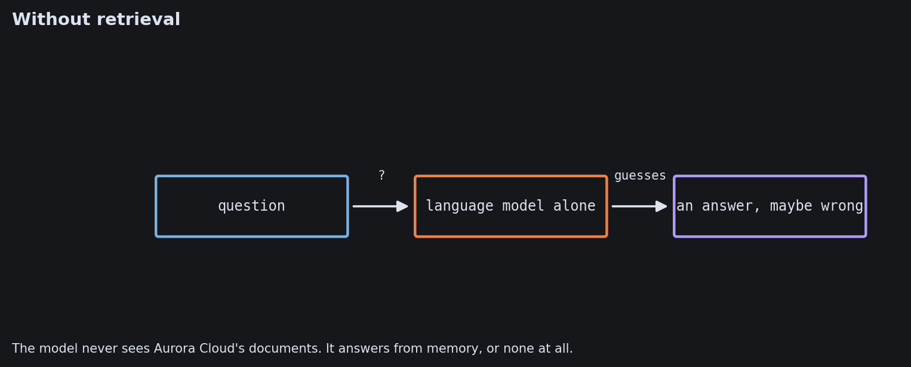{fig-align="center"}

## The Problem, and the Fix {auto-animate=true}

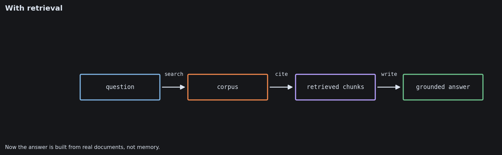{fig-align="center"}

## The Problem, and the Fix {auto-animate=true}

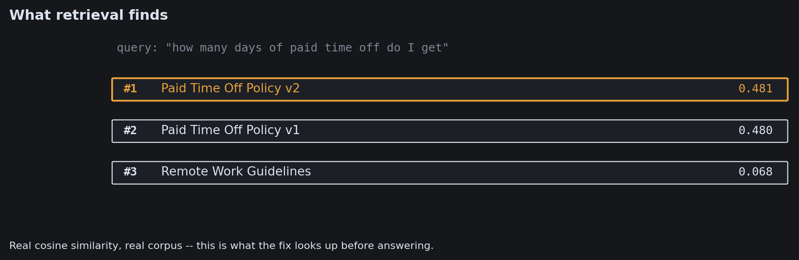{fig-align="center"}

## The Problem, and the Fix {auto-animate=true}

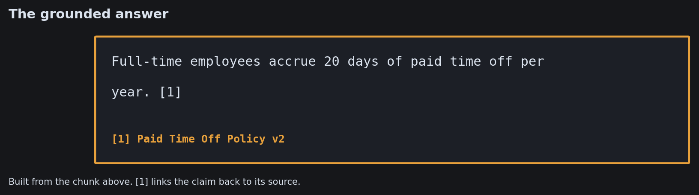{fig-align="center"}

---

# Two clocks, one system {.center}

::: lead
Building the index and answering a question are two different jobs, on two different clocks.
:::

One runs once, ahead of time. The other runs every time someone types a question.

::: notes
Every later topic (chunking, embeddings, hybrid search, reranking, prompts, refusals) is a closeup of one box here. Hold the shape and the details never get confusing about when they happen.
:::

---

## The corpus becomes a frozen index

The raw documents get chunked and turned into vectors a single time. After that, the index just sits there, ready to be searched.

```{=html}
<svg viewBox="0 0 1000 380" class="ragfig">
  <rect class="zone" x="30" y="60" width="940" height="260"/>
  <text class="zonelabel" x="500" y="92" text-anchor="middle">OFFLINE &middot; RUNS ONCE</text>

  <g class="fragment pop" data-fragment-index="1">
    <rect class="card" x="55" y="150" width="230" height="90"/>
    <text class="cardtext" x="77" y="201" style="font-size:20px">corpus</text>
  </g>
  <path class="flow draw fragment" data-fragment-index="2" pathLength="1" d="M 285 195 L 393 195"/>
  <g class="fragment pop" data-fragment-index="2">
    <text class="note" x="340" y="175" text-anchor="middle" style="font-size:13px">chunk</text>
    <rect class="card" x="395" y="150" width="230" height="90"/>
    <text class="cardtext" x="417" y="201" style="font-size:20px">chunks</text>
  </g>
  <path class="flow draw fragment" data-fragment-index="3" pathLength="1" d="M 625 195 L 733 195"/>
  <g class="fragment pop" data-fragment-index="3">
    <text class="note" x="680" y="175" text-anchor="middle" style="font-size:13px">embed + fit</text>
    <rect class="card" x="735" y="150" width="230" height="90"/>
    <text class="cardtext" x="757" y="201" style="font-size:20px">index</text>
  </g>
  <text class="note fragment" x="500" y="285" text-anchor="middle">A batch job. Nothing here is waiting on a question.</text>
</svg>
```

::: notes
The frozen-index assumption is what makes RAG cheap to run, and also what breaks when a corpus changes by the hour. Live-updating indexes come later. The naive loop just rebuilds from scratch.
:::

---

## Every question walks the same four steps

A question comes in, gets turned into a search, and the results get folded into a prompt before the model ever runs.

```{=html}
<svg viewBox="0 0 1000 380" class="ragfig">
  <rect class="zone" x="20" y="60" width="960" height="260"/>
  <text class="zonelabel" x="500" y="92" text-anchor="middle">ONLINE &middot; RUNS PER QUESTION</text>

  <g class="fragment pop" data-fragment-index="1">
    <rect class="card" x="45" y="150" width="190" height="90"/>
    <text class="cardtext" x="65" y="201" style="font-size:19px">query</text>
  </g>
  <path class="flow draw fragment" data-fragment-index="2" pathLength="1" d="M 235 195 L 281 195"/>
  <g class="fragment pop" data-fragment-index="2">
    <text class="note" x="258" y="175" text-anchor="middle" style="font-size:12px">search index</text>
    <rect class="card" x="285" y="150" width="190" height="90"/>
    <text class="cardtext" x="305" y="201" style="font-size:19px">retrieve</text>
  </g>
  <path class="flow draw fragment" data-fragment-index="3" pathLength="1" d="M 475 195 L 521 195"/>
  <g class="fragment pop" data-fragment-index="3">
    <text class="note" x="498" y="175" text-anchor="middle" style="font-size:12px">build prompt</text>
    <rect class="card" x="525" y="150" width="190" height="90"/>
    <text class="cardtext" x="545" y="201" style="font-size:19px">augment</text>
  </g>
  <path class="flow draw fragment" data-fragment-index="4" pathLength="1" d="M 715 195 L 761 195"/>
  <g class="fragment pop" data-fragment-index="4">
    <text class="note" x="738" y="175" text-anchor="middle" style="font-size:12px">call model</text>
    <rect class="card" x="765" y="150" width="190" height="90"/>
    <text class="cardtext" x="785" y="201" style="font-size:19px">generate</text>
  </g>
  <text class="note fragment" x="500" y="285" text-anchor="middle">Same four steps, every single time someone asks.</text>
</svg>
```

::: notes
Everything advanced later (reranking, query rewriting, sharper prompts) is a swap inside one of these four boxes. The shape of the loop never changes.
:::

---

## Same shape, very different rhythm

Both loops, side by side. One runs once, the other runs for every question.

```{=html}
<svg viewBox="0 0 1000 410" class="ragfig">
  <rect class="zone" x="40" y="40" width="400" height="340"/>
  <text class="zonelabel" x="240" y="72" text-anchor="middle">OFFLINE</text>

  <rect class="zone" x="560" y="40" width="380" height="340"/>
  <text class="zonelabel" x="750" y="72" text-anchor="middle">ONLINE</text>

  <g class="fragment pop" data-fragment-index="1">
    <rect class="card" x="90" y="95" width="300" height="58"/>
    <text class="cardtext" x="112" y="133" style="font-size:18px">corpus</text>
  </g>
  <path class="flow draw fragment" data-fragment-index="2" pathLength="1" d="M 240 153 L 240 183"/>
  <g class="fragment pop" data-fragment-index="2">
    <text class="note" x="270" y="173" style="font-size:12px">chunk</text>
    <rect class="card" x="90" y="185" width="300" height="58"/>
    <text class="cardtext" x="112" y="223" style="font-size:18px">chunks</text>
  </g>
  <path class="flow draw fragment" data-fragment-index="3" pathLength="1" d="M 240 243 L 240 273"/>
  <g class="fragment pop" data-fragment-index="3">
    <text class="note" x="270" y="263" style="font-size:12px">embed + fit</text>
    <rect class="card" x="90" y="275" width="300" height="58"/>
    <text class="cardtext" x="112" y="313" style="font-size:18px">index</text>
  </g>
  <text class="note fragment" x="240" y="363" text-anchor="middle">a batch job, ahead of time</text>

  <g class="fragment pop" data-fragment-index="4">
    <rect class="card" x="610" y="90" width="280" height="46"/>
    <text class="cardtext" x="632" y="121" style="font-size:17px">query</text>
  </g>
  <path class="flow draw fragment" data-fragment-index="5" pathLength="1" d="M 750 136 L 750 158"/>
  <g class="fragment pop" data-fragment-index="5">
    <text class="note" x="800" y="152" style="font-size:11px">search index</text>
    <rect class="card" x="610" y="160" width="280" height="46"/>
    <text class="cardtext" x="632" y="191" style="font-size:17px">retrieve</text>
  </g>
  <path class="flow draw fragment" data-fragment-index="6" pathLength="1" d="M 750 206 L 750 228"/>
  <g class="fragment pop" data-fragment-index="6">
    <text class="note" x="800" y="222" style="font-size:11px">build prompt</text>
    <rect class="card" x="610" y="230" width="280" height="46"/>
    <text class="cardtext" x="632" y="261" style="font-size:17px">augment</text>
  </g>
  <path class="flow draw fragment" data-fragment-index="7" pathLength="1" d="M 750 276 L 750 298"/>
  <g class="fragment pop" data-fragment-index="7">
    <text class="note" x="800" y="292" style="font-size:11px">call model</text>
    <rect class="card" x="610" y="300" width="280" height="46"/>
    <text class="cardtext" x="632" y="331" style="font-size:17px">generate</text>
  </g>
  <text class="note fragment" x="750" y="363" text-anchor="middle">runs again for every new question</text>

  <path class="flow draw fragment" data-fragment-index="8" pathLength="1" d="M 890 323 C 958 323, 958 113, 890 113"/>
  <text class="note fragment" data-fragment-index="8" x="978" y="218" text-anchor="end" style="font-size:12px">next question</text>
</svg>
```

::: notes
Left column runs once and is done. Right column is the loop, firing again for every question, always cold from the same frozen index. That coldness is the naive part, nothing carries between questions but the index.
:::

---

## This is the whole map

Everything from here on zooms into one box from this picture: how retrieval actually scores a match, how the prompt gets assembled, how the model is kept from making things up.

::: notes
The split between building the index and answering a question is the one fact to hold onto here. Get it right and every later concept has an obvious home.
:::


# The Naive RAG Loop

## The Naive RAG Loop {auto-animate=true}

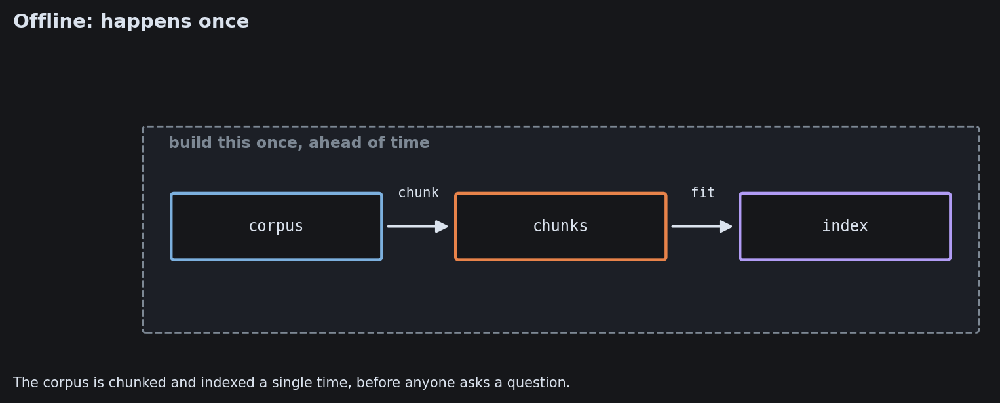{fig-align="center"}

## The Naive RAG Loop {auto-animate=true}

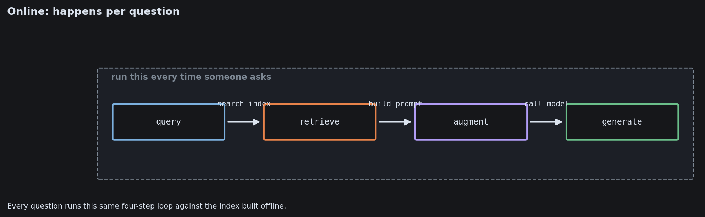{fig-align="center"}

## The Naive RAG Loop {auto-animate=true}

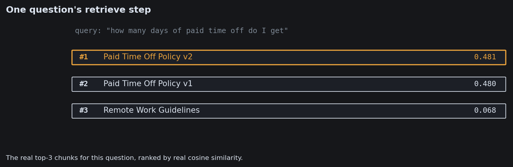{fig-align="center"}

## The Naive RAG Loop {auto-animate=true}

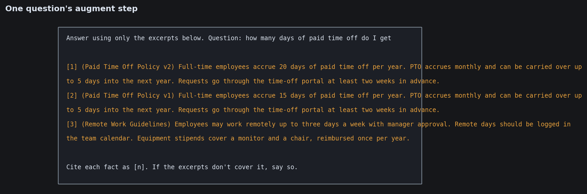{fig-align="center"}

---

# One document holds many facts {.center}

::: lead
A document mixes several separate facts into one block of text. A question only needs one of them back, not the whole page.
:::

```{=html}
<svg class="ragfig" viewBox="0 0 1000 400">
  <g class="fragment">
    <rect class="card" x="220" y="60" width="560" height="300"/>
    <text class="cap big" x="500" y="100" text-anchor="middle" style="fill:var(--accent)">Paid Time Off Policy v1</text>
    <rect class="card" x="260" y="130" width="480" height="50"/>
    <text class="cardtext" x="284" y="160">15 days accrued per year</text>
    <rect class="card" x="260" y="195" width="480" height="50"/>
    <text class="cardtext" x="284" y="225">carries over up to 5 days</text>
    <rect class="card" x="260" y="260" width="480" height="50"/>
    <text class="cardtext" x="284" y="290">request 2 weeks ahead</text>
  </g>
  <g class="fragment pop">
    <rect class="card hot" x="260" y="130" width="480" height="50"/>
    <path class="leader head" d="M 750 155 L 815 155"/>
    <text class="cap" x="890" y="150" text-anchor="middle" style="fill:var(--amber)">the one line</text>
    <text class="cap" x="890" y="173" text-anchor="middle" style="fill:var(--amber)">a query needs</text>
  </g>
  <text class="note" x="500" y="385" text-anchor="middle">Retrieval works chunk by chunk -- it can only hand back what it indexed as one unit.</text>
</svg>
```

::: notes
Indexed whole, this document answers every query that touches it with all three facts. Split, a question about accrual pulls only the accrual line. It is hr-01, the one the walkthrough splits later.
:::

---

## Equal, non-overlapping cuts can break an idea

A window of fixed size slides across the words. The simplest version just cuts, edge to edge, with nothing shared.

```{=html}
<svg class="ragfig" viewBox="0 0 1000 400">
  <g class="fragment">
    <rect class="card" x="40" y="210" width="58" height="40"/>
    <rect class="card" x="106" y="210" width="58" height="40"/>
    <rect class="card" x="172" y="210" width="58" height="40"/>
    <rect class="card" x="238" y="210" width="58" height="40"/>
    <rect class="card" x="304" y="210" width="58" height="40"/>
    <rect class="card" x="370" y="210" width="58" height="40"/>
    <rect class="card" x="436" y="210" width="58" height="40"/>
    <rect class="card" x="502" y="210" width="58" height="40"/>
    <rect class="card" x="568" y="210" width="58" height="40"/>
    <rect class="card" x="634" y="210" width="58" height="40"/>
  </g>
  <g class="fragment">
    <rect x="36" y="185" width="330" height="90" style="fill:var(--accent); fill-opacity:0.08; stroke:var(--accent); stroke-width:3; rx:14"/>
    <text class="cap" x="201" y="165" text-anchor="middle" style="fill:var(--accent)">chunk 1</text>
  </g>
  <g class="fragment">
    <rect x="366" y="185" width="330" height="90" style="fill:var(--feat); fill-opacity:0.08; stroke:var(--feat); stroke-width:3; rx:14"/>
    <text class="cap" x="531" y="165" text-anchor="middle" style="fill:var(--feat)">chunk 2</text>
  </g>
  <g class="fragment pop">
    <path class="leader head" d="M 366 178 L 366 288" style="stroke-dasharray:8 6"/>
    <text class="note" x="366" y="320" text-anchor="middle" style="fill:var(--amber)">a fact split here survives whole in neither chunk</text>
  </g>
</svg>
```

::: notes
Fixed-size cuts with no sharing are the baseline. They hold until an idea straddles a boundary, then it lands half in one chunk, half in the next. Overlap, on the next slide, fixes it.
:::

---

## Overlap keeps the idea whole

Shift the window by less than its full size, and consecutive chunks share a few words at the seam.

```{=html}
<svg class="ragfig" viewBox="0 0 1000 400">
  <g class="fragment">
    <rect class="card" x="40" y="210" width="58" height="40"/>
    <rect class="card" x="106" y="210" width="58" height="40"/>
    <rect class="card" x="172" y="210" width="58" height="40"/>
    <rect class="card" x="238" y="210" width="58" height="40"/>
    <rect class="card" x="304" y="210" width="58" height="40"/>
    <rect class="card" x="370" y="210" width="58" height="40"/>
    <rect class="card" x="436" y="210" width="58" height="40"/>
    <rect class="card" x="502" y="210" width="58" height="40"/>
    <rect class="card" x="568" y="210" width="58" height="40"/>
    <rect class="card" x="634" y="210" width="58" height="40"/>
  </g>
  <g class="fragment">
    <rect x="36" y="185" width="396" height="90" style="fill:var(--accent); fill-opacity:0.08; stroke:var(--accent); stroke-width:3; rx:14"/>
    <text class="cap" x="234" y="165" text-anchor="middle" style="fill:var(--accent)">chunk 1</text>
  </g>
  <g class="fragment">
    <rect x="300" y="185" width="396" height="90" style="fill:var(--feat); fill-opacity:0.08; stroke:var(--feat); stroke-width:3; rx:14"/>
    <text class="cap" x="498" y="305" text-anchor="middle" style="fill:var(--feat)">chunk 2</text>
  </g>
  <g class="fragment pop">
    <rect x="300" y="185" width="132" height="90" style="fill:var(--amber); fill-opacity:0.22; stroke:var(--amber); stroke-width:2; rx:8"/>
    <text class="note" x="366" y="234" text-anchor="middle" style="fill:var(--amber); font-weight:600">overlap</text>
  </g>
  <text class="note" x="500" y="380" text-anchor="middle">The last words of chunk 1 are the first words of chunk 2 -- the idea at the seam survives in both.</text>
</svg>
```

::: notes
The shared band does the work. Any idea that falls inside it survives in both neighbours, so the seam can no longer split it. The walkthrough checks the words themselves, asserting `chunk_i.text.split()[-5:] == chunk_{i+1}.text.split()[:5]`.
:::

---

## Size is a tradeoff

A bigger window swallows unrelated ideas into one chunk. A smaller window slices a single idea into fragments that lose their surrounding context.

```{=html}
<svg class="ragfig" viewBox="0 0 1000 400">
  <g class="fragment pop">
    <rect class="card hot" x="60" y="90" width="400" height="240"/>
    <text class="cap" x="260" y="70" text-anchor="middle" style="fill:var(--amber)">size too big</text>
    <rect class="tag main" x="100" y="140" width="140" height="36"/>
    <text class="tagtext" x="170" y="163" text-anchor="middle">pricing</text>
    <rect class="tag feat" x="260" y="140" width="150" height="36"/>
    <text class="tagtext" x="335" y="163" text-anchor="middle">retention</text>
    <rect class="tag head" x="100" y="210" width="170" height="36"/>
    <text class="tagtext" x="185" y="233" text-anchor="middle">encryption</text>
    <text class="note" x="260" y="300" text-anchor="middle">three unrelated facts, one chunk</text>
  </g>
  <g class="fragment pop">
    <rect class="card hot" x="540" y="90" width="400" height="240"/>
    <text class="cap" x="740" y="70" text-anchor="middle" style="fill:var(--amber)">size too small</text>
    <rect class="card" x="560" y="150" width="100" height="40"/>
    <text class="cardtext" x="568" y="175" style="font-size:13px">...costs 6</text>
    <rect class="card" x="680" y="150" width="100" height="40"/>
    <text class="cardtext" x="688" y="175" style="font-size:13px">dollars a</text>
    <rect class="card" x="800" y="150" width="100" height="40"/>
    <text class="cardtext" x="808" y="175" style="font-size:13px">month...</text>
    <path class="edge" d="M 660 170 L 680 170" style="stroke-dasharray:4 4"/>
    <path class="edge" d="M 780 170 L 800 170" style="stroke-dasharray:4 4"/>
    <text class="note" x="740" y="300" text-anchor="middle">one idea, chopped into pieces with no context</text>
  </g>
  <text class="note" x="500" y="370" text-anchor="middle">There is no universally right size -- it depends on how self-contained your documents' ideas are.</text>
</svg>
```

::: notes
The two failures hurt retrieval in opposite ways. A big chunk dilutes what the retriever matches on. A small one stops being a coherent unit. Aurora Cloud's default is size=40, overlap=10, and the walkthrough shrinks it to show the damage.
:::

---

## Most of Aurora Cloud's documents need no splitting at all

Under the window this pipeline uses, nearly every one of the 48 documents collapses to a single chunk. Shrink the window, and one of them finally splits.

```{=html}
<svg class="ragfig" viewBox="0 0 1000 400">
  <g class="fragment">
    <text class="zonelabel" x="500" y="110" text-anchor="middle">48 SHORT DOCUMENTS</text>
    <rect class="card" x="300" y="150" width="40" height="90"/>
    <rect class="card" x="350" y="150" width="40" height="90"/>
    <rect class="card" x="400" y="150" width="40" height="90"/>
    <rect class="card" x="450" y="150" width="40" height="90"/>
    <rect class="card" x="500" y="150" width="40" height="90"/>
    <rect class="card hot" x="550" y="150" width="40" height="90"/>
    <rect class="card" x="600" y="150" width="40" height="90"/>
    <rect class="card" x="650" y="150" width="40" height="90"/>
    <rect class="card" x="700" y="150" width="40" height="90"/>
    <rect class="card" x="750" y="150" width="40" height="90"/>
    <rect class="card" x="800" y="150" width="40" height="90"/>
    <rect class="card" x="850" y="150" width="40" height="90"/>
  </g>
  <g class="fragment pop">
    <path class="leader head" d="M 570 244 L 570 280"/>
    <text class="cap" x="570" y="305" text-anchor="middle" style="fill:var(--amber)">this one splits</text>
  </g>
  <text class="note" x="500" y="370" text-anchor="middle">The walkthrough shrinks the window until one document splits, then checks the overlap word for word.</text>
</svg>
```

::: notes
Each square is one Aurora Cloud document. At size=40 with overlap=10, all 48 stay intact, a count taken from the corpus itself. The flipbook drops to size=15, catches one document splitting, and compares the overlapping words directly.
:::


# Chunking the Corpus

## Chunking the Corpus {auto-animate=true}

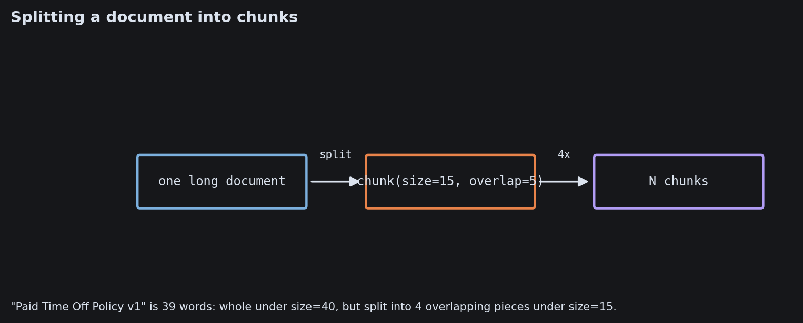{fig-align="center"}

## Chunking the Corpus {auto-animate=true}

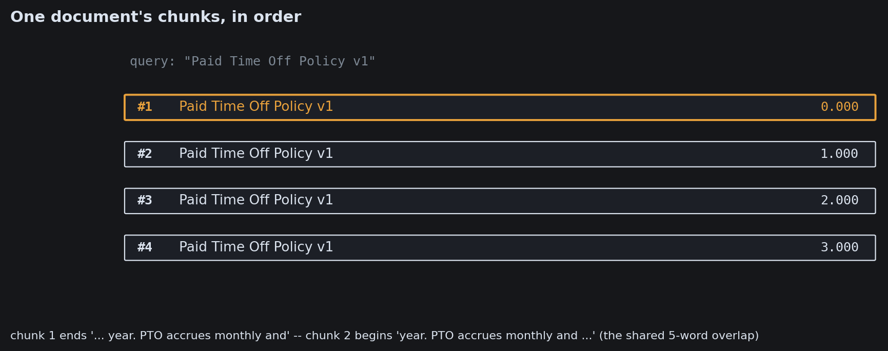{fig-align="center"}

## Chunking the Corpus {auto-animate=true}

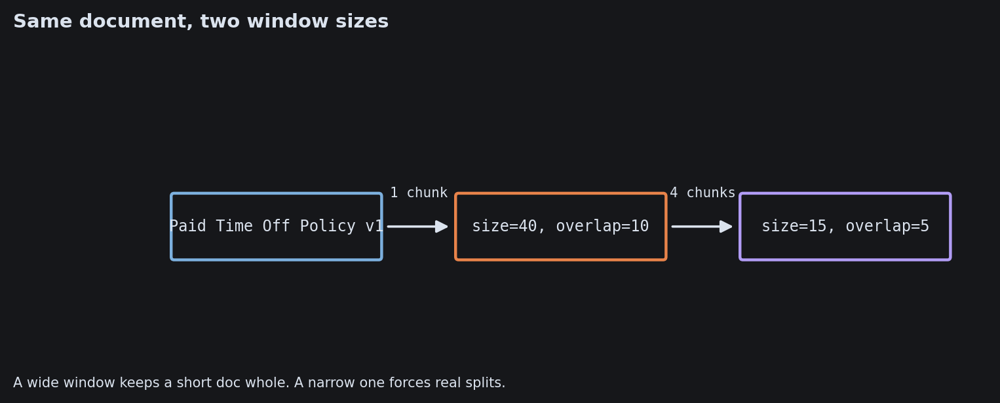{fig-align="center"}

---

# Embeddings are geometry {.center}

::: lead
A chunk of text turns into a list of numbers. That list is a location, somewhere you could point to on a map.
:::

Once meaning has a location, comparing meanings becomes measuring distance.

::: notes
Retrieval, hybrid search, and reranking all sit on this one move. Once a chunk has coordinates, finding relevant text becomes arithmetic on distances.
:::

---

## A chunk becomes a point in space

```{=html}
<svg viewBox="0 0 1000 400" class="ragfig">
  <g class="fragment">
    <rect class="card" x="40" y="150" width="270" height="100"/>
    <text class="cardtext" x="60" y="185">"requests for time off</text>
    <text class="cardtext" x="60" y="210">must be submitted two</text>
    <text class="cardtext" x="60" y="235">weeks in advance..."</text>
    <text class="cap" x="175" y="128">a chunk of text</text>
  </g>
  <g class="fragment">
    <path class="flow" d="M 316 200 L 380 200"/>
    <text class="note" x="348" y="182" text-anchor="middle" style="font-size:13px">vectorize</text>
  </g>
  <g class="fragment">
    <rect class="card" x="385" y="165" width="270" height="70"/>
    <text class="cardtext" x="405" y="192">[0.02, 0.31, 0.00,</text>
    <text class="cardtext" x="405" y="217">0.18, 0.00, ...]</text>
    <text class="cap" x="520" y="128">a TF-IDF vector</text>
  </g>
  <g class="fragment">
    <path class="flow" d="M 661 200 L 725 200"/>
    <text class="note" x="693" y="182" text-anchor="middle" style="font-size:13px">project</text>
  </g>
  <g class="fragment pop">
    <circle class="node" cx="830" cy="200" r="34"/>
    <text class="cap big" x="830" y="128" style="fill:var(--accent)">a point in space</text>
  </g>
</svg>
```

::: notes
Any vectorizer works here, TF-IDF word counts or a neural embedding model. This deck uses TF-IDF because it is transparent, every coordinate traces back to words you can see in the chunk.
:::

---

## Hundreds of numbers, two you can draw

```{=html}
<svg viewBox="0 0 1000 400" class="ragfig">
  <g class="fragment">
    <text class="cap" x="500" y="80" style="fill:var(--muted)">a real vector has hundreds of numbers</text>
    <rect class="card" x="120" y="120" width="34" height="34"/>
    <rect class="card" x="164" y="120" width="34" height="34"/>
    <rect class="card" x="208" y="120" width="34" height="34"/>
    <rect class="card" x="252" y="120" width="34" height="34"/>
    <text class="note" x="310" y="142">...</text>
    <rect class="card" x="360" y="120" width="34" height="34"/>
    <rect class="card" x="404" y="120" width="34" height="34"/>
    <rect class="card" x="448" y="120" width="34" height="34"/>
    <rect class="card" x="492" y="120" width="34" height="34"/>
    <text class="note" x="700" y="142">...</text>
    <rect class="card" x="750" y="120" width="34" height="34"/>
    <rect class="card" x="794" y="120" width="34" height="34"/>
    <rect class="card" x="838" y="120" width="34" height="34"/>
    <text class="note" x="500" y="192" text-anchor="middle">one number per dimension of meaning</text>
  </g>
  <g class="fragment">
    <path class="flow" d="M 500 210 L 500 250"/>
    <text class="note" x="500" y="238" text-anchor="middle" style="font-size:13px">keep the 2 that separate topics best</text>
  </g>
  <g class="fragment pop">
    <path d="M 350 355 L 350 270" style="stroke:var(--edge);stroke-width:1.5;fill:none"/>
    <path d="M 350 355 L 650 355" style="stroke:var(--edge);stroke-width:1.5;fill:none"/>
    <circle class="node" cx="500" cy="310" r="18"/>
    <text class="note" x="500" y="390" text-anchor="middle">a flat picture you can actually look at</text>
  </g>
</svg>
```

::: notes
The pictures here are a 2D projection (TruncatedSVD on the TF-IDF matrix), not the full embedding. Projecting loses some distances, but it keeps enough structure that near on the page means near in meaning.
:::

---

## Related chunks land close together

```{=html}
<svg viewBox="0 0 1000 400" class="ragfig">
  <g class="fragment">
    <rect class="zone" x="185" y="175" width="220" height="150" style="stroke-dasharray:5 4"/>
    <circle class="node" cx="260" cy="220" r="26"/>
    <circle class="node" cx="330" cy="260" r="26"/>
    <circle class="node" cx="230" cy="290" r="26"/>
    <text class="note" x="270" y="180" text-anchor="middle">"PTO"</text>
    <text class="note" x="370" y="245" text-anchor="middle">"parental leave"</text>
    <text class="note" x="150" y="305" text-anchor="middle">"sick days"</text>
    <text class="cap" x="295" y="360" style="fill:var(--accent)">close together = related</text>
  </g>
  <g class="fragment pop">
    <circle class="node ghost" cx="800" cy="150" r="26"/>
    <text class="note" x="800" y="110" text-anchor="middle">"sharpen a kitchen knife"</text>
    <text class="cap" x="800" y="200" style="fill:var(--muted)">far away = unrelated</text>
  </g>
</svg>
```

::: notes
The three HR questions share vocabulary, so they land in the same neighborhood. The kitchen-knife question shares almost none, so it sits far off on its own.
:::

---

## Search by meaning is search by distance

The query is vectorized like every chunk, then dropped onto the same map.

```{=html}
<svg viewBox="0 0 1000 400" class="ragfig">
  <rect class="zone" x="185" y="175" width="220" height="150" style="stroke-dasharray:5 4"/>
  <circle class="node" cx="260" cy="220" r="24"/>
  <circle class="node" cx="330" cy="260" r="24"/>
  <circle class="node" cx="230" cy="290" r="24"/>
  <circle class="node ghost" cx="800" cy="150" r="24"/>
  <g class="fragment pop">
    <circle class="node merge" cx="300" cy="330" r="22"/>
    <text class="cap" x="300" y="378" style="fill:var(--amber)">query: "how many days off do I get"</text>
  </g>
  <g class="fragment">
    <path class="edge draw" pathLength="1" d="M 300 308 L 260 244" style="stroke:var(--amber);marker-end:none"/>
    <text class="note" x="140" y="270" style="fill:var(--amber);font-size:13px">nearest -> this is the answer</text>
  </g>
  <g class="fragment">
    <path d="M 320 315 L 780 172" style="stroke:var(--muted);stroke-width:1.5;stroke-dasharray:4 4;fill:none"/>
    <text class="note" x="640" y="230" style="fill:var(--muted);font-size:13px">far -> never considered</text>
  </g>
</svg>
```

::: notes
So "search by meaning" gets a concrete definition, nearest neighbor on the map. Retrieval, the next section, does the same thing across the whole corpus, using cosine similarity as the distance.
:::

---

## The next screens are the real thing {.center}

This is the Aurora Cloud corpus itself, 48 documents chunked into TF-IDF vectors and projected to two axes. Each dot is a chunk, colored by its document tag. The star is a query, placed by the same vectorizer.


# Embeddings Are Geometry

## Embeddings Are Geometry {auto-animate=true}

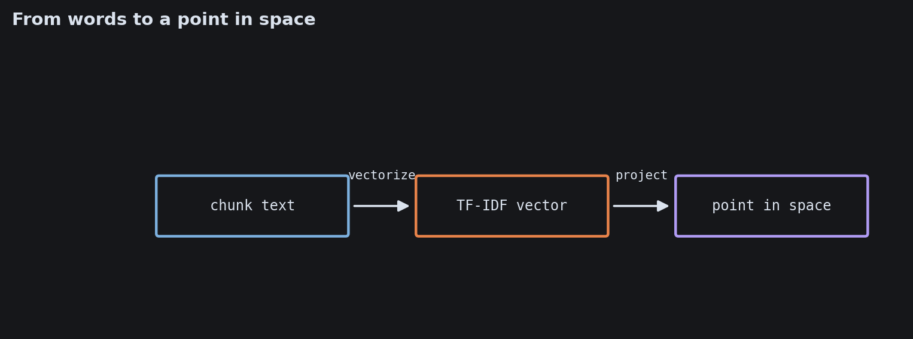{fig-align="center"}

## Embeddings Are Geometry {auto-animate=true}

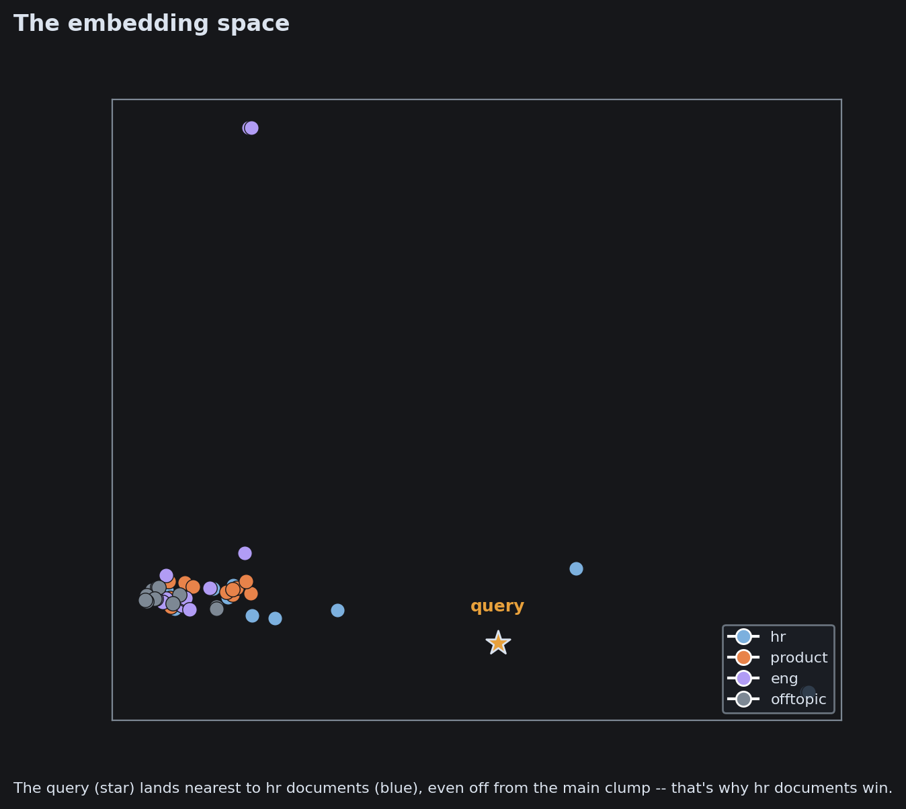{fig-align="center"}

## Embeddings Are Geometry {auto-animate=true}

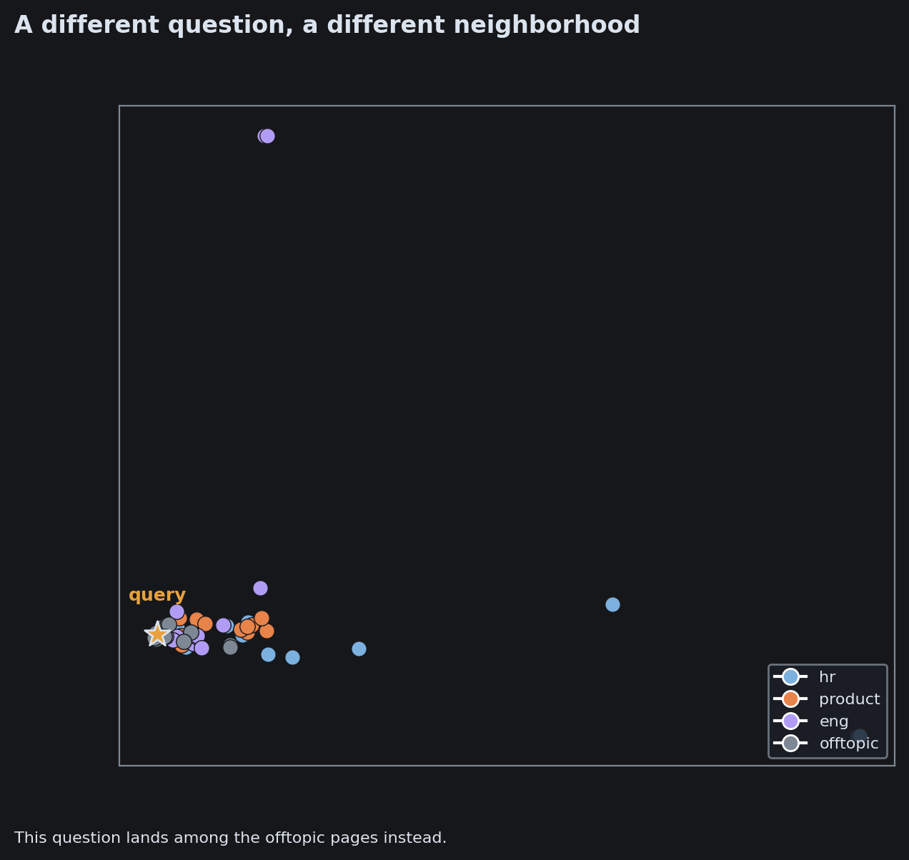{fig-align="center"}

---

# Building the Index {.center}

::: lead
Every chunk now has a vector. Those vectors don't sit around loose, they
get packed into one structure, the index. Building it happens once.
Answering a question against it never rebuilds it.
:::

::: notes
The bridge from "embeddings as geometry" to "retrieval". Once each of the
48 chunks is a point in space, the points get stored together as one fitted
object -- the TF-IDF matrix plus the vectorizer that built it. Fitting
happens once. Every later question is just a lookup against that same
object.
:::

---

## Vectors get stored together

48 separate vectors. One structure holds all of them.

```{=html}
<svg class="ragfig" viewBox="0 0 1000 400">
  <g class="fragment pop">
    <circle class="node" cx="150" cy="120" r="16"/>
    <circle class="node" cx="230" cy="180" r="16"/>
    <circle class="node" cx="130" cy="240" r="16"/>
    <circle class="node" cx="270" cy="90"  r="16"/>
    <circle class="node" cx="190" cy="300" r="16"/>
    <circle class="node" cx="310" cy="230" r="16"/>
    <text class="cap" x="220" y="350">48 chunk vectors</text>
  </g>
  <path class="edge draw fragment" pathLength="1" d="M 162 126 L 620 195"/>
  <path class="edge draw fragment" pathLength="1" d="M 240 184 L 620 202"/>
  <path class="edge draw fragment" pathLength="1" d="M 140 243 L 620 210"/>
  <path class="edge draw fragment" pathLength="1" d="M 278 94  L 620 190"/>
  <path class="edge draw fragment" pathLength="1" d="M 200 302 L 620 216"/>
  <path class="edge draw fragment" pathLength="1" d="M 318 232 L 620 205"/>
  <g class="fragment pop">
    <rect class="card hot" x="620" y="150" width="280" height="100"/>
    <text class="cap big" x="760" y="207" text-anchor="middle">the index</text>
  </g>
  <text class="note" x="500" y="385" text-anchor="middle">Packed into one shared structure, right now.</text>
</svg>
```

::: notes
Under the hood it's one `VectorIndex` object, a fitted `TfidfVectorizer`
plus the matrix of every chunk's vector. No per-chunk index. One index that
holds 48 rows.
:::

---

## Fit once, then query without limit

The fit is a single event. Every search after it is free to repeat.

```{=html}
<svg class="ragfig" viewBox="0 0 1000 400">
  <line x1="120" y1="230" x2="900" y2="230" style="stroke:var(--rule);stroke-width:2"/>
  <g class="fragment pop">
    <text class="zonelabel" x="220" y="90">BUILD ONCE</text>
    <circle class="node merge" cx="220" cy="230" r="28"/>
    <text class="cap" x="220" y="175">fit the index</text>
  </g>
  <path class="edge draw fragment" pathLength="1" d="M 248 230 L 900 230" style="stroke-dasharray:8 6"/>
  <text class="zonelabel" x="620" y="90">QUERY ANY NUMBER OF TIMES</text>
  <g class="fragment pop">
    <circle class="node" cx="400" cy="230" r="18"/>
    <text class="cap" x="400" y="290">search #1</text>
  </g>
  <g class="fragment pop">
    <circle class="node" cx="570" cy="230" r="18"/>
    <text class="cap" x="570" y="290">search #2</text>
  </g>
  <g class="fragment pop">
    <circle class="node" cx="740" cy="230" r="18"/>
    <text class="cap" x="740" y="290">search #3</text>
  </g>
  <g class="fragment pop">
    <text class="cap big" x="860" y="238" text-anchor="middle">...</text>
  </g>
  <text class="note" x="500" y="365" text-anchor="middle">The fit sits at the left edge, once. Everything to its right is the same lookup, repeated.</text>
</svg>
```

::: notes
The piece people miss. Fitting builds the vocabulary and the matrix, and
its cost stops mattering because it runs only once. What recurs is search,
and search is cheap.
:::

---

## Many questions, one index

Three unrelated questions. One already-built index answers all of them.

```{=html}
<svg class="ragfig" viewBox="0 0 1000 400">
  <rect class="card hot" x="370" y="260" width="260" height="90"/>
  <text class="cap big" x="500" y="312" text-anchor="middle">the index</text>

  <g class="fragment pop" data-fragment-index="1">
    <rect class="card" x="40" y="40" width="300" height="80"/>
    <text class="cardtext" x="60" y="70">"how many days of PTO</text>
    <text class="cardtext" x="60" y="94">do I get?"</text>
  </g>
  <path class="edge draw fragment" data-fragment-index="1" pathLength="1" d="M 200 120 L 415 260"/>

  <g class="fragment pop" data-fragment-index="2">
    <rect class="card" x="360" y="10" width="280" height="80"/>
    <text class="cardtext" x="380" y="40">"what happens during a</text>
    <text class="cardtext" x="380" y="64">database outage?"</text>
  </g>
  <path class="edge draw fragment" data-fragment-index="2" pathLength="1" d="M 500 90 L 500 258"/>

  <g class="fragment pop" data-fragment-index="3">
    <rect class="card" x="660" y="40" width="300" height="80"/>
    <text class="cardtext" x="680" y="70">"how do I sharpen a</text>
    <text class="cardtext" x="680" y="94">kitchen knife?"</text>
  </g>
  <path class="edge draw fragment" data-fragment-index="3" pathLength="1" d="M 800 120 L 585 260"/>

  <text class="note" x="500" y="385" text-anchor="middle">PTO, outage, and an off-topic knife question, all on one index, zero refits.</text>
</svg>
```

::: notes
All three call `.search()` on the fitted object from the top of the
section. Even the knife question, which the corpus barely covers, runs the
identical code path.
:::

---

## The index never rebuilds

The wrong mental model refits per question. The right one fits once.

```{=html}
<svg class="ragfig" viewBox="0 0 1000 400">
  <text class="zonelabel" x="500" y="45" text-anchor="middle">NOT THIS</text>
  <g class="fragment pop">
    <rect class="node ghost" x="120" y="65" width="180" height="70"/>
    <text class="cap" x="210" y="105" text-anchor="middle">rebuild</text>
    <rect class="node ghost" x="410" y="65" width="180" height="70"/>
    <text class="cap" x="500" y="105" text-anchor="middle">rebuild</text>
    <rect class="node ghost" x="700" y="65" width="180" height="70"/>
    <text class="cap" x="790" y="105" text-anchor="middle">rebuild</text>
    <text class="note" x="500" y="160" text-anchor="middle">a fresh index per question, thrown away every time</text>
  </g>

  <line x1="80" y1="195" x2="920" y2="195" style="stroke:var(--rule);stroke-width:1.5;stroke-dasharray:4 4"/>

  <text class="zonelabel" x="500" y="235" text-anchor="middle">THIS</text>
  <g class="fragment pop">
    <rect class="card hot" x="410" y="250" width="180" height="70"/>
    <text class="cap" x="500" y="290" text-anchor="middle">one index</text>
    <path class="flow" d="M 480 250 C 380 205, 260 295, 210 320"/>
    <path class="flow" d="M 500 250 L 500 320"/>
    <path class="flow" d="M 520 250 C 620 205, 740 295, 790 320"/>
    <text class="cap" x="210" y="345" text-anchor="middle">search</text>
    <text class="cap" x="500" y="345" text-anchor="middle">search</text>
    <text class="cap" x="790" y="345" text-anchor="middle">search</text>
  </g>
  <text class="note" x="500" y="385" text-anchor="middle">Built once, searched as many times as there are questions. Next, watch it happen live.</text>
</svg>
```

::: notes
The failure to rule out is treating "build the index" as a step inside the
query loop. It runs once, before the first question arrives, and every
later question is a pure read against it.
:::

---

## Choosing an embedding method

Before committing to TF-IDF or a neural model, hold the inputs fixed and score every candidate on the same four axes.

```{=html}
<svg class="ragfig" viewBox="0 0 1000 400">
  <text class="zonelabel" x="150" y="88" text-anchor="middle">HELD FIXED</text>
  <rect class="card" x="45" y="108" width="205" height="184"/>
  <text class="cardtext" x="72" y="158">corpus</text>
  <text class="cardtext" x="72" y="205">chunking</text>
  <text class="cardtext" x="72" y="252">eval queries</text>

  <path class="edge draw fragment" pathLength="1" d="M 250 200 L 340 200"/>

  <g class="fragment pop">
    <text class="zonelabel" x="700" y="55" text-anchor="middle">SCORE ON THE SAME FOUR AXES</text>
    <text class="cap" x="534" y="92" text-anchor="middle">retrieval</text>
    <text class="cap" x="534" y="112" text-anchor="middle">quality</text>
    <text class="cap" x="662" y="102" text-anchor="middle">latency</text>
    <text class="cap" x="790" y="102" text-anchor="middle">storage</text>
    <text class="cap" x="918" y="92" text-anchor="middle">answer</text>
    <text class="cap" x="918" y="112" text-anchor="middle">quality</text>
    <line x1="340" y1="128" x2="982" y2="128" style="stroke:var(--rule);stroke-width:1.5"/>
  </g>

  <g class="fragment pop">
    <rect class="card" x="340" y="140" width="642" height="66"/>
    <text class="cardtext" x="356" y="180">TF-IDF</text>
    <text class="cap" x="534" y="181" text-anchor="middle">&#9679;&#9679;&#9675;</text>
    <text class="cap" x="662" y="181" text-anchor="middle">&#9679;&#9679;&#9679;</text>
    <text class="cap" x="790" y="181" text-anchor="middle">&#9679;&#9679;&#9679;</text>
    <text class="cap" x="918" y="181" text-anchor="middle">&#9679;&#9679;&#9675;</text>
  </g>

  <g class="fragment pop">
    <rect class="card" x="340" y="214" width="642" height="66"/>
    <text class="cardtext" x="356" y="254">neural embed</text>
    <text class="cap" x="534" y="255" text-anchor="middle">&#9679;&#9679;&#9679;</text>
    <text class="cap" x="662" y="255" text-anchor="middle">&#9679;&#9675;&#9675;</text>
    <text class="cap" x="790" y="255" text-anchor="middle">&#9679;&#9675;&#9675;</text>
    <text class="cap" x="918" y="255" text-anchor="middle">&#9679;&#9679;&#9679;</text>
  </g>

  <text class="note" x="500" y="330" text-anchor="middle">Same corpus, same questions, scored on all four axes at once.</text>
</svg>
```

::: notes
The four axes pull against each other. Neural embeddings usually win retrieval and answer quality -- TF-IDF wins latency and storage. Holding the corpus, chunking, and eval queries fixed is what makes the numbers comparable. What feels more semantic is not the tiebreaker.
:::


# Building the Index

## Building the Index {auto-animate=true}

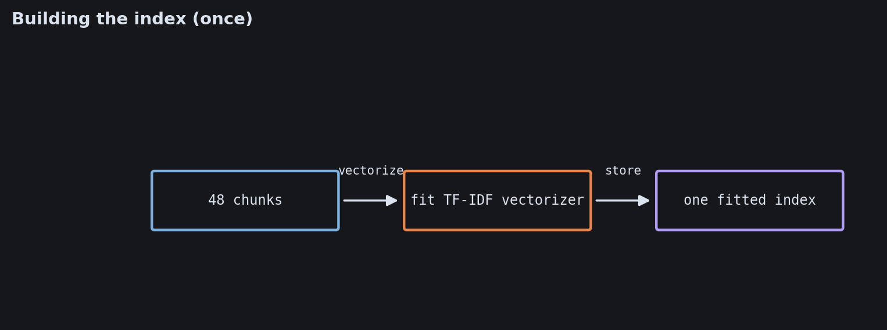{fig-align="center"}

## Building the Index {auto-animate=true}

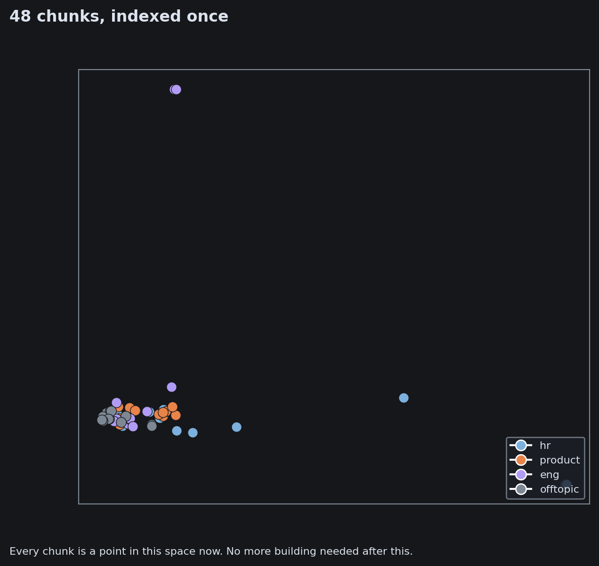{fig-align="center"}

## Building the Index {auto-animate=true}

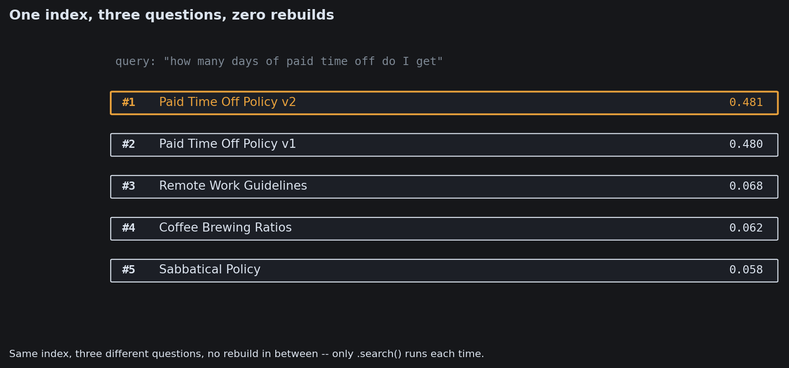{fig-align="center"}

---

# Retrieval: The Nearest Points Win {.center}

::: lead
The index holds 48 points. Retrieval is the one move that matters. Drop the query
onto the same map, and read off whichever points sit closest.
:::

Nothing about retrieval is mysterious once the geometry is in place. It's a distance
calculation, run once per question.

::: notes
Two earlier ideas set this up. Embeddings gave every chunk a location, the index
made those locations searchable. Retrieval spends both at once, turning a question
from text to match into a point to locate.
:::

---

## From a question to a ranked list

```{=html}
<svg class="ragfig" viewBox="0 0 1000 380">
  <g class="fragment pop">
    <rect class="card" x="60" y="150" width="260" height="70"/>
    <text class="cardtext" x="80" y="182">"how many days of</text>
    <text class="cardtext" x="80" y="204">PTO do I get?"</text>
  </g>
  <path class="flow draw fragment" pathLength="1" d="M 320 185 L 390 185"/>
  <g class="fragment pop">
    <text class="note" x="355" y="165" text-anchor="middle" style="font-size:13px">vectorize</text>
    <rect class="node" x="395" y="150" width="180" height="70" rx="10"/>
    <text class="cap" x="485" y="192" text-anchor="middle">query vector</text>
  </g>
  <path class="flow draw fragment" pathLength="1" d="M 575 185 L 645 185"/>
  <g class="fragment pop">
    <text class="note" x="610" y="165" text-anchor="middle" style="font-size:13px">compare</text>
    <rect class="node" x="650" y="150" width="180" height="70" rx="10"/>
    <text class="cap" x="740" y="192" text-anchor="middle">48 chunk scores</text>
  </g>
  <path class="flow draw fragment" pathLength="1" d="M 830 185 L 900 185"/>
  <g class="fragment pop">
    <rect class="card hot" x="905" y="150" width="70" height="70"/>
    <text class="cap" x="940" y="192" text-anchor="middle">top-k</text>
  </g>
  <text class="note fragment" x="500" y="300" text-anchor="middle">Every chunk gets a score. Only the highest few ever get shown to anyone.</text>
</svg>
```

::: notes
The query runs through the same vectorizer used on every chunk, so the distances
mean something. Cosine scores all 48 at once, and the top-k is a sort away.
:::

---

## Nearest wins, and "nearest" is a number

```{=html}
<svg class="ragfig" viewBox="0 0 1000 360">
  <circle class="node merge" cx="500" cy="180" r="24"/>
  <text class="cap" x="500" y="140" text-anchor="middle" style="fill:var(--amber)">query</text>
  <g class="fragment">
    <circle class="node" cx="330" cy="140" r="18"/>
    <path class="edge draw" pathLength="1" d="M 480 190 L 348 148"/>
    <text class="note" x="300" y="110" text-anchor="middle" style="fill:var(--feat)">0.481 (close)</text>
  </g>
  <g class="fragment">
    <circle class="node" cx="740" cy="230" r="18"/>
    <path class="edge draw" pathLength="1" d="M 520 195 L 725 226"/>
    <text class="note" x="770" y="270" text-anchor="middle" style="fill:var(--muted)">0.068 (far)</text>
  </g>
  <g class="fragment">
    <circle class="node" cx="620" cy="90" r="18"/>
    <path class="edge draw" pathLength="1" d="M 510 160 L 610 100"/>
    <text class="note" x="660" y="70" text-anchor="middle" style="fill:var(--muted)">0.062 (far)</text>
  </g>
  <text class="cap big fragment" x="500" y="330" text-anchor="middle">Rank by score, take the top few, done.</text>
</svg>
```

::: notes
Retrieval has no threshold. It returns its top-k every time, whether the best score
is 0.48 or 0.02. A weak top score is generation's problem -- cite or refuse -- a few
concepts out.
:::

---

## The next screens are the real thing

Everything ahead is computed live, the Aurora Cloud corpus, the index from the last
concept, and one query pushed through `.search()`. No staged numbers.

::: notes
Two things to watch. The PTO query lands right on top of the hr documents in the
map. A second, uncovered question comes back with uniformly low scores, retrieval
still answers, just with nothing behind it.
:::

---

## One score shown, five metrics reported

```{=html}
<svg class="ragfig" viewBox="0 0 1000 400">
  <g class="fragment pop">
    <rect class="card hot" x="28" y="116" width="168" height="80"/>
    <text class="cap" x="112" y="150" text-anchor="middle">raw cosine</text>
    <text class="cap" x="112" y="176" text-anchor="middle" style="fill:var(--amber)">0.481</text>
  </g>
  <text class="note" x="112" y="214" text-anchor="middle" style="font-size:13px">what the deck has shown</text>
  <g class="fragment">
    <path class="edge draw" pathLength="1" d="M 196 152 L 280 38"/>
    <rect class="card" x="280" y="14" width="690" height="48"/>
    <text class="cap" x="300" y="44" style="text-anchor:start;font-weight:600;fill:var(--accent)">Recall@K</text>
    <text class="note" x="472" y="44">did the right document land anywhere in the top K?</text>
  </g>
  <g class="fragment">
    <path class="edge draw" pathLength="1" d="M 196 154 L 280 97"/>
    <rect class="card" x="280" y="73" width="690" height="48"/>
    <text class="cap" x="300" y="103" style="text-anchor:start;font-weight:600;fill:var(--accent)">Hit Rate@K</text>
    <text class="note" x="472" y="103">yes or no, was it in the top K at all?</text>
  </g>
  <g class="fragment">
    <path class="edge draw" pathLength="1" d="M 196 156 L 280 156"/>
    <rect class="card" x="280" y="132" width="690" height="48"/>
    <text class="cap" x="300" y="162" style="text-anchor:start;font-weight:600;fill:var(--accent)">MRR</text>
    <text class="note" x="472" y="162">how near #1? higher when the answer ranks first</text>
  </g>
  <g class="fragment">
    <path class="edge draw" pathLength="1" d="M 196 158 L 280 215"/>
    <rect class="card" x="280" y="191" width="690" height="48"/>
    <text class="cap" x="300" y="221" style="text-anchor:start;font-weight:600;fill:var(--accent)">nDCG</text>
    <text class="note" x="472" y="221">is the whole ranking order right, best chunks first?</text>
  </g>
  <g class="fragment">
    <path class="edge draw" pathLength="1" d="M 196 160 L 280 274"/>
    <rect class="card" x="280" y="250" width="690" height="48"/>
    <text class="cap" x="300" y="280" style="text-anchor:start;font-weight:600;fill:var(--accent)">Precision@K</text>
    <text class="note" x="472" y="280">how much of the top K is on-topic?</text>
  </g>
  <text class="cap big fragment" x="500" y="344" text-anchor="middle">Real evaluation reports these against a labeled query set.</text>
  <text class="note fragment" x="500" y="376" text-anchor="middle">Recall leads, a chunk that is never retrieved can never be cited.</text>
</svg>
```

::: notes
None of these come from one query. They need a labeled set of questions paired with
the chunks that truly answer them. For RAG, recall@k is usually the headline,
whatever retrieval drops, the generator never gets a second chance at it.
:::


# Retrieval: The Nearest Points Win

## Retrieval: The Nearest Points Win {auto-animate=true}

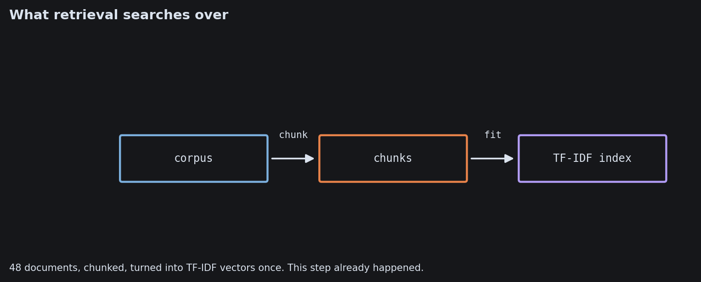{fig-align="center"}

## Retrieval: The Nearest Points Win {auto-animate=true}

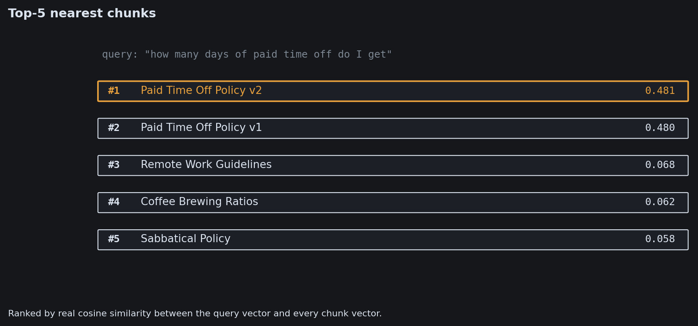{fig-align="center"}

## Retrieval: The Nearest Points Win {auto-animate=true}

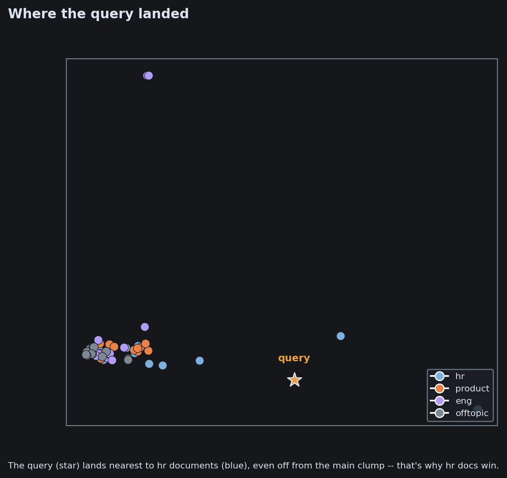{fig-align="center"}

## Retrieval: The Nearest Points Win {auto-animate=true}

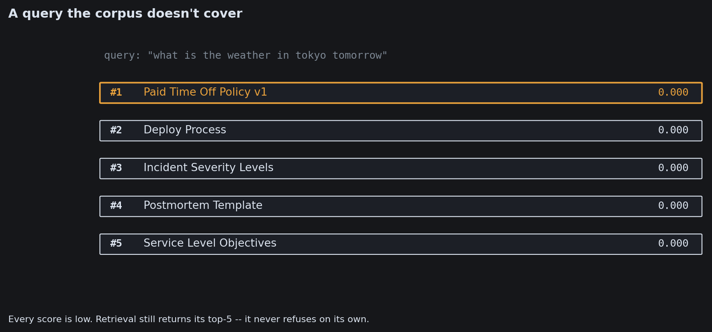{fig-align="center"}

---

# One ranking isn't enough {.center}

::: lead
Dense search ranks by meaning. Sparse search ranks by exact words. Run the same
query through both and they don't agree. Fusing the two beats trusting either alone.
:::

---

## Dense vs. sparse: two different notions of "relevant"

```{=html}
<svg class="ragfig" viewBox="0 0 1000 400">
  <g class="fragment">
    <rect class="zone" x="40" y="55" width="430" height="300"/>
    <text class="zonelabel" x="255" y="90" text-anchor="middle" style="fill:var(--accent)">DENSE · COSINE SIMILARITY</text>
    <text class="note" x="118" y="155">query</text>
    <circle class="node" cx="150" cy="205" r="34"/><text class="hash" x="150" y="211">Q</text>
    <circle class="node" cx="365" cy="150" r="30" style="stroke:var(--amber)"/>
    <text class="cardtext" x="365" y="127" text-anchor="middle">Pricing</text>
    <circle class="node" cx="365" cy="270" r="30" style="stroke:var(--feat)"/>
    <text class="cardtext" x="365" y="313" text-anchor="middle">Escalation</text>
    <path class="edge" d="M 182 192 L 336 158"/>
    <text class="note" x="255" y="160" style="font-size:13px">0.28</text>
    <path class="edge" d="M 182 216 L 336 262"/>
    <text class="note" x="255" y="255" style="font-size:13px">0.16</text>
    <text class="note" x="255" y="335" text-anchor="middle">scores every doc by overall topical closeness</text>
  </g>
  <g class="fragment">
    <rect class="zone" x="530" y="55" width="430" height="300"/>
    <text class="zonelabel" x="745" y="90" text-anchor="middle" style="fill:var(--feat)">SPARSE · BM25</text>
    <rect class="card" x="565" y="120" width="105" height="42"/><text class="cardtext" x="617" y="146" text-anchor="middle">notify</text>
    <rect class="card" x="680" y="120" width="120" height="42" style="stroke:var(--feat)"/><text class="cardtext" x="740" y="146" text-anchor="middle" style="fill:var(--feat)">escalation</text>
    <rect class="card" x="810" y="120" width="105" height="42"/><text class="cardtext" x="862" y="146" text-anchor="middle">on-call</text>
    <path class="edge" d="M 740 162 L 740 228" style="stroke:var(--feat)"/>
    <rect class="card" x="650" y="235" width="180" height="55" style="stroke:var(--feat)"/>
    <text class="cardtext" x="740" y="268" text-anchor="middle" style="fill:var(--feat)">Escalation Policy</text>
    <text class="note" x="745" y="335" text-anchor="middle">exact term match wins, regardless of topic overlap</text>
  </g>
</svg>
```

::: notes
Dense scores are continuous, so every document is graded on overall closeness and
near-synonyms still rank. BM25 only checks whether the query's rare words appear, and
weights the rarest ones hardest. That is why "escalation" alone pulls a document up.
:::

---

## Same query, two different rankings

```{=html}
<svg class="ragfig" viewBox="0 0 1000 400">
  <g class="fragment">
    <text class="cap big" x="140" y="50" text-anchor="middle" style="fill:var(--accent)">DENSE</text>
    <rect class="card" x="10" y="80" width="260" height="60" style="stroke:var(--amber)"/>
    <text class="cardtext" x="30" y="116">#1</text><text class="cardtext" x="90" y="116" style="fill:var(--amber)">Pricing</text>
    <rect class="card" x="10" y="170" width="260" height="60"/>
    <text class="cardtext" x="30" y="206">#2</text><text class="cardtext" x="90" y="206">Overview</text>
    <rect class="card" x="10" y="260" width="260" height="60" style="stroke:var(--feat)"/>
    <text class="cardtext" x="30" y="296">#3</text><text class="cardtext" x="90" y="296" style="fill:var(--feat)">Escalation Policy</text>
  </g>
  <g class="fragment">
    <text class="cap big" x="860" y="50" text-anchor="middle" style="fill:var(--feat)">SPARSE</text>
    <rect class="card" x="730" y="80" width="260" height="60" style="stroke:var(--feat)"/>
    <text class="cardtext" x="750" y="116">#1</text><text class="cardtext" x="810" y="116" style="fill:var(--feat)">Escalation Policy</text>
    <rect class="card" x="730" y="170" width="260" height="60" style="stroke:var(--amber)"/>
    <text class="cardtext" x="750" y="206">#2</text><text class="cardtext" x="810" y="206" style="fill:var(--amber)">Pricing</text>
    <rect class="card" x="730" y="260" width="260" height="60"/>
    <text class="cardtext" x="750" y="296">#3</text><text class="cardtext" x="810" y="296">Overview</text>
  </g>
  <g class="fragment">
    <path class="edge" d="M 270 110 C 450 110, 550 196, 730 196" style="stroke:var(--amber);stroke-dasharray:5 4"/>
    <path class="edge" d="M 270 200 C 450 200, 550 286, 730 286" style="stroke:var(--accent);stroke-dasharray:5 4"/>
    <path class="edge" d="M 270 290 C 450 290, 550 110, 730 110" style="stroke:var(--feat);stroke-dasharray:5 4"/>
    <text class="note" x="500" y="370" text-anchor="middle">Same corpus, same query -- Escalation Policy jumps from #3 to #1.</text>
  </g>
</svg>
```

::: notes
Neither list is wrong. Each answers a slightly different question. The chunk you need
sits third in one ranker but first in the other, so a tight cutoff can drop it before
the model ever sees it.
:::

---

## Fusion: combine by rank, not raw score

```{=html}
<svg class="ragfig" viewBox="0 0 1000 400">
  <g class="fragment">
    <text class="cap big" x="140" y="50" text-anchor="middle" style="fill:var(--accent)">DENSE</text>
    <rect class="card" x="10" y="88" width="260" height="54" style="stroke:var(--amber)"/>
    <text class="cardtext" x="30" y="115">#1</text><text class="cardtext" x="90" y="115" style="fill:var(--amber)">Pricing</text>
    <rect class="card" x="10" y="178" width="260" height="54"/>
    <text class="cardtext" x="30" y="205">#2</text><text class="cardtext" x="90" y="205">Overview</text>
    <rect class="card" x="10" y="268" width="260" height="54" style="stroke:var(--feat)"/>
    <text class="cardtext" x="30" y="295">#3</text><text class="cardtext" x="90" y="295" style="fill:var(--feat)">Escalation</text>
  </g>
  <g class="fragment">
    <text class="cap big" x="500" y="50" text-anchor="middle" style="fill:var(--feat)">SPARSE</text>
    <rect class="card" x="370" y="88" width="260" height="54" style="stroke:var(--feat)"/>
    <text class="cardtext" x="390" y="115">#1</text><text class="cardtext" x="450" y="115" style="fill:var(--feat)">Escalation</text>
    <rect class="card" x="370" y="178" width="260" height="54" style="stroke:var(--amber)"/>
    <text class="cardtext" x="390" y="205">#2</text><text class="cardtext" x="450" y="205" style="fill:var(--amber)">Pricing</text>
    <rect class="card" x="370" y="268" width="260" height="54"/>
    <text class="cardtext" x="390" y="295">#3</text><text class="cardtext" x="450" y="295">Overview</text>
  </g>
  <g class="fragment">
    <path class="edge" d="M 270 115 C 550 115, 600 115, 730 115" style="stroke:var(--amber)"/>
    <path class="edge" d="M 630 205 C 690 205, 700 130, 730 118" style="stroke:var(--amber)"/>
    <path class="edge" d="M 270 295 C 550 295, 600 220, 730 208" style="stroke:var(--feat)"/>
    <path class="edge" d="M 630 115 C 690 115, 700 190, 730 205" style="stroke:var(--feat)"/>
    <path class="edge" d="M 270 205 C 550 205, 600 290, 730 298" style="stroke:var(--accent)"/>
    <path class="edge" d="M 630 295 C 690 295, 700 300, 730 298" style="stroke:var(--accent)"/>
  </g>
  <g class="fragment">
    <text class="cap big" x="860" y="50" text-anchor="middle">FUSED</text>
    <rect class="card" x="730" y="88" width="260" height="54" style="stroke:var(--amber)"/>
    <text class="cardtext" x="750" y="115">#1</text><text class="cardtext" x="810" y="115" style="fill:var(--amber)">Pricing</text>
    <rect class="card" x="730" y="178" width="260" height="54" style="stroke:var(--feat)"/>
    <text class="cardtext" x="750" y="205">#2</text><text class="cardtext" x="810" y="205" style="fill:var(--feat)">Escalation</text>
    <rect class="card" x="730" y="268" width="260" height="54" style="stroke:var(--accent)"/>
    <text class="cardtext" x="750" y="295">#3</text><text class="cardtext" x="810" y="295">Overview</text>
    <text class="note" x="500" y="375" text-anchor="middle">score(chunk) = 1/(60 + rank_dense) + 1/(60 + rank_sparse) -- rank position only, never raw score</text>
  </g>
</svg>
```

::: notes
The two scores live on incomparable scales, so averaging them directly lets the bigger
scale quietly dominate. Ranks are unitless, which is why fusion leans on them. A chunk
that places decently in both lists then beats one that tops a single list and is
missing from the other.
:::

---

## Why fusion is more robust than either alone

```{=html}
<svg class="ragfig" viewBox="0 0 1000 400">
  <g class="fragment">
    <circle cx="380" cy="200" r="170" style="fill:var(--accent);fill-opacity:0.10;stroke:var(--accent);stroke-width:2.5"/>
    <text class="cap big" x="260" y="105" style="fill:var(--accent)">DENSE</text>
    <text class="note" x="150" y="335">paraphrases, synonyms, "what happens when..."</text>
  </g>
  <g class="fragment">
    <circle cx="620" cy="200" r="170" style="fill:var(--feat);fill-opacity:0.10;stroke:var(--feat);stroke-width:2.5"/>
    <text class="cap big" x="655" y="105" text-anchor="end" style="fill:var(--feat)">SPARSE</text>
    <text class="note" x="855" y="335" text-anchor="end">product names, IDs, exact jargon</text>
  </g>
  <g class="fragment">
    <text class="cap big" x="500" y="215" text-anchor="middle" style="fill:var(--amber);font-weight:700">FUSED</text>
    <text class="note" x="500" y="385" text-anchor="middle">doesn't have to guess which case the query is</text>
  </g>
</svg>
```

::: notes
Each method has a blind spot the other covers. Dense whiffs on an error code it never
saw spelled out. Sparse whiffs on a zero-overlap paraphrase. Running both costs one
extra retrieval pass, cheap insurance against guessing which failure a query hits.
:::


# Hybrid Search

## Hybrid Search {auto-animate=true}

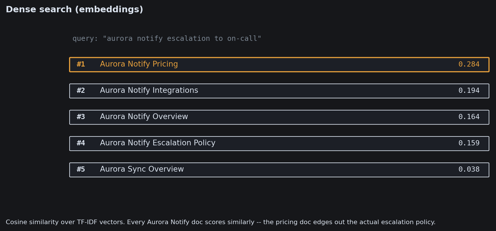{fig-align="center"}

## Hybrid Search {auto-animate=true}

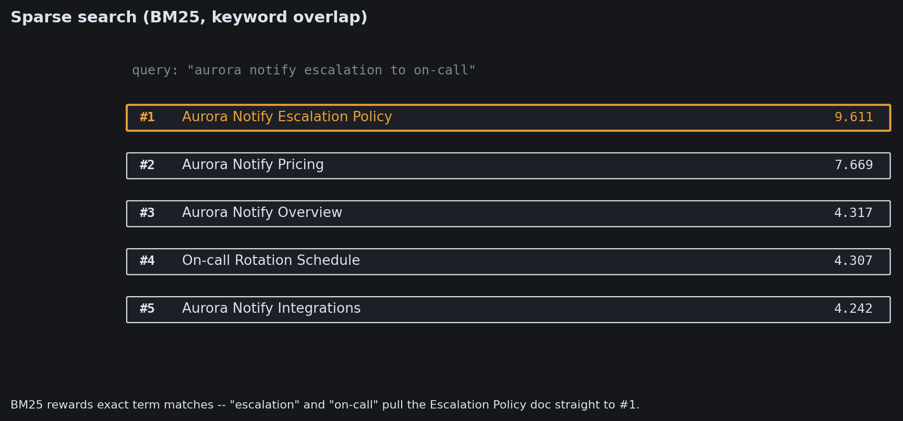{fig-align="center"}

## Hybrid Search {auto-animate=true}

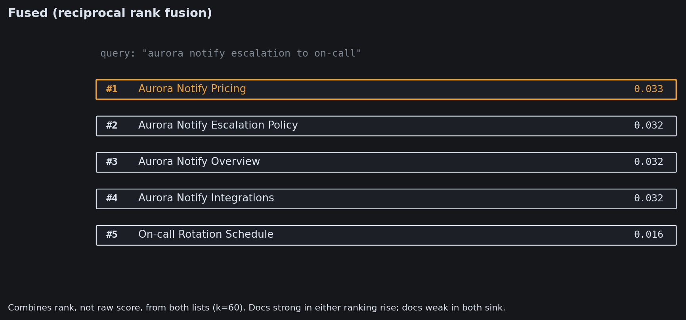{fig-align="center"}

## Hybrid Search {auto-animate=true}

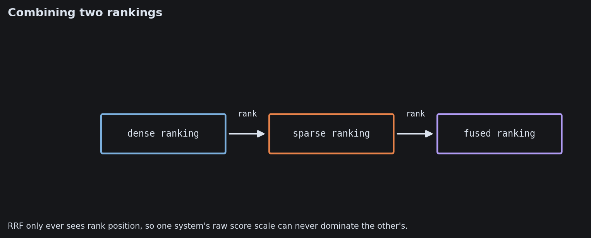{fig-align="center"}

---

# Reranking: A Second, More Careful Pass {.center}

::: lead
Retrieval scores every chunk against the query at once, using one cheap global signal.
That is what makes it fast. It is also why the order it returns is only roughly right.
:::

Reranking takes only the candidates retrieval already found. It looks at each one
again, on its own, and asks a narrower, more literal question. How much of the query's
actual wording is in this chunk?

::: notes
Retrieval already narrowed 48 documents to 5 candidates, and reranking never sees the
other 43. It is a second pass over a short list, not a second search.
:::

---

## The First Pass Is Approximate

A single global signal, spread across every word in the query, does not always put
the right document on top.

```{=html}
<svg class="ragfig" viewBox="0 0 1000 400">
  <text class="zonelabel" x="230" y="55">RETRIEVAL'S ORDER</text>
  <text class="zonelabel" x="770" y="55">A CLOSER LOOK</text>

  <g class="fragment pop" data-fragment-index="1">
    <rect class="card hot" x="70" y="80" width="320" height="64"/>
    <text class="cardtext" x="95" y="107">#1 &middot; candidate A</text>
    <text class="cardtext" x="95" y="128" style="fill:var(--muted);font-size:12px">matches many query words a little</text>
  </g>
  <g class="fragment pop" data-fragment-index="1">
    <rect class="card" x="70" y="164" width="320" height="64"/>
    <text class="cardtext" x="95" y="191">#2 &middot; candidate B</text>
    <text class="cardtext" x="95" y="212" style="fill:var(--muted);font-size:12px">matches one query word exactly</text>
  </g>

  <path class="edge draw fragment" data-fragment-index="2" pathLength="1" d="M 410 112 C 500 112, 500 228, 610 228"/>
  <path class="edge draw fragment" data-fragment-index="2" pathLength="1" d="M 410 196 C 500 196, 500 112, 610 112"/>

  <g class="fragment pop" data-fragment-index="2">
    <rect class="card" x="610" y="80" width="320" height="64"/>
    <text class="cardtext" x="635" y="107">#1 &middot; candidate B</text>
  </g>
  <g class="fragment pop" data-fragment-index="2">
    <rect class="card hot" x="610" y="164" width="320" height="64"/>
    <text class="cardtext" x="635" y="191">#2 &middot; candidate A</text>
  </g>

  <text class="note" x="500" y="360" text-anchor="middle">Same two candidates. Scored one at a time, the exact match wins.</text>
</svg>
```

::: notes
A doc that scatters partial matches across many query words can still lose to a doc
with one precise match, once each is judged on its own instead of against the whole
corpus. The next slide puts numbers on it.
:::

---

## What Actually Happened: "on-call handoff day"

The near-duplicate pairs came first (PTO days, expense threshold, outage lag). None of
them swap, because the one word that tells each pair apart never appears in the query.
This query, tried next, swaps the top two.

```{=html}
<svg class="ragfig" viewBox="0 0 1000 400">
  <text class="cap big" x="500" y="40" text-anchor="middle">query: "on-call handoff day"</text>
  <text class="zonelabel" x="230" y="80">BEFORE &middot; TF-IDF COSINE</text>
  <text class="zonelabel" x="770" y="80">AFTER &middot; KEYWORD OVERLAP</text>

  <g class="fragment pop" data-fragment-index="1">
    <rect class="card hot" x="60" y="100" width="340" height="66"/>
    <text class="cardtext" x="85" y="128">#1 Onboarding Checklist</text>
    <text class="cardtext" x="85" y="150" style="fill:var(--amber);font-size:13px">score 0.208</text>
  </g>
  <g class="fragment pop" data-fragment-index="1">
    <rect class="card" x="60" y="186" width="340" height="66"/>
    <text class="cardtext" x="85" y="214">#2 On-call Rotation Schedule</text>
    <text class="cardtext" x="85" y="236" style="fill:var(--muted);font-size:13px">score 0.138</text>
  </g>

  <path class="edge draw fragment" data-fragment-index="2" pathLength="1" d="M 420 133 C 520 133, 520 253, 600 253"/>
  <path class="edge draw fragment" data-fragment-index="2" pathLength="1" d="M 420 219 C 520 219, 520 133, 600 133"/>

  <g class="fragment pop" data-fragment-index="2">
    <rect class="card hot" x="600" y="100" width="340" height="66"/>
    <text class="cardtext" x="625" y="128">#1 On-call Rotation Schedule</text>
    <text class="cardtext" x="625" y="150" style="fill:var(--amber);font-size:13px">score 0.557</text>
  </g>
  <g class="fragment pop" data-fragment-index="2">
    <rect class="card" x="600" y="186" width="340" height="66"/>
    <text class="cardtext" x="625" y="214">#2 Onboarding Checklist</text>
    <text class="cardtext" x="625" y="236" style="fill:var(--muted);font-size:13px">score 0.371</text>
  </g>

  <text class="note" x="500" y="330" text-anchor="middle">"Onboarding Checklist" repeats the generic word "day" twice.</text>
  <text class="note" x="500" y="352" text-anchor="middle">Only "On-call Rotation Schedule" contains the exact word "handoff" -- reranking promotes it.</text>
</svg>
```

::: notes
The numbers come straight from `build/topics/reranking/run.py`,
`index.search("on-call handoff day", k=5)` then `rerank(...)` on the same five
results. TF-IDF's top hit is the wrong document here. Plain word-counting fixes it.
"day" is common and diluted by idf, "handoff" is rare and, scored per chunk, decisive.
:::

---

## Reranking Reorders. It Does Not Fetch.

```{=html}
<svg class="ragfig" viewBox="0 0 1000 400">
  <rect class="zone" x="60" y="100" width="380" height="220"/>
  <text class="zonelabel" x="250" y="130">5 CANDIDATES</text>
  <circle class="node" cx="150" cy="220" r="26"/>
  <circle class="node" cx="220" cy="220" r="26"/>
  <circle class="node feat" cx="290" cy="220" r="26"/>
  <circle class="node" cx="360" cy="220" r="26"/>
  <circle class="node" cx="150" cy="270" r="0"/>

  <path class="flow" d="M 460 210 L 555 210"/>
  <text class="note" x="507" y="190" text-anchor="middle" style="font-size:13px">rerank()</text>

  <rect class="zone" x="560" y="100" width="380" height="220"/>
  <text class="zonelabel" x="750" y="130">SAME 5, REORDERED</text>
  <circle class="node feat" cx="650" cy="220" r="26"/>
  <circle class="node" cx="720" cy="220" r="26"/>
  <circle class="node" cx="790" cy="220" r="26"/>
  <circle class="node" cx="860" cy="220" r="26"/>

  <text class="note" x="500" y="360" text-anchor="middle">No new document ever enters. Reranking can only work with what retrieval already found.</text>
</svg>
```

::: notes
Ties to the assert in run.py, `set(ids_before) == set(ids_after)`. If retrieval missed
the right document entirely, no amount of reranking gets it back. Recovering it is
retrieval's job.
:::

---

## What Reranking Can't Fix

The corpus has three near-duplicate pairs, same wording, one changed number. None of
them swap under this reranker.

```{=html}
<svg class="ragfig" viewBox="0 0 1000 400">
  <rect class="card" x="230" y="110" width="300" height="90"/>
  <text class="cardtext" x="255" y="145">Paid Time Off Policy v1</text>
  <text class="cardtext" x="255" y="170" style="fill:var(--muted);font-size:13px">"...accrue <tspan style="fill:var(--fg)">15</tspan> days..."</text>

  <rect class="card" x="470" y="110" width="300" height="90"/>
  <text class="cardtext" x="495" y="145">Paid Time Off Policy v2</text>
  <text class="cardtext" x="495" y="170" style="fill:var(--muted);font-size:13px">"...accrue <tspan style="fill:var(--fg)">20</tspan> days..."</text>

  <g class="fragment">
    <text class="cap" x="500" y="250" text-anchor="middle">query: "how many days of paid time off"</text>
    <text class="note" x="500" y="280" text-anchor="middle">Neither "15" nor "20" is in the query, so both chunks overlap it identically.</text>
    <text class="note" x="500" y="304" text-anchor="middle">The tie always breaks back to whichever retrieval already ranked first.</text>
  </g>
</svg>
```

::: notes
Checked against run.py rather than eyeballed. Run the PTO query and the pair's order
is identical before and after reranking, down to the tie-break score. What resolves a
pair like this lives upstream, deduplication or picking one canonical version, well
before reranking sees it.
:::

---

## Does Reranking Actually Earn Its Cost?

One swap at #1 is only a hint. A verdict needs the whole eval set.

```{=html}
<svg class="ragfig" viewBox="0 0 1000 420">
  <text class="cap big" x="500" y="36" text-anchor="middle">measure it across the set, don't eyeball one query</text>

  <text class="zonelabel" x="250" y="82">RETRIEVER-ONLY</text>
  <text class="zonelabel" x="750" y="82">RERANKED</text>

  <g class="fragment pop" data-fragment-index="1">
    <rect class="card" x="95" y="98" width="310" height="72"/>
    <text class="cardtext" x="120" y="128">rank the labeled eval set</text>
    <text class="cardtext" x="120" y="152" style="fill:var(--muted);font-size:13px">every query has known-right chunks</text>
  </g>
  <g class="fragment pop" data-fragment-index="1">
    <rect class="card" x="595" y="98" width="310" height="72"/>
    <text class="cardtext" x="620" y="128">rerank the same lists</text>
    <text class="cardtext" x="620" y="152" style="fill:var(--muted);font-size:13px">then score the new order</text>
  </g>

  <path class="flow" d="M 250 174 L 250 216"/>
  <path class="flow" d="M 750 174 L 750 216"/>

  <g class="fragment pop" data-fragment-index="2">
    <rect class="card" x="95" y="222" width="310" height="150"/>
    <text class="cardtext" x="120" y="258">Recall@K</text>
    <text class="cardtext" x="120" y="300">nDCG</text>
    <text class="cardtext" x="120" y="342">answer quality</text>
  </g>
  <g class="fragment pop" data-fragment-index="2">
    <rect class="card" x="595" y="222" width="310" height="150"/>
    <text class="cardtext" x="620" y="258">Recall@K</text>
    <text class="cardtext" x="620" y="300">nDCG</text>
    <text class="cardtext" x="620" y="342">answer quality</text>
  </g>

  <text class="cap" x="500" y="300" text-anchor="middle">same yardstick</text>

  <text class="note" x="500" y="408" text-anchor="middle">The "on-call handoff day" swap is one data point. Only the eval set settles whether reranking earns its latency.</text>
</svg>
```

::: notes
The eval set is what the anecdote can't supply. Recall@K and nDCG score the ranking
against known-right chunks, and downstream answer quality checks whether a better
ranking changes what the model finally says. Reranking costs a second pass of latency,
so it ships only if it pays for itself on those numbers.
:::


# Reranking

## Reranking {auto-animate=true}

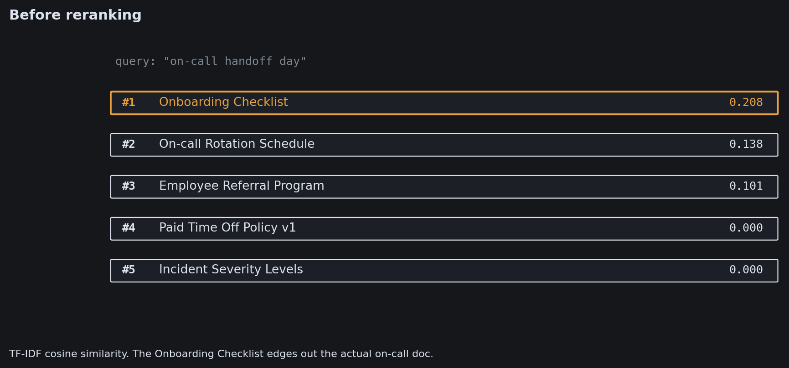{fig-align="center"}

## Reranking {auto-animate=true}

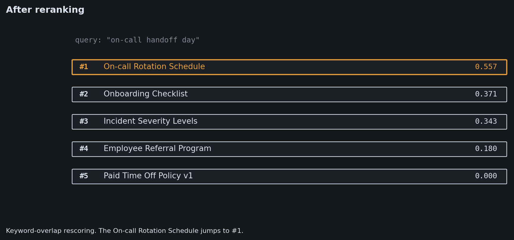{fig-align="center"}

## Reranking {auto-animate=true}

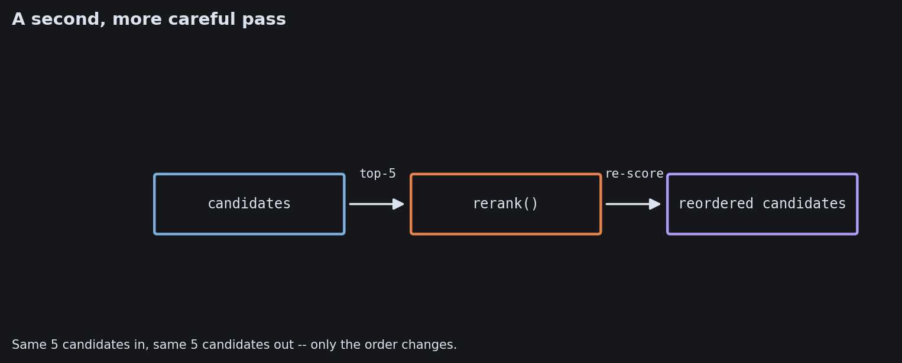{fig-align="center"}

---

# The chunks aren't the input {.center}

::: lead
Retrieval hands back three objects. The model reads one string. Something has to build that string.
:::

```{=html}
<svg class="ragfig" viewBox="0 0 1000 380">
  <rect class="zone" x="40" y="70" width="920" height="230"/>
  <text class="zonelabel" x="500" y="100" text-anchor="middle">RETRIEVAL'S OUTPUT</text>
  <g class="fragment">
    <rect class="card" x="80" y="130" width="260" height="120" style="stroke:var(--accent)"/>
    <text class="cardtext" x="100" y="168">Paid Time Off</text>
    <text class="cardtext" x="100" y="192">Policy v2</text>
    <text class="note" x="100" y="226">score 0.481</text>
  </g>
  <g class="fragment">
    <rect class="card" x="370" y="130" width="260" height="120" style="stroke:var(--feat)"/>
    <text class="cardtext" x="390" y="168">Paid Time Off</text>
    <text class="cardtext" x="390" y="192">Policy v1</text>
    <text class="note" x="390" y="226">score 0.480</text>
  </g>
  <g class="fragment">
    <rect class="card" x="660" y="130" width="260" height="120" style="stroke:var(--amber)"/>
    <text class="cardtext" x="680" y="168">Remote Work</text>
    <text class="cardtext" x="680" y="192">Guidelines</text>
    <text class="note" x="680" y="226">score 0.068</text>
  </g>
  <text class="cap" x="500" y="335" text-anchor="middle">a title, a score, a wall of text -- three separate objects</text>
</svg>
```

A chat model takes plain text in. Three `Chunk` objects are not plain text yet.

::: notes
This is the seam between the two halves of RAG. Everything up to now was ranking. Everything after is about the single string the model receives.
:::

---

## assemble_prompt() turns them into one string

The retrieved chunks flow into a single card, and each one gains a number as it lands.

```{=html}
<svg class="ragfig" viewBox="0 0 1000 400">
  <g class="fragment">
    <rect class="card" x="60" y="30" width="240" height="60" style="stroke:var(--accent)"/>
    <text class="cardtext" x="80" y="66">PTO Policy v2</text>
  </g>
  <g class="fragment">
    <rect class="card" x="380" y="30" width="240" height="60" style="stroke:var(--feat)"/>
    <text class="cardtext" x="400" y="66">PTO Policy v1</text>
  </g>
  <g class="fragment">
    <rect class="card" x="700" y="30" width="240" height="60" style="stroke:var(--amber)"/>
    <text class="cardtext" x="720" y="66">Remote Work Guidelines</text>
  </g>

  <path class="flow draw fragment" pathLength="1" d="M 180 92 L 260 195"/>
  <path class="flow draw fragment" pathLength="1" d="M 500 92 L 500 195"/>
  <path class="flow draw fragment" pathLength="1" d="M 820 92 L 740 195"/>

  <text class="cap big" x="500" y="178" text-anchor="middle" style="fill:var(--amber)">assemble_prompt()</text>
  <rect class="card hot" x="120" y="195" width="760" height="170"/>

  <g class="fragment">
    <rect class="tag main" x="150" y="222" width="46" height="30"/>
    <text class="tagtext" x="173" y="243">[1]</text>
    <text class="cardtext" x="210" y="243">PTO Policy v2, excerpt</text>
  </g>
  <g class="fragment">
    <rect class="tag feat" x="150" y="264" width="46" height="30"/>
    <text class="tagtext" x="173" y="285">[2]</text>
    <text class="cardtext" x="210" y="285">PTO Policy v1, excerpt</text>
  </g>
  <g class="fragment">
    <rect class="tag head" x="150" y="306" width="46" height="30"/>
    <text class="tagtext" x="173" y="327">[3]</text>
    <text class="cardtext" x="210" y="327">Remote Work Guidelines, excerpt</text>
  </g>
</svg>
```

::: notes
`assemble_prompt()` is a plain string builder. It walks the chunk list in order and writes each one behind a bracketed number. Grounding holds because this step stays mechanical and inspectable.
:::

---

## Every excerpt is numbered, not named

```{=html}
<svg class="ragfig" viewBox="0 0 1000 320">
  <g class="fragment">
    <rect class="card" x="120" y="60" width="360" height="70" style="stroke:var(--accent)"/>
    <text class="cardtext" x="145" y="102">Chunk: "PTO Policy v2"</text>
  </g>
  <path class="flow draw fragment" pathLength="1" d="M 500 95 L 560 95"/>
  <g class="fragment">
    <rect class="tag main" x="600" y="60" width="60" height="34"/>
    <text class="tagtext" x="630" y="83">[1]</text>
    <rect class="card" x="670" y="60" width="260" height="70"/>
    <text class="cardtext" x="690" y="102">(PTO Policy v2) ...</text>
  </g>
  <text class="cap" x="500" y="200" text-anchor="middle">the number is the excerpt's only name inside the prompt</text>
  <text class="note" x="500" y="240" text-anchor="middle">order of chunks in decides the order of numbers out -- nothing else does</text>
</svg>
```

A chunk's doc title never reaches the model directly. Its `[n]` does.

::: notes
Chunk one becomes `[1]` because it arrives first, nothing more. That fixed order is what lets generation write `[2]` later and the app resolve it back to its source. The mapping was set the moment the prompt was built.
:::

---

## An instruction wraps the excerpts

```{=html}
<svg class="ragfig" viewBox="0 0 1000 380">
  <g class="fragment">
    <rect class="zone" x="40" y="50" width="280" height="280"/>
    <text class="zonelabel" x="180" y="80" text-anchor="middle">PREAMBLE</text>
    <text class="note" x="180" y="180" text-anchor="middle">the question, plus</text>
    <text class="note" x="180" y="206" text-anchor="middle">"answer using only</text>
    <text class="note" x="180" y="232" text-anchor="middle">the excerpts below"</text>
  </g>
  <g class="fragment">
    <rect class="zone" x="360" y="50" width="280" height="280" style="stroke:var(--accent)"/>
    <text class="zonelabel" x="500" y="80" text-anchor="middle" style="fill:var(--accent)">EXCERPTS</text>
    <rect class="tag main" x="470" y="140" width="60" height="30"/>
    <text class="tagtext" x="500" y="161">[1]</text>
    <rect class="tag feat" x="470" y="182" width="60" height="30"/>
    <text class="tagtext" x="500" y="203">[2]</text>
    <rect class="tag head" x="470" y="224" width="60" height="30"/>
    <text class="tagtext" x="500" y="245">[3]</text>
  </g>
  <g class="fragment">
    <rect class="zone" x="680" y="50" width="280" height="280"/>
    <text class="zonelabel" x="820" y="80" text-anchor="middle">CLOSING RULE</text>
    <text class="note" x="820" y="180" text-anchor="middle">"cite each fact as [n].</text>
    <text class="note" x="820" y="206" text-anchor="middle">If the excerpts don't</text>
    <text class="note" x="820" y="232" text-anchor="middle">cover it, say so."</text>
  </g>
</svg>
```

::: notes
Three zones, in this order: an instruction that scopes the model to the excerpts, the numbered excerpts, and a closing rule demanding a citation per claim. That closing rule is what makes cite-or-refuse enforceable. It lives inside the prompt, reaching the model before it writes a word.
:::

---

## What crosses the boundary to the model

```{=html}
<svg class="ragfig" viewBox="0 0 1000 380">
  <rect class="zone" x="40" y="60" width="420" height="260"/>
  <text class="zonelabel" x="250" y="90" text-anchor="middle">EVERYTHING RAG KNOWS</text>
  <g class="fragment">
    <rect class="node ghost" x="80" y="120" width="150" height="55"/>
    <text class="cardtext" x="100" y="153">corpus</text>
  </g>
  <g class="fragment">
    <rect class="node ghost" x="290" y="120" width="150" height="55"/>
    <text class="cardtext" x="315" y="153">index</text>
  </g>
  <g class="fragment">
    <rect class="node ghost" x="80" y="200" width="360" height="55"/>
    <text class="cardtext" x="100" y="233">48 chunks</text>
  </g>

  <rect class="zone" x="620" y="60" width="340" height="260" style="stroke:var(--amber)"/>
  <text class="zonelabel" x="790" y="90" text-anchor="middle" style="fill:var(--amber)">THE MODEL</text>

  <g class="fragment">
    <path class="flow draw fragment" pathLength="1" d="M 460 250 L 640 250"/>
    <rect class="card hot" x="660" y="220" width="260" height="60"/>
    <text class="cardtext" x="680" y="255" style="fill:var(--amber)">the prompt string</text>
  </g>

  <text class="cap" x="500" y="355" text-anchor="middle">corpus, index, and every other chunk never cross -- only this one string does</text>
</svg>
```

::: notes
Grounding is checkable because the model's whole universe for this answer is the string `assemble_prompt()` returned, rebuilt for each question. Nothing it absorbed in training enters here, because nothing else is in the channel.
:::


# Augmentation: Building the Prompt

## Augmentation: Building the Prompt {auto-animate=true}

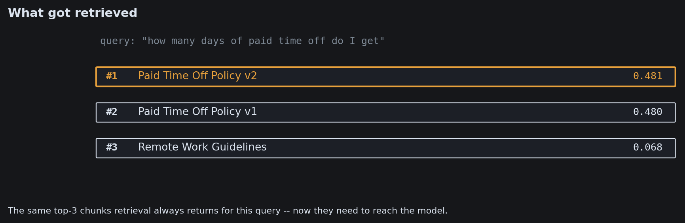{fig-align="center"}

## Augmentation: Building the Prompt {auto-animate=true}

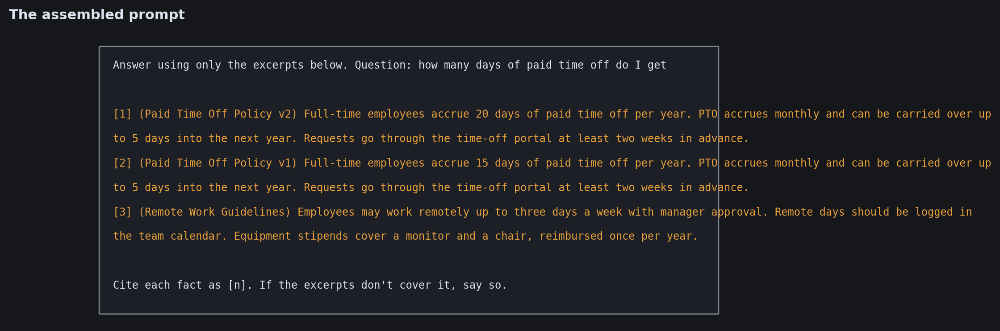{fig-align="center"}

## Augmentation: Building the Prompt {auto-animate=true}

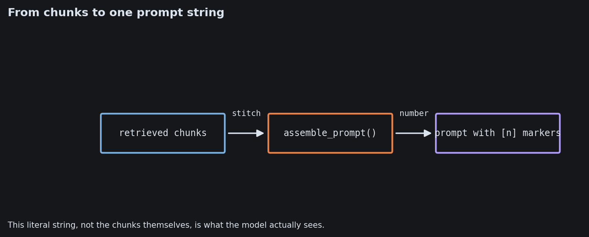{fig-align="center"}

---

# Cite or Refuse {.center}

::: lead
Retrieval and augmentation hand the model a stack of excerpts. Generation is the
last step. Turn that stack into a sentence a reader can trust, or say the corpus
has no answer.
:::

Every sentence ties back to a source, or the system declines. That is what makes
a RAG answer worth trusting.

::: notes
Same demo query as the retrieval and augmentation slides, now at its two possible
endings. The point to say out loud: there is no third option between a cited
claim and a refusal.
:::

---

## Two ways a question can end

```{=html}
<svg class="ragfig" viewBox="0 0 1000 400">
  <g class="fragment">
    <text class="note" x="255" y="55" text-anchor="middle" style="fill:var(--muted)">query: "how many days of PTO do I get"</text>
    <rect class="card" x="60" y="80" width="390" height="260" style="stroke:var(--feat)"/>
    <text class="zonelabel" x="255" y="112" style="fill:var(--feat)">ANSWERED</text>
    <text class="cardtext" x="85" y="160">Full-time employees accrue 20</text>
    <text class="cardtext" x="85" y="188">days of paid time off per year.</text>
    <rect class="tag feat" x="85" y="212" width="34" height="26"/>
    <text class="tagtext" x="102" y="230">[1]</text>
    <text class="note" x="130" y="230">Paid Time Off Policy v2</text>
    <text class="note" x="255" y="316" text-anchor="middle" style="fill:var(--feat)">score clears the refusal bar</text>
  </g>
  <g class="fragment">
    <text class="note" x="745" y="55" text-anchor="middle" style="fill:var(--muted)">query: "what's the weather in Tokyo tomorrow"</text>
    <rect class="card" x="550" y="80" width="390" height="260" style="stroke:#e06b9c"/>
    <text class="zonelabel" x="745" y="112" style="fill:#e06b9c">REFUSED</text>
    <text class="cardtext" x="575" y="170">"The corpus doesn't cover this</text>
    <text class="cardtext" x="575" y="198">well enough to answer."</text>
    <text class="note" x="745" y="316" text-anchor="middle" style="fill:#e06b9c">score never clears the bar</text>
  </g>
  <g class="fragment">
    <text class="cap big" x="500" y="380">Same generator, same gate -- the evidence decides which card you land on.</text>
  </g>
</svg>
```

::: notes
Nothing in the generator changes between the two endings. The only difference is
what retrieval found. A covered question gets a cited sentence, an uncovered one
gets a decline.
:::

---

## A citation is a pointer, not decoration

```{=html}
<svg class="ragfig" viewBox="0 0 1000 400">
  <g class="fragment">
    <text class="cap big" x="500" y="90">"...accrue 20 days of paid time off per year."</text>
    <rect class="tag feat" x="710" y="66" width="46" height="30"/>
    <text class="tagtext" x="733" y="86">[1]</text>
  </g>
  <g class="fragment">
    <path class="leader feat" d="M 733 96 L 733 210" style="stroke:var(--feat)"/>
    <rect class="card" x="330" y="210" width="340" height="130" style="stroke:var(--feat)"/>
    <text class="zonelabel" x="500" y="242" style="fill:var(--feat)">RETRIEVED CHUNK</text>
    <text class="cardtext" x="352" y="278">Paid Time Off Policy v2</text>
    <text class="note" x="352" y="306">"...accrue 20 days of paid time off..."</text>
  </g>
  <g class="fragment">
    <text class="note" x="500" y="378" text-anchor="middle">[1] names the chunk the sentence came from, so a reader can check it.</text>
  </g>
</svg>
```

::: notes
The bracket number resolves to one chunk in the index. A reader can follow it
back to the source and check the claim without trusting the model's wording.
:::

---

## Where the line gets drawn

```{=html}
<svg class="ragfig" viewBox="0 0 1000 400">
  <g class="fragment">
    <path class="edge" style="marker-end:none;stroke:var(--edge)" d="M 100 220 L 900 220"/>
    <text class="note" x="100" y="252">low similarity</text>
    <text class="note" x="900" y="252" text-anchor="end">high similarity</text>
  </g>
  <g class="fragment">
    <path class="leader head" d="M 196 190 L 196 250" style="stroke:var(--amber)"/>
    <text class="cap" x="196" y="170" style="fill:var(--amber)">refusal threshold</text>
  </g>
  <g class="fragment">
    <circle cx="140" cy="220" r="16" style="fill:#3a2230;stroke:#e06b9c;stroke-width:2.5"/>
    <text class="note" x="140" y="290" text-anchor="middle" style="fill:#e06b9c">weather query: 0.00</text>
  </g>
  <g class="fragment">
    <circle class="node feat" cx="580" cy="220" r="16"/>
    <text class="note" x="580" y="290" text-anchor="middle" style="fill:var(--feat)">PTO query: 0.48</text>
  </g>
  <g class="fragment">
    <text class="cap big" x="500" y="360">Below the line: refuse. Above it: cite.</text>
  </g>
</svg>
```

::: notes
The gate is one number, the best similarity score retrieval returned. Set it too
low and the model guesses on thin evidence. Set it too high and it refuses
questions the corpus covers. Tuning that one knob trades the two failure modes
against each other.
:::

---

## No partial credit

```{=html}
<svg class="ragfig" viewBox="0 0 1000 400">
  <g class="fragment">
    <rect class="card" x="400" y="50" width="200" height="70"/>
    <text class="cardtext" x="420" y="92">check top score</text>
  </g>
  <g class="fragment">
    <path class="edge" d="M 460 120 L 260 220"/>
    <rect class="card" x="80" y="220" width="320" height="110" style="stroke:var(--feat)"/>
    <text class="zonelabel" x="240" y="252" style="fill:var(--feat)">ABOVE THE BAR</text>
    <text class="cardtext" x="105" y="292">write the answer, cite [n]</text>
  </g>
  <g class="fragment">
    <path class="edge" d="M 540 120 L 740 220"/>
    <rect class="card" x="600" y="220" width="320" height="110" style="stroke:#e06b9c"/>
    <text class="zonelabel" x="760" y="252" style="fill:#e06b9c">BELOW THE BAR</text>
    <text class="cardtext" x="625" y="292">decline</text>
  </g>
  <g class="fragment">
    <text class="note" x="500" y="378" text-anchor="middle">An answer is either grounded, or it doesn't happen -- there is no middle.</text>
  </g>
</svg>
```

::: notes
A plain language model never has this branch. It always produces text. Cite or
refuse gives the system a way to say "I don't know" instead of a fluent guess.
:::

---

## Grading the gate itself

```{=html}
<svg class="ragfig" viewBox="0 0 1000 470">
  <g class="fragment">
    <text class="note" x="430" y="90" text-anchor="middle" style="fill:var(--muted)">system answered</text>
    <text class="note" x="710" y="90" text-anchor="middle" style="fill:var(--muted)">system refused</text>
    <text class="note" x="150" y="168" text-anchor="middle" style="fill:var(--muted)">has an</text>
    <text class="note" x="150" y="192" text-anchor="middle" style="fill:var(--muted)">answer</text>
    <text class="note" x="150" y="308" text-anchor="middle" style="fill:var(--muted)">has no</text>
    <text class="note" x="150" y="332" text-anchor="middle" style="fill:var(--muted)">answer</text>
  </g>
  <g class="fragment">
    <rect class="card" x="300" y="110" width="260" height="120" style="stroke:var(--feat)"/>
    <text class="zonelabel" x="430" y="176" style="fill:var(--feat)">correct answer</text>
    <rect class="card" x="580" y="250" width="260" height="120" style="stroke:var(--feat)"/>
    <text class="zonelabel" x="710" y="316" style="fill:var(--feat)">correct refusal</text>
  </g>
  <g class="fragment">
    <rect class="card" x="580" y="110" width="260" height="120" style="stroke:var(--amber)"/>
    <text class="zonelabel" x="710" y="176" style="fill:var(--amber)">over-refusal</text>
    <rect class="card" x="300" y="250" width="260" height="120" style="stroke:#e06b9c;stroke-width:3"/>
    <text class="zonelabel" x="430" y="304" style="fill:#e06b9c">FALSE ANSWER</text>
    <text class="note" x="430" y="332" text-anchor="middle" style="fill:#e06b9c">answered with no source to stand on</text>
  </g>
  <g class="fragment">
    <text class="note" x="500" y="410" text-anchor="middle">false-answer rate: how often it answers a no-answer question</text>
    <text class="note" x="500" y="434" text-anchor="middle">refusal precision: of its refusals, how many truly had no answer</text>
    <text class="note" x="500" y="458" text-anchor="middle">refusal recall: of the no-answer questions, how many it caught</text>
  </g>
</svg>
```

::: notes
Treat answer-or-refuse as its own label, separate from whether the answer text
reads well. The bottom-left cell is the one that costs trust: a confident answer
where the corpus has nothing. Precision and recall on refusals show which way
the threshold is skewed.
:::

---

## A citation can be wrong even when the answer is right

```{=html}
<svg class="ragfig" viewBox="0 0 1000 400">
  <g class="fragment">
    <text class="cardtext" x="500" y="70" text-anchor="middle">"PTO accrues monthly [1] and rolls over each year [2]."</text>
    <rect class="tag feat" x="330" y="86" width="40" height="28"/>
    <text class="tagtext" x="350" y="106">[1]</text>
    <rect class="tag head" x="600" y="86" width="40" height="28"/>
    <text class="tagtext" x="620" y="106">[2]</text>
  </g>
  <g class="fragment">
    <path class="leader feat" d="M 350 118 L 250 220" style="stroke:var(--feat)"/>
    <rect class="card" x="120" y="222" width="260" height="90" style="stroke:var(--feat)"/>
    <text class="cardtext" x="140" y="258">"...accrues monthly..."</text>
    <text class="note" x="140" y="286" style="fill:var(--feat)">supports the claim</text>
  </g>
  <g class="fragment">
    <path class="leader head" d="M 620 118 L 720 220" style="stroke:#e06b9c"/>
    <rect class="card" x="600" y="222" width="260" height="90" style="stroke:#e06b9c;stroke-width:3"/>
    <text class="cardtext" x="620" y="258">"...5 unused days max..."</text>
    <text class="note" x="620" y="286" style="fill:#e06b9c">says nothing about rollover</text>
  </g>
  <text class="cap big" x="500" y="360" text-anchor="middle">[2] points at a real chunk. It just isn't the one that backs this sentence.</text>
</svg>
```

::: notes
Grading generation isn't just "did it cite something." Check each citation
against the claim it's attached to, check every load-bearing claim has one,
and check whether a better-supporting chunk existed but got skipped. A
correct-sounding answer with a mismatched citation still fails.
:::


# Generation: Cite or Refuse

## Generation: Cite or Refuse {auto-animate=true}

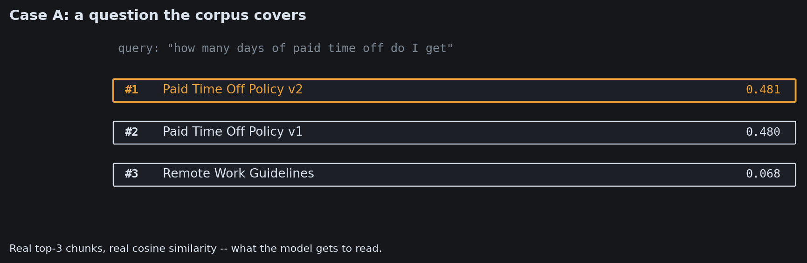{fig-align="center"}

## Generation: Cite or Refuse {auto-animate=true}

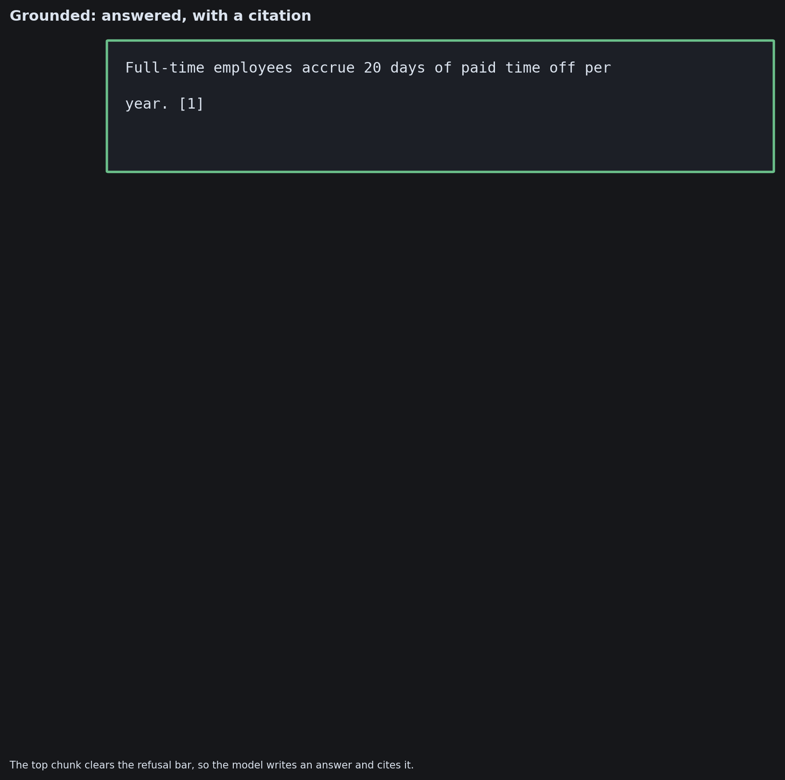{fig-align="center"}

## Generation: Cite or Refuse {auto-animate=true}

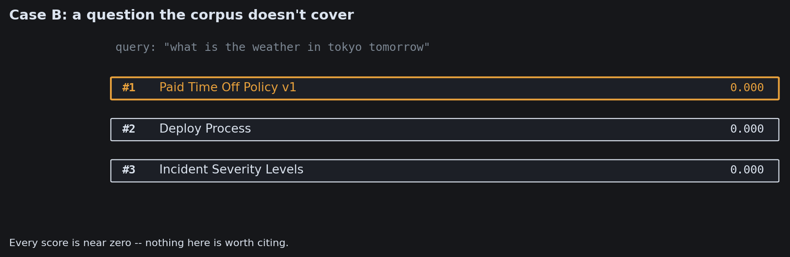{fig-align="center"}

## Generation: Cite or Refuse {auto-animate=true}

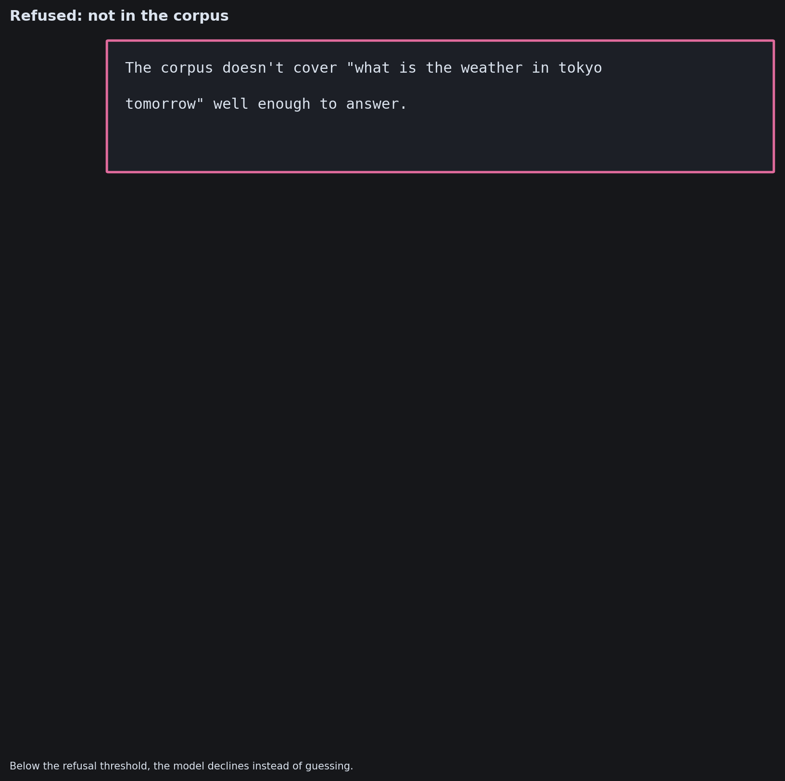{fig-align="center"}

---

# Agentic RAG: The Tool-Use Loop {.center}

::: lead
Every concept so far runs retrieval exactly once per question. An agent gets to
check its own result first, and search again if it wasn't good enough.
:::

::: notes
The last mechanical concept before evaluation. Retrieval is unchanged, the same
`.search()` as every earlier topic. What changes is the wrapper. It reads the score,
then pays for a second call only when the first one earns it.
:::

---

## One search, or two?

The retrieval loop so far always asks once. An agent gets to check its own work first.

```{=html}
<svg class="ragfig" viewBox="0 0 1000 400">
  <g class="fragment">
    <rect class="card" x="60" y="90" width="380" height="220"/>
    <text class="cap big" x="250" y="140" text-anchor="middle">One-shot retrieval</text>
    <text class="note" x="250" y="185" text-anchor="middle">search once</text>
    <text class="note" x="250" y="215" text-anchor="middle">answer immediately</text>
    <text class="note" x="250" y="245" text-anchor="middle">no matter how weak the hit</text>
  </g>
  <g class="fragment">
    <rect class="card hot" x="560" y="90" width="380" height="220"/>
    <text class="cap big" x="750" y="140" text-anchor="middle">Agentic retrieval</text>
    <text class="note" x="750" y="185" text-anchor="middle">search, then check the score</text>
    <text class="note" x="750" y="215" text-anchor="middle">reformulate if it's weak</text>
    <text class="note" x="750" y="245" text-anchor="middle">search again before answering</text>
  </g>
  <g class="fragment">
    <text class="note" x="500" y="360" text-anchor="middle">The only difference: the ability to look at its own result and try again.</text>
  </g>
</svg>
```

::: notes
Every topic so far is one fixed pass: embed, retrieve, answer. Agentic RAG exposes that same search_corpus as a tool the model can call, inspect, and call again. Only the choice of when to stop is new.
:::

---

## The decision loop

One tool call, one confidence check, and a fork: answer now, or search again first.

```{=html}
<svg class="ragfig" viewBox="0 0 1000 400">
  <g class="fragment">
    <rect class="node" x="40" y="140" width="170" height="90"/>
    <text class="cap" x="125" y="192" text-anchor="middle">question</text>
  </g>
  <g class="fragment">
    <path class="edge" d="M 210 185 L 278 185"/>
    <text class="note" x="245" y="165" text-anchor="middle">call</text>
    <rect class="node feat" x="280" y="140" width="230" height="90"/>
    <text class="cap" x="395" y="192" text-anchor="middle">search_corpus</text>
  </g>
  <g class="fragment">
    <path class="edge" d="M 510 185 L 588 185"/>
    <text class="note" x="550" y="165" text-anchor="middle">check</text>
    <polygon class="node" points="680,110 770,185 680,260 590,185"/>
    <text class="cap" x="680" y="190" text-anchor="middle">confident?</text>
  </g>
  <g class="fragment">
    <path class="edge" d="M 770 185 L 828 185"/>
    <text class="note" x="800" y="165" text-anchor="middle">yes</text>
    <rect class="node" x="830" y="140" width="140" height="90"/>
    <text class="cap" x="900" y="192" text-anchor="middle">answer</text>
  </g>
  <g class="fragment">
    <path class="flow draw fragment" pathLength="1" d="M 680 260 C 680 335, 395 335, 395 232"/>
    <text class="note" x="540" y="355" text-anchor="middle">no -> reformulate, search_corpus again</text>
  </g>
</svg>
```

::: notes
run_agent() runs a scripted loop. It calls search_corpus once and takes the loop-back edge only if the top score lands under 0.2. The retry is capped at one, with no second pass through the diamond, so it can never spiral into unbounded search.
:::

---

## A captured trace

The question: "what's up with the database when it just kind of goes down." Vague on purpose.

```{=html}
<svg class="ragfig" viewBox="0 0 1000 400">
  <g class="fragment">
    <rect class="card" x="60" y="50" width="880" height="110"/>
    <text class="cardtext" x="90" y="95">search_corpus("what's up with the database ... goes down")</text>
    <text class="note" x="90" y="130">-> top: On-call Runbook: Database Outage v2, score 0.176</text>
    <text class="note" x="90" y="152" style="fill:var(--amber)">0.176 &lt; 0.2 -> not confident, reformulate</text>
  </g>
  <g class="fragment">
    <rect class="card hot" x="60" y="200" width="880" height="110"/>
    <text class="cardtext" x="90" y="245">search_corpus("what's with database ... goes down")</text>
    <text class="note" x="90" y="280">-> top: On-call Runbook: Database Outage v2, score 0.176</text>
    <text class="note" x="90" y="302">same top doc, same score, so the second call only confirmed the first</text>
  </g>
  <g class="fragment">
    <text class="cap" x="500" y="360" text-anchor="middle">finish: "If the primary database is unreachable, page the database on-call immediately. [1]"</text>
  </g>
</svg>
```

::: notes
The constant named DEMO_QUERY_WEAK ("what happens during a database outage") scores 0.212, just over the 0.2 bar, so it never fires a second call. The vaguer phrasing shown here is what pushes the first score under threshold. Both calls land on the same document, so the reformulation only had to clear the bar.
:::

---

## How the rewrite happens

The reformulation is a word filter. It drops every word four letters or shorter.

```{=html}
<svg class="ragfig" viewBox="0 0 1000 400">
  <g class="fragment">
    <rect class="card" x="60" y="70" width="880" height="120"/>
    <text class="cardtext" x="90" y="140" xml:space="preserve"><tspan>what's </tspan><tspan style="fill:var(--muted);text-decoration:line-through">up </tspan><tspan>with </tspan><tspan style="fill:var(--muted);text-decoration:line-through">the </tspan><tspan>database when </tspan><tspan style="fill:var(--muted);text-decoration:line-through">it </tspan><tspan>just kind </tspan><tspan style="fill:var(--muted);text-decoration:line-through">of </tspan><tspan>goes down</tspan></text>
    <text class="note" x="90" y="175">grey + struck: words of length 3 or less</text>
  </g>
  <g class="fragment">
    <path class="edge" d="M 500 190 L 500 235"/>
    <rect class="card hot" x="60" y="245" width="880" height="90"/>
    <text class="cardtext" x="90" y="298">what's with database when just kind goes down</text>
  </g>
  <g class="fragment">
    <text class="note" x="500" y="370" text-anchor="middle">A production agent would rewrite with an LLM call. This toy loop stays deterministic, so the figure reproduces the same way every time.</text>
  </g>
</svg>
```

::: notes
The rule is `" ".join(w for w in question.split() if len(w) > 3)`. Word length only, no notion of meaning. Keeping words of four characters or more drops the filler and leaves the content words, which is why the cleaned query still points at the same runbook.
:::

---

## Not blind repetition

The agent only pays for a second search when the first one earns it.

```{=html}
<svg class="ragfig" viewBox="0 0 1000 400">
  <g class="fragment">
    <rect class="zone" x="30" y="30" width="940" height="150"/>
    <text class="zonelabel" x="500" y="55" text-anchor="middle">CONFIDENT ON THE FIRST TRY, ONE CALL</text>
    <rect class="node" x="60" y="80" width="150" height="70"/>
    <text class="cap" x="135" y="122" text-anchor="middle">question</text>
    <path class="edge" d="M 210 115 L 268 115"/>
    <rect class="node" x="270" y="80" width="220" height="70"/>
    <text class="cap" x="380" y="122" text-anchor="middle">search_corpus</text>
    <path class="edge" d="M 490 115 L 548 115"/>
    <rect class="node" x="550" y="80" width="150" height="70"/>
    <text class="cap" x="625" y="122" text-anchor="middle">answer</text>
    <text class="note" x="850" y="122" text-anchor="middle">score 0.212</text>
  </g>
  <g class="fragment">
    <rect class="zone" x="30" y="210" width="940" height="170"/>
    <text class="zonelabel" x="500" y="235" text-anchor="middle">WEAK ON THE FIRST TRY, TWO CALLS</text>
    <rect class="node" x="60" y="260" width="130" height="70"/>
    <text class="cap" x="125" y="302" text-anchor="middle">question</text>
    <path class="edge" d="M 190 295 L 238 295"/>
    <rect class="node" x="240" y="260" width="190" height="70"/>
    <text class="cap" x="335" y="302" text-anchor="middle">search_corpus</text>
    <path class="edge" d="M 430 295 L 478 295"/>
    <rect class="node feat" x="480" y="260" width="190" height="70"/>
    <text class="cap" x="575" y="302" text-anchor="middle">search again</text>
    <path class="edge" d="M 670 295 L 718 295"/>
    <rect class="node" x="720" y="260" width="130" height="70"/>
    <text class="cap" x="785" y="302" text-anchor="middle">answer</text>
    <text class="note" x="920" y="302" text-anchor="middle">0.176</text>
  </g>
</svg>
```

::: notes
Same corpus, same k, same code path. Only the confidence of the first hit changes the trace. Searching twice on every question would double latency and cost with no gain on the ones already nailed. The threshold keeps the expensive path for when it pays off.
:::

---

## Scoring a multi-hop question

Single-hop scoring asks whether one good doc surfaced. Multi-hop scoring asks whether every hop's doc did.

```{=html}
<svg class="ragfig" viewBox="0 0 1000 400">
  <g class="fragment">
    <rect class="node" x="30" y="60" width="150" height="80"/>
    <text class="cap" x="105" y="106" text-anchor="middle">question</text>
    <path class="edge" d="M 180 100 L 223 100"/>
    <rect class="node feat" x="225" y="60" width="180" height="80"/>
    <text class="cap" x="315" y="106" text-anchor="middle">search 1</text>
    <path class="edge" d="M 405 100 L 448 100"/>
    <rect class="node feat" x="450" y="60" width="180" height="80"/>
    <text class="cap" x="540" y="106" text-anchor="middle">search 2</text>
    <path class="edge" d="M 630 100 L 673 100"/>
    <rect class="node" x="675" y="60" width="160" height="80"/>
    <text class="cap" x="755" y="106" text-anchor="middle">answer</text>
  </g>
  <g class="fragment">
    <path class="edge" d="M 315 140 L 315 197"/>
    <rect class="card" x="225" y="200" width="180" height="66"/>
    <text class="cardtext" x="248" y="240">needs doc A</text>
    <path d="M 355 236 L 366 248 L 388 224" fill="none" stroke="var(--feat)" stroke-width="4" stroke-linecap="round" stroke-linejoin="round"/>
    <path class="edge" d="M 540 140 L 540 197"/>
    <rect class="card" x="450" y="200" width="180" height="66"/>
    <text class="cardtext" x="473" y="240">needs doc B</text>
    <path d="M 580 236 L 591 248 L 613 224" fill="none" stroke="var(--feat)" stroke-width="4" stroke-linecap="round" stroke-linejoin="round"/>
  </g>
  <g class="fragment">
    <path class="flow draw fragment" pathLength="1" d="M 388 224 C 480 150, 660 150, 742 166"/>
    <path class="flow draw fragment" pathLength="1" d="M 613 224 C 665 185, 705 178, 758 166"/>
    <path d="M 736 168 L 750 184 L 784 150" fill="none" stroke="var(--feat)" stroke-width="6" stroke-linecap="round" stroke-linejoin="round"/>
    <text class="note" x="760" y="208" text-anchor="middle" style="fill:var(--feat)">all evidence in</text>
  </g>
  <g class="fragment">
    <text class="note" x="500" y="330" text-anchor="middle">Single-hop: was one relevant doc anywhere in the top-K?</text>
    <text class="note" x="500" y="360" text-anchor="middle">Multi-hop: was doc A AND doc B both retrieved across the chain? Miss one and the final answer is wrong.</text>
  </g>
</svg>
```

::: notes
Top-K recall normally counts a question solved if any gold doc appears in the results. A multi-hop question splits its answer across two documents, so retrieving one and missing the other looks like a partial win but still gives a wrong answer. The fix is to score the whole chain, requiring every supporting doc across all the searches.
:::


# Agentic RAG: The Tool-Use Loop

## Agentic RAG: The Tool-Use Loop {auto-animate=true}

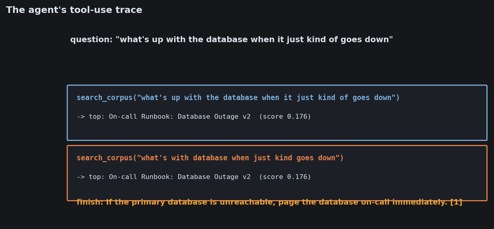{fig-align="center"}

## Agentic RAG: The Tool-Use Loop {auto-animate=true}

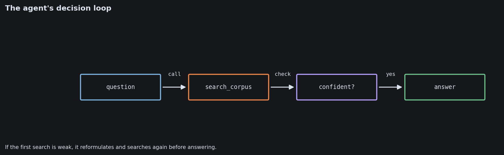{fig-align="center"}

---

# Evaluation: How You Know It's Working {.center}

::: lead
A demo can look convincing and still be wrong. The only way to trust a RAG
system is to run it against questions with known answers, and grade it.
:::

Every concept so far is a design choice: chunking, retrieval, hybrid search,
reranking, generation. Evaluation is how you find out whether those choices
work.

::: notes
Nothing built so far earns trust just because a one-off demo looks
reasonable. Evaluation is a fixed question set with a known answer for each,
rerun automatically on every pipeline change, so a regression shows up the
moment it appears.
:::

---

## A frozen set of questions, each with a known answer

Write down questions a user would ask, then name the one document that
answers each. Freeze the list. Score every future change against it,
unchanged.

```{=html}
<svg class="ragfig" viewBox="0 0 1000 400">
  <g class="fragment">
    <rect class="card" x="40" y="30" width="560" height="60"/>
    <text class="cardtext" x="66" y="67">"parental leave weeks"</text>
    <path class="edge" d="M 610 60 L 700 60"/>
    <rect class="card" x="710" y="30" width="250" height="60"/>
    <text class="cardtext" x="734" y="67" style="font-size:13px">hr-06 &middot; Parental Leave Policy</text>
  </g>
  <g class="fragment">
    <rect class="card" x="40" y="110" width="560" height="60"/>
    <text class="cardtext" x="66" y="147">"code review pull request size"</text>
    <path class="edge" d="M 610 140 L 700 140"/>
    <rect class="card" x="710" y="110" width="250" height="60"/>
    <text class="cardtext" x="734" y="147" style="font-size:13px">eng-08 &middot; Code Review Guidelines</text>
  </g>
  <g class="fragment">
    <rect class="card" x="40" y="190" width="560" height="60"/>
    <text class="cardtext" x="66" y="227">"aurora vault encryption key rotation"</text>
    <path class="edge" d="M 610 220 L 700 220"/>
    <rect class="card" x="710" y="190" width="250" height="60"/>
    <text class="cardtext" x="734" y="227" style="font-size:13px">prod-08 &middot; Aurora Vault Encryption</text>
  </g>
  <g class="fragment">
    <rect class="card" x="40" y="290" width="560" height="60" style="stroke:var(--muted); stroke-dasharray:6 5"/>
    <text class="cardtext" x="66" y="327">"what is the meaning of life"</text>
    <path class="edge" d="M 610 320 L 700 320" style="stroke-dasharray:6 5"/>
    <rect class="card" x="710" y="290" width="250" height="60" style="stroke:var(--muted); stroke-dasharray:6 5"/>
    <text class="cardtext" x="734" y="315" style="font-size:12px">no matching document</text>
    <text class="cardtext" x="734" y="333" style="font-size:12px">in the corpus</text>
  </g>
</svg>
```

::: notes
Three of the four have an answer in the corpus. The fourth has none. It
earns its place by testing what the system does when there is nothing to
find.
:::

---

## Recall@k is a looser bar than faithful

Recall@k asks whether the right document is anywhere in the top few
results. Faithful asks a stricter question. Is it the very top hit, with a
similarity score worth trusting?

```{=html}
<svg class="ragfig" viewBox="0 0 1000 400">
  <g class="fragment">
    <circle class="zone" cx="280" cy="200" r="150"/>
    <circle class="zone" cx="280" cy="200" r="100"/>
    <circle class="zone" cx="280" cy="200" r="50"/>
    <circle cx="280" cy="140" r="9" fill="var(--accent)"/>
    <text class="cap" x="280" y="370">recall@5</text>
    <text class="note" x="280" y="392" text-anchor="middle" style="font-size:13px">right doc lands anywhere in the top 5</text>
  </g>
  <g class="fragment">
    <circle class="zone" cx="720" cy="200" r="150"/>
    <circle class="zone" cx="720" cy="200" r="100"/>
    <circle class="zone" cx="720" cy="200" r="50"/>
    <circle cx="720" cy="200" r="9" fill="var(--feat)"/>
    <text class="cap" x="720" y="370">faithful</text>
    <text class="note" x="720" y="392" text-anchor="middle" style="font-size:13px">right doc is the #1 hit, above threshold</text>
  </g>
</svg>
```

::: notes
A pipeline can pass recall@k and still fail at the top. The right document
sits in the list, but a weaker one outranks it -- and that is what gets
cited. Faithful is the stricter bar.
:::

---

## Running the eval

```{=html}
<svg class="ragfig" viewBox="0 0 1000 400">
  <g class="fragment">
    <rect class="card" x="60" y="20" width="620" height="56"/>
    <text class="cardtext" x="86" y="55">"parental leave weeks"</text>
    <circle cx="820" cy="48" r="24" fill="none" stroke="var(--feat)" stroke-width="4"/>
    <path d="M 808,48 L 817,58 L 834,36" fill="none" stroke="var(--feat)" stroke-width="4" stroke-linecap="round" stroke-linejoin="round"/>
  </g>
  <g class="fragment">
    <rect class="card" x="60" y="100" width="620" height="56"/>
    <text class="cardtext" x="86" y="135">"code review pull request size"</text>
    <circle cx="820" cy="128" r="24" fill="none" stroke="var(--feat)" stroke-width="4"/>
    <path d="M 808,128 L 817,138 L 834,116" fill="none" stroke="var(--feat)" stroke-width="4" stroke-linecap="round" stroke-linejoin="round"/>
  </g>
  <g class="fragment">
    <rect class="card" x="60" y="180" width="620" height="56"/>
    <text class="cardtext" x="86" y="215">"aurora vault encryption key rotation"</text>
    <circle cx="820" cy="208" r="24" fill="none" stroke="var(--feat)" stroke-width="4"/>
    <path d="M 808,208 L 817,218 L 834,196" fill="none" stroke="var(--feat)" stroke-width="4" stroke-linecap="round" stroke-linejoin="round"/>
  </g>
  <g class="fragment">
    <rect class="card" x="60" y="260" width="620" height="56" style="stroke:#e06b9c"/>
    <text class="cardtext" x="86" y="295">"what is the meaning of life"</text>
    <circle cx="820" cy="288" r="24" fill="none" stroke="#e06b9c" stroke-width="4"/>
    <path d="M 808,276 L 832,300 M 832,276 L 808,300" stroke="#e06b9c" stroke-width="4" stroke-linecap="round"/>
  </g>
  <g class="fragment">
    <text class="note" x="500" y="360" text-anchor="middle">The one X is not a defect. It is the system correctly saying it does not know.</text>
  </g>
</svg>
```

::: notes
The toy pipeline ran against the four frozen questions. Three pass recall
and faithful. The fourth fails both, because nothing in the corpus covers
the meaning of life, and saying so beats guessing from the nearest chunk.
:::

---

## Back to where this deck started

A plain language model would have answered the meaning-of-life question
anyway, fluently and with no warning that it was guessing. This system
checks itself against the evidence first. It only speaks when it has some.

---

## Three lenses, one system

Retrieval quality, answer quality, and end-to-end usefulness are three
different questions. A system can pass one and fail the next.

```{=html}
<svg class="ragfig" viewBox="0 0 1000 400">
  <g class="fragment">
    <circle class="node" cx="150" cy="80" r="44"/>
    <text class="cap" x="150" y="86">retrieval</text>
    <text class="note" x="150" y="150" text-anchor="middle" style="font-size:13px">right docs found?</text>
    <path class="edge" d="M 196 84 L 636 182"/>
  </g>
  <g class="fragment">
    <circle class="node" cx="150" cy="200" r="44"/>
    <text class="cap" x="150" y="206">answer</text>
    <text class="note" x="150" y="270" text-anchor="middle" style="font-size:13px">correct + grounded?</text>
    <path class="edge" d="M 196 200 L 636 200"/>
  </g>
  <g class="fragment">
    <circle class="node" cx="150" cy="320" r="44"/>
    <text class="cap" x="150" y="326">utility</text>
    <text class="note" x="150" y="390" text-anchor="middle" style="font-size:13px">did it help?</text>
    <path class="edge" d="M 196 316 L 636 218"/>
  </g>
  <g class="fragment">
    <rect class="card" x="640" y="140" width="300" height="120"/>
    <text class="cap big" x="790" y="196">one number</text>
    <text class="note" x="790" y="230" text-anchor="middle">hides which lens broke</text>
  </g>
</svg>
```

::: notes
A system can ace retrieval and still write a weak answer, or nail the answer
and still lose the user on latency or tone. One combined score gives you a
grade but never the reason.
:::

---

## When an answer is wrong, where did it break?

A wrong answer breaks at one stage. Walk the tree until a branch says no.

```{=html}
<svg class="ragfig" viewBox="0 0 1000 400">
  <g class="fragment">
    <rect class="card" x="250" y="15" width="340" height="52"/>
    <text class="cap" x="420" y="47" style="font-size:15px">evidence retrieved at all?</text>
    <path class="edge" d="M 592 41 L 676 41"/>
    <text class="note" x="634" y="34" text-anchor="middle" style="font-size:12px">no</text>
    <rect class="card hot" x="680" y="15" width="280" height="52"/>
    <text class="cap" x="820" y="47" style="font-size:15px">corpus / chunking / embedding</text>
  </g>
  <g class="fragment">
    <path class="edge" d="M 420 69 L 420 103"/>
    <text class="note" x="432" y="92" style="font-size:12px">yes</text>
    <rect class="card" x="250" y="105" width="340" height="52"/>
    <text class="cap" x="420" y="137" style="font-size:15px">ranked high enough to reach it?</text>
    <path class="edge" d="M 592 131 L 676 131"/>
    <text class="note" x="634" y="124" text-anchor="middle" style="font-size:12px">no</text>
    <rect class="card hot" x="680" y="105" width="280" height="52"/>
    <text class="cap" x="820" y="137" style="font-size:15px">retrieval / reranking</text>
  </g>
  <g class="fragment">
    <path class="edge" d="M 420 159 L 420 193"/>
    <text class="note" x="432" y="182" style="font-size:12px">yes</text>
    <rect class="card" x="250" y="195" width="340" height="52"/>
    <text class="cap" x="420" y="227" style="font-size:15px">did the model use it?</text>
    <path class="edge" d="M 592 221 L 676 221"/>
    <text class="note" x="634" y="214" text-anchor="middle" style="font-size:12px">no</text>
    <rect class="card hot" x="680" y="195" width="280" height="52"/>
    <text class="cap" x="820" y="227" style="font-size:15px">generation</text>
  </g>
  <g class="fragment">
    <path class="edge" d="M 420 249 L 420 283"/>
    <text class="note" x="432" y="272" style="font-size:12px">yes</text>
    <rect class="card" x="250" y="285" width="340" height="52"/>
    <text class="cap" x="420" y="317" style="font-size:15px">correct, but user unhappy?</text>
    <path class="edge" d="M 592 311 L 676 311"/>
    <text class="note" x="634" y="304" text-anchor="middle" style="font-size:12px">yes</text>
    <rect class="card hot" x="680" y="285" width="280" height="52"/>
    <text class="cap" x="820" y="317" style="font-size:15px">product / presentation</text>
  </g>
</svg>
```

::: notes
Fix the earliest failing stage first -- tuning the generator cannot help
when the evidence never arrived. Most "the model is dumb" complaints are a
retrieval or chunking fault one stage upstream.
:::

---

## The diagnosis picks the fix

The stage that failed tells you which lever to pull.

```{=html}
<svg class="ragfig" viewBox="0 0 1000 400">
  <g class="fragment">
    <rect class="card" x="40" y="40" width="420" height="80"/>
    <text class="cap" x="250" y="86" style="font-size:15px">evidence missing or mis-ranked</text>
    <path class="edge" d="M 466 80 L 534 80"/>
    <rect class="node" x="540" y="40" width="420" height="80"/>
    <text class="cap" x="750" y="74">improve retrieval</text>
    <text class="note" x="750" y="100" text-anchor="middle" style="font-size:13px">corpus &middot; chunking &middot; reranker</text>
  </g>
  <g class="fragment">
    <rect class="card" x="40" y="150" width="420" height="80"/>
    <text class="cap" x="250" y="196" style="font-size:15px">evidence there, answer wrong</text>
    <path class="edge" d="M 466 190 L 534 190"/>
    <rect class="node" x="540" y="150" width="420" height="80"/>
    <text class="cap" x="750" y="184">improve the generator</text>
    <text class="note" x="750" y="210" text-anchor="middle" style="font-size:13px">prompt &middot; context &middot; format</text>
  </g>
  <g class="fragment">
    <rect class="node ghost" x="40" y="285" width="920" height="80"/>
    <text class="cap" x="500" y="320">fine-tuning is the last lever</text>
    <text class="note" x="500" y="348" text-anchor="middle" style="font-size:13px">used only after the same failure repeats</text>
  </g>
</svg>
```

::: notes
Reaching for fine-tuning first is the common trap. It is slow, it is costly,
and it buries the retrieval bug the earlier stages would have surfaced for
free.
:::

---

## The eval set is its own discipline

```{=html}
<svg class="ragfig" viewBox="0 0 1000 400">
  <g class="fragment">
    <rect class="card" x="40" y="24" width="440" height="300"/>
    <text class="cap" x="260" y="62">cover the space</text>
    <text class="note" x="70" y="108" style="font-size:15px">across frequency, difficulty,</text>
    <text class="note" x="70" y="136" style="font-size:15px">domain, freshness, user segment</text>
    <text class="note" x="70" y="196" style="font-size:15px">question types, all four:</text>
    <text class="note" x="70" y="224" style="font-size:15px">answerable &middot; unanswerable</text>
    <text class="note" x="70" y="252" style="font-size:15px">ambiguous &middot; multi-hop</text>
  </g>
  <g class="fragment">
    <rect class="card" x="520" y="24" width="440" height="300"/>
    <text class="cap" x="740" y="62">trust the labels</text>
    <text class="note" x="550" y="108" style="font-size:15px">human relevance judgments,</text>
    <text class="note" x="550" y="136" style="font-size:15px">or controlled synthetic questions</text>
    <text class="note" x="550" y="196" style="font-size:15px">passage-level labels beat</text>
    <text class="note" x="550" y="224" style="font-size:15px">document-level for debugging</text>
  </g>
  <g class="fragment">
    <text class="note" x="500" y="372" text-anchor="middle" style="font-size:13px">in this deck, 2 of 4 eval queries first matched the wrong twin of a near-duplicate doc</text>
  </g>
</svg>
```

::: notes
The two flagged queries were labeled against the stale twin of a duplicated
policy, so a correct retrieval scored as a miss. A four-question set still
hid a labeling bug. Ground truth is the hard part, harder than picking the
metric.
:::

---

## Past the toy pipeline

Four offline questions is where this deck stops. Production starts here.

```{=html}
<svg class="ragfig" viewBox="0 0 1000 400">
  <g class="fragment">
    <rect class="card" x="40" y="40" width="280" height="300"/>
    <text class="cap" x="180" y="88">stress-test</text>
    <text class="note" x="70" y="150" style="font-size:14px">distractors, contradictions</text>
    <text class="note" x="70" y="188" style="font-size:14px">stale + duplicate docs</text>
    <text class="note" x="70" y="226" style="font-size:14px">follow evidence or prior?</text>
  </g>
  <g class="fragment">
    <rect class="card" x="360" y="40" width="280" height="300"/>
    <text class="cap" x="500" y="88">audit the judge</text>
    <text class="note" x="390" y="150" style="font-size:14px">validate vs human labels</text>
    <text class="note" x="390" y="188" style="font-size:14px">measure agreement</text>
    <text class="note" x="390" y="226" style="font-size:14px">test prompt, model, order</text>
  </g>
  <g class="fragment">
    <rect class="card" x="680" y="40" width="280" height="300"/>
    <text class="cap" x="820" y="88">go online</text>
    <text class="note" x="710" y="150" style="font-size:14px">resolution + follow-up rate</text>
    <text class="note" x="710" y="188" style="font-size:14px">task completion</text>
    <text class="note" x="710" y="226" style="font-size:14px">latency + cost as guardrails</text>
  </g>
</svg>
```

::: notes
Each column is its own project. An LLM judge that never gets checked against
people drifts, confidently. The online numbers are the ones that pay for the
system, and they arrive last.
:::

---


# Evaluation: How You Know It Works

## Evaluation: How You Know It Works {auto-animate=true}

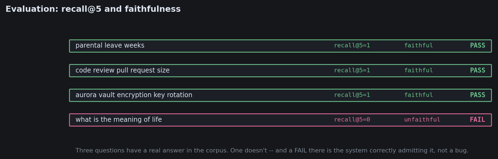{fig-align="center"}

## Evaluation: How You Know It Works {auto-animate=true}

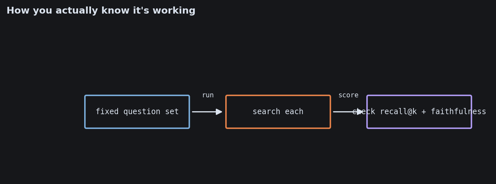{fig-align="center"}
